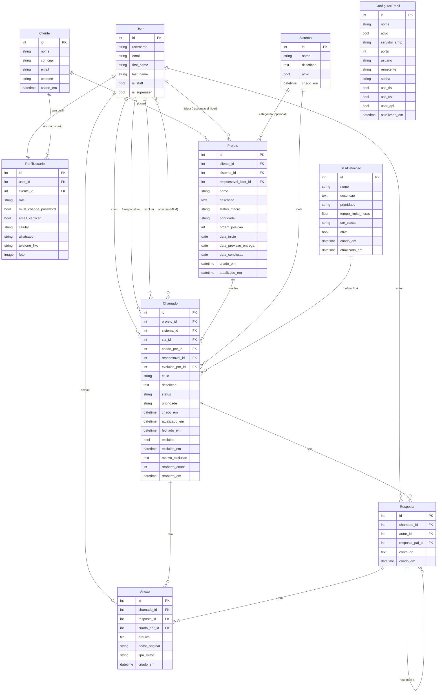

# Digiana — Sistema de Abertura de Chamados

Documentação técnica completa do projeto: histórico de implementações, estado atual de cada arquivo e decisões de arquitetura.

---

## Arquitetura do Sistema

### ERD — Diagrama de Entidades e Relacionamentos



**Como ler:**

| Símbolo | Significado |
|---|---|
| `\|\|` | Exatamente um (obrigatório) |
| `o\|` | Zero ou um (opcional) |
| `\|{` | Um ou mais |
| `o{` | Zero ou mais |

**Observações críticas do diagrama:**

- **`User` é o hub central** — FK em 8 lugares (`criado_por`, `responsavel`, `excluido_por`, `observadores` M2M, `autor` de Resposta, `criado_por` de Anexo, `PerfilUsuario`, `responsavel_lider` de Projeto). Toda feature nova que envolva usuário passa por ele.
- **`Projeto` ganhou um Kanban próprio** — `status_macro` (5 colunas), `prioridade`, `ordem_posicao`, `responsavel_lider`, `sistema` e 3 datas de ciclo de vida. Ver Implementação 49.
- **`Chamado` é o modelo mais complexo** — 7 FKs, 1 M2M, 19 campos. Maior risco em migrations.
- **`Resposta` tem auto-referência** — `resposta_pai_id` aponta para si mesmo; cuidado em queries recursivas.
- **`ConfigurarEmail` é isolado** — nenhuma FK para outros modelos; configuração pura.

**Onde `Hardware` se encaixa (feature planejada — não implementada):**

```
Hardware → FK Cliente (SET_NULL)
Hardware → FK User/responsavel (SET_NULL)
Chamado  → FK Hardware (SET_NULL, nullable)   ← campo novo
Chamado  → campo tipo: 'software' | 'hardware' | 'geral'   ← campo novo
```

Relação a adicionar no ERD quando implementado:
```
Hardware ||--o{ Chamado : "afetado em"
Cliente  ||--o{ Hardware : "possui"
User     ||--o{ Hardware : "guardião"
```

> ⚠️ **Atenção ao numerar as migrations quando este estudo for implementado.** As migrations `0025` e `0026` já foram consumidas pela Implementação 49 (Kanban de Projetos) — a próxima migration livre no repositório é `0027`. Os nomes `0025_hardware.py` / `0026_chamado_hardware_tipo.py` citados neste estudo são apenas ilustrativos e precisam ser renumerados no momento da implementação real.

---

---

## Visão Geral

Sistema web para registro e acompanhamento de chamados de suporte a sistemas de software desenvolvidos por uma empresa de contabilidade. Usuários de diferentes áreas (diretores, coordenadores, analistas, desenvolvedores e usuários finais) abrem chamados vinculados a projetos e clientes, que são tratados pela equipe de TI/desenvolvimento.

**Nome do sistema:** Digiana  
**Logo navbar:** `Abertura de Chamados` (texto simples, classe `header-logo-text`)  
**Logo tela de login:** a palavra `Login` exibida com efeito glow neon ciano pulsante (classe `login-logo-text .ia-glow`)  
**Animação CSS `ia-glow`:** ciano pulsante — dark mode `#00f0ff` / light mode `#0090bb` — keyframe `ia-pulse` e `ia-pulse-light` em `base.html`
**Ambiente atual:** o sistema já está em produção no Railway; os commits atualizam o código local e o repositório, e o deploy depende do `push` para o branch configurado. Há também containerização Docker completa para desenvolvimento local via Docker Desktop (ver Implementação 50); o estudo de migração/deploy autônomo contempla infraestrutura VPS na Oracle Cloud (OCI) com Linux Ubuntu 24.04 LTS (2 OCPUs e 12 GB de RAM).

---

## Stack Tecnológica

| Camada | Tecnologia | Observação |
|---|---|---|
| Framework web | Django 3.2.25 | Projeto nomeado `setup`, app principal `core` |
| Banco de dados | PostgreSQL (produção) / SQLite (dev) | Railway PostgreSQL em produção; SQLite local como fallback |
| Frontend CSS | Tailwind CSS via CDN | Sem build step (sem Node/webpack) |
| Tipografia | Inter, Poppins, Montserrat | Google Fonts |
| Backend Python | Python 3.11 | Pinado via `.python-version` |
| E-mail | ConfigurarEmail — múltiplas configs | Suporte a SMTP convencional e API HTTP Brevo (porta 443) |
| Arquivos estáticos | WhiteNoise | `CompressedManifestStaticFilesStorage`, sem CDN |
| Mídia persistente | Cloudinary | Avatares, anexos e imagens CKEditor em produção |
| WSGI / Produção | Gunicorn | 2 workers, timeout 120 s, Railway |

---

## Estrutura de Arquivos

```
chamados/
├── setup/
│   ├── settings.py              # Configurações Django
│   ├── urls.py                  # Roteamento raiz
│   └── wsgi.py
├── core/
│   ├── models.py                # 9 modelos de dados
│   ├── views.py                 # Views e lógica de negócio (~2100 linhas)
│   ├── forms.py                 # Formulários Django
│   ├── urls.py                  # URLs do app core
│   ├── admin.py                 # Registro no Django Admin
│   ├── middleware.py            # ForcePasswordChangeMiddleware + SecurityHeadersMiddleware
│   ├── context_processors.py    # Injeta user_role em todos os templates
│   ├── email_backend.py         # Py312SMTPEmailBackend — compatibilidade Python 3.12
│   └── migrations/              # 24 migrações (0001–0024)
│       └── management/
│           └── commands/
│               ├── setup_inicial.py  # Cria superusuário inicial (idempotente)
│               ├── setup_dev.py      # Ambiente local: migrations + fixture
│               └── seed_base.py      # Seed de Sistema/Cliente/Projeto (get_or_create)
├── templates/
│   ├── base.html                # Layout base com navbar, dark/light mode, hambúrguer
│   └── core/
│       ├── login.html           # Login com banner estático Dark.png/Light.png
│       ├── cadastro.html
│       ├── alterar_senha.html
│       ├── usuarios_list.html
│       ├── usuario_edit.html
│       ├── dashboard.html
│       ├── chamados_list.html
│       ├── chamado_detail.html  # ~844 linhas — conversa unificada, badge SLA
│       ├── chamado_form.html
│       ├── clientes_list.html
│       ├── cliente_form.html
│       ├── projetos_list.html
│       ├── projeto_form.html
│       ├── sistemas_list.html
│       ├── sistema_form.html
│       ├── configurar_email.html
│       ├── configurar_email_form.html
│       ├── relatorios.html      # ITIL 4: MTTR, distribuições, tendências, SLA compliance
│       ├── sla_list.html
│       ├── sla_form.html
│       ├── projetos_kanban.html           # Board Kanban de projetos (5 colunas)
│       ├── _dashboard_chamados_table.html # Partial — tabela de chamados recentes (SPA/polling)
│       └── _dashboard_projetos_sprint.html# Partial — card de projetos em sprint (SPA/polling)
├── static/
│   └── img/
│       ├── Dark.png             # Banner da tela de login (dark mode)
│       └── Light.png            # Banner da tela de login (light mode)
├── fixtures_inicial.json        # Dados de dev (não carregar em produção)
├── CHECKLIST_RAILWAY.md         # Checklist de deploy Railway
├── Procfile                     # Comando de inicialização Railway (deploy Railway/Nixpacks)
├── Dockerfile                   # Build multi-stage p/ deploy em VPS/Docker (ver Impl. 50)
├── docker-compose.yml           # App + PostgreSQL, p/ Docker Desktop/VPS (ver Impl. 50)
├── .dockerignore
├── .env.example                 # Template de variáveis de ambiente (Docker/VPS)
├── requirements.txt             # 11 dependências com versões exatas
├── .python-version              # 3.11
├── db.sqlite3                   # Banco local (não commitar)
├── chamados.html                # Versão HTML deste doc (regenerar após editar este arquivo)
└── manage.py
```

---

## Histórico de Implementações

> A numeração de "Implementação N" reflete a ordem em que cada mudança foi registrada neste documento, agrupada por tema (ex.: as seções de e-mail/Railway ficam juntas). Não é um índice cronológico estrito de commits — para a ordem real de aplicação no banco, use a tabela **Migrações**.

### Implementação 1 — Estrutura Base e CRUD Inicial

**O que foi construído:**
- Projeto Django criado com `django-admin startproject setup`
- App `core` criado com `python manage.py startapp core`
- Modelos iniciais: `Cliente`, `Projeto`, `Chamado`
- Views básicas: login, logout, dashboard, clientes, projetos, chamados
- Template `base.html` com navbar e layout Tailwind
- Migração inicial `0001_initial.py`

**Modelos criados:**

```python
class Cliente(models.Model):
    nome = models.CharField(max_length=150)
    email = models.EmailField(unique=True)
    telefone = models.CharField(max_length=20, blank=True, null=True)
    criado_em = models.DateTimeField(auto_now_add=True)

class Projeto(models.Model):
    cliente = models.ForeignKey(Cliente, on_delete=models.CASCADE, related_name='projetos')
    nome = models.CharField(max_length=150)
    descricao = models.TextField(blank=True, null=True)
    criado_em = models.DateTimeField(auto_now_add=True)

class Chamado(models.Model):
    STATUS_CHOICES = [('aberto','Aberto'),('em_progresso','Em Progresso'),('pendente','Pendente'),('resolvido','Resolvido'),('fechado','Fechado')]
    PRIORIDADE_CHOICES = [('baixa','Baixa'),('media','Média'),('alta','Alta')]
    projeto = models.ForeignKey(Projeto, on_delete=models.CASCADE, related_name='chamados')
    titulo = models.CharField(max_length=200)
    descricao = models.TextField()
    status = models.CharField(max_length=20, choices=STATUS_CHOICES, default='aberto')
    prioridade = models.CharField(max_length=20, choices=PRIORIDADE_CHOICES, default='media')
    responsavel = models.ForeignKey(User, on_delete=models.SET_NULL, null=True, blank=True, related_name='chamados_atribuidos')
    criado_por = models.ForeignKey(User, on_delete=models.CASCADE, related_name='chamados_criados')
    criado_em = models.DateTimeField(auto_now_add=True)
    atualizado_em = models.DateTimeField(auto_now=True)
```

**Configurações em `setup/settings.py`:**
- `LANGUAGE_CODE = 'pt-br'`
- `TIME_ZONE = 'America/Sao_Paulo'`
- `TEMPLATES.DIRS = [BASE_DIR / 'templates']`
- `STATICFILES_DIRS = [BASE_DIR / 'static']`
- `DEFAULT_AUTO_FIELD = 'django.db.models.BigAutoField'`

---

### Implementação 2 — Identidade Visual Digiana e Dark Mode

**O que foi construído:**
- Logo navbar: texto `Abertura de Chamados` (classe `header-logo-text`, fonte Poppins bold)
- Logo tela de login: palavra `Login` exibida com animação CSS `ia-glow` (glow ciano pulsante)
- Banner lateral na tela de login: imagens estáticas `static/img/Dark.png` e `static/img/Light.png` trocadas conforme o tema
- Dark mode como padrão do sistema
- Light mode opcional com toggle de ícones **lua** (dark) / **sol** (light) na navbar
- Transição animada entre temas usando a **View Transitions API** (`document.startViewTransition`) com efeito circular ripple a partir do botão
- Fallback com `clip-path` animado para navegadores sem suporte à API

**Lógica do tema (JavaScript no `<head>` de `base.html`):**
- Tema salvo em `localStorage` com chave `digiana-theme`
- Script executa imediatamente (antes do `DOMContentLoaded`) para evitar flash de tema errado
- Toggle via `<input type="checkbox" id="theme-toggle">` + `<label>` com ícones SVG lua/sol

**CSS do glow (em `base.html` `<style>`):**

```css
@keyframes ia-pulse {
    0%   { text-shadow: 0 0 5px rgba(0,240,255,0.2),...; color: #00f0ff; }
    50%  { text-shadow: 0 0 10px rgba(0,240,255,0.6),...; color: #7fffff; }
    100% { text-shadow: 0 0 5px rgba(0,240,255,0.2),...; color: #00f0ff; }
}
.login-logo-text .ia-glow {
    animation: ia-pulse 2.5s ease-in-out infinite;
    display: inline-block;
}
```

Variante mais suave para light mode (`ia-pulse-light`) com ciano escuro `#0090bb`.

**Dark mode como padrão:** todas as variáveis CSS de cor são sobrescritas globalmente para as classes Tailwind mais usadas (`bg-white`, `text-slate-800`, `bg-slate-50`, etc.), redirecionando para a paleta escura `#131314` / `#1e1e20`.

---

### Implementação 3 — Painel de Configuração de E-mail SMTP

**O que foi construído:**
- Modelo `ConfigurarEmail` para armazenar configuração SMTP (padrão: Zoho Mail)
- Form `ConfigurarEmailForm` com preservação de senha (campo em branco não sobrescreve)
- View `configurar_email_view` com padrão singleton (sempre edita o único registro existente)
- Template `configurar_email.html` no estilo painel de gestão (`max-w-2xl mx-auto`)
- Função `disparar_email()` em `views.py` para envio programático com a config salva
- Migrações `0002_configuraremail` e `0003_...` para os campos de SSL/TLS

**Modelo:**

```python
class ConfigurarEmail(models.Model):
    servidor_smtp = models.CharField(max_length=200, default='smtp.zoho.com')
    porta = models.IntegerField(default=465)
    usuario = models.EmailField(default='dev@anagma.com.br')
    senha = models.CharField(max_length=200, blank=True, null=True)
    use_tls = models.BooleanField(default=False)   # STARTTLS — porta 587
    use_ssl = models.BooleanField(default=True)    # SSL direto — porta 465 (Zoho)
    atualizado_em = models.DateTimeField(auto_now=True)
```

**Validação no form:** SSL e TLS não podem estar ativos ao mesmo tempo — levanta `forms.ValidationError`.

**Função de envio:**

```python
def disparar_email(assunto, mensagem, destinatarios):
    config = ConfigurarEmail.objects.first()
    if not config or not config.senha:
        return False
    connection = get_connection(
        backend='django.core.mail.backends.smtp.EmailBackend',
        host=config.servidor_smtp, port=config.porta,
        username=config.usuario, password=config.senha,
        use_tls=config.use_tls, use_ssl=config.use_ssl,
    )
    EmailMessage(assunto, mensagem, config.usuario, destinatarios, connection=connection).send()
    return True
```

E-mails são enviados automaticamente ao:
- Abrir um chamado (para responsável e e-mail do cliente)
- Atualizar um chamado (para responsável, cliente e criador)
- Reabrir um chamado (para responsável e cliente)

---

### Implementação 4 — Controle de Acesso por Papel (RBAC)

**Problema:** O sistema precisava de níveis de acesso diferenciados pois é usado por uma empresa de contabilidade onde nem todos os usuários são desenvolvedores. Coordenadores e diretores gerenciam mas não desenvolvem. Usuários são clientes internos abrindo chamados.

**Solução:** Modelo `PerfilUsuario` com 6 cargos mapeados para 4 níveis de acesso internos.

**Migrações:** `0004_perfilusuario`, `0005_...`, `0006_...`

**Modelo:**

```python
class PerfilUsuario(models.Model):
    ROLE_CHOICES = [
        ('diretor_ti',   'Diretor de Tecnologia'),
        ('diretor',      'Diretor'),
        ('coordenador',  'Coordenador'),
        ('dev',          'Analista e Desenvolvedor de Sistemas'),
        ('analista',     'Analista de Sistema'),
        ('usr',          'Usuário'),
    ]
    _ADMIN_ROLES  = {'diretor_ti'}
    _GESTOR_ROLES = {'diretor', 'coordenador'}
    _DEV_ROLES    = {'dev', 'analista'}

    user = models.OneToOneField(User, on_delete=models.CASCADE, related_name='perfil')
    role = models.CharField(max_length=20, choices=ROLE_CHOICES, default='usr')
    must_change_password = models.BooleanField(default=True)

    @classmethod
    def role_for(cls, user):
        if user.is_superuser:
            return 'admin'
        try:
            role = user.perfil.role
        except cls.DoesNotExist:
            return 'admin' if user.is_staff else 'usuario'
        if role in cls._ADMIN_ROLES:  return 'admin'
        if role in cls._GESTOR_ROLES: return 'gestor'
        if role in cls._DEV_ROLES:    return 'dev'
        return 'usuario'
```

**Matriz de permissões (atualizada até Impl. 26):**

| Funcionalidade | Admin | Gestor | Dev | Usuário |
|---|:---:|:---:|:---:|:---:|
| Dashboard completo | ✅ | ✅ | ✅ | ✅ (criados + observados) |
| Ver Clientes/Projetos | ✅ | ✅ | ✅ | ❌ |
| Abrir chamado | ✅ | ✅ | ✅ | ✅ |
| Editar chamado alheio | ✅ | ✅ se criador/responsável | ✅ | ✅ se criador/responsável |
| Fechar chamado (status `fechado`) | ✅ | ❌ | ✅ **se responsável** | ❌ |
| Excluir chamado | ✅ | ❌ | ✅ **se responsável** | ❌ |
| Atribuir responsável | ✅ | ❌ | ✅ | ❌ |
| Marcar chamado como Pendente | ✅ | ❌ | ✅ | ❌ |
| Reabrir chamado | ✅ | ✅ | ✅ | ✅ **se criador** |
| Cadastrar usuário | ✅ | ❌ | ❌ | ❌ |
| Ver lista de usuários | ✅ | ❌ | ❌ | ❌ |
| Config. e-mail SMTP | ✅ | ❌ | ❌ | ❌ |
| Cadastrar Sistemas | ✅ | ❌ | ❌ | ❌ |

**Helper de restrição em formulários:**

```python
def _aplicar_restricoes_usuario(form, user):
    if _role(user) in ('usuario', 'gestor'):
        form.fields.pop('status', None)
        form.fields.pop('responsavel', None)
```

Gestor e Usuário não veem os campos `status` e `responsavel` no formulário de chamado, o que os impede de fechar ou atribuir chamados.

---

### Implementação 5 — Cadastro de Usuário com Seleção Visual de Cargo

**O que foi construído:**
- Form `UserRegisterForm` estende `UserCreationForm` com campos extras: `email`, `first_name`, `last_name`, `role`
- `field_order` controla a sequência: `username → email → first_name → last_name → role → password1 → password2`
- `save()` cria automaticamente o `PerfilUsuario` e define `is_staff=True` para cargos admin
- Template `cadastro.html` com cards radio visuais (barra horizontal) para seleção de cargo
- Descrição de cada cargo exibida nos cards para orientar o cadastrante

**Ordem dos campos (motivo):** O campo `role` (perfil de acesso) foi inserido entre `last_name` e `password1` para que o cadastrante defina o nível de acesso antes de criar a senha.

**Método `save` do form:**

```python
def save(self, commit=True):
    user = super().save(commit=False)
    role = self.cleaned_data.get('role', 'analista')
    if role in PerfilUsuario._ADMIN_ROLES:
        user.is_staff = True
    if commit:
        user.save()
        PerfilUsuario.objects.create(user=user, role=role)
    return user
```

**View protegida:** Apenas `admin` pode acessar `/cadastro/`.

---

### Implementação 6 — Troca Obrigatória de Senha no Primeiro Login

**Problema:** Novos usuários criados pelo admin recebem uma senha temporária. É necessário forçar a troca antes de qualquer outra ação.

**Solução em três partes:**

**1. Campo no modelo (`0007_perfilusuario_must_change_password.py`):**

```python
must_change_password = models.BooleanField(default=True)
```

Todo usuário novo nasce com `must_change_password=True`.

**2. Middleware (`core/middleware.py`):**

```python
class ForcePasswordChangeMiddleware:
    _EXEMPT = ('/alterar-senha/', '/logout/', '/login/', '/painel-adm/', '/static/')

    def __call__(self, request):
        if request.user.is_authenticated:
            if not any(request.path.startswith(p) for p in self._EXEMPT):
                try:
                    if request.user.perfil.must_change_password:
                        return redirect('alterar_senha')
                except Exception:
                    pass
        return self.get_response(request)
```

Registrado no final do `MIDDLEWARE` em `settings.py`. Intercepta todas as rotas exceto as isentas.

> **`SecurityHeadersMiddleware`** — adicionado posteriormente ao mesmo arquivo `core/middleware.py`. Injeta em toda resposta: `Content-Security-Policy` (CSP com `script-src cdn.tailwindcss.com cdn.ckeditor.com`, `img-src res.cloudinary.com`), `Permissions-Policy` (câmera/microfone/geolocalização desativados) e `X-XSS-Protection: 1; mode=block`. Não possui lista de isenção — aplica-se a todas as respostas.

**3. View e template (`alterar_senha_view` / `alterar_senha.html`):**

- Usa `PasswordChangeForm` nativo do Django
- Ao salvar, chama `update_session_auth_hash` (mantém o usuário logado após troca)
- Define `must_change_password = False` no perfil
- Passa `must_change` para o template
- Template exibe banner âmbar de aviso quando `must_change=True`
- Botão "Cancelar" oculto quando a troca é obrigatória

---

### Implementação 7 — Context Processor `user_role`

**Arquivo:** `core/context_processors.py`

```python
from .models import PerfilUsuario

def role_context(request):
    if request.user.is_authenticated:
        return {'user_role': PerfilUsuario.role_for(request.user)}
    return {'user_role': ''}
```

**Registro em `settings.py`:**

```python
'context_processors': [
    ...
    'core.context_processors.role_context',
],
```

**Motivo:** Permite que qualquer template use `{{ user_role }}` e `` sem precisar passar o dado manualmente em cada view. Usado extensivamente em `base.html`, `chamado_detail.html` e `chamado_form.html`.

---

### Implementação 8 — Lista de Usuários (Admin Only)

**O que foi construído:**
- View `usuarios_list` protegida por `_role != 'admin'`
- Template `usuarios_list.html` com tabela estilizada
- Exibe: avatar com inicial, nome completo / username, e-mail, cargo (label do choice), nível de acesso (badge colorido), status de senha, data de cadastro

**Badges de nível:**
- Azul `bg-blue-100 text-blue-700` → Admin
- Roxo `bg-purple-100 text-purple-700` → Gestor
- Verde `bg-emerald-100 text-emerald-700` → Dev
- Cinza `bg-slate-100 text-slate-600` → Usuário

**Badge de status de senha:**
- Âmbar com ícone `⚠` → "Troca pendente"
- Verde com ícone `✓` → "OK"

---

### Implementação 9 — Reabertura de Chamados

**Problema:** Chamados resolvidos ou fechados precisavam poder ser reabertos sem permitir que qualquer usuário alterasse o status livremente pelo form de edição.

**Solução:** View dedicada `chamado_reopen` separada da edição.

```python
@login_required(login_url='login')
def chamado_reopen(request, pk):
    chamado = get_object_or_404(Chamado, pk=pk)
    role = _role(request.user)
    if role == 'usuario' and chamado.criado_por != request.user:
        return redirect('dashboard')
    if request.method == 'POST' and chamado.status in ('resolvido', 'fechado'):
        chamado.status = 'aberto'
        chamado.save()
        # envia e-mail de notificação...
    return redirect('chamado_detail', pk=pk)
```

**No template `chamado_detail.html`:** Botão "Reabrir Chamado" aparece apenas quando status é `resolvido` ou `fechado`, e apenas para quem tem permissão. Implementado como `<form method="POST">` separado para garantir que seja um POST (não acessível por URL direta via GET).

---

### Implementação 10 — Modelo Sistema e Feature de Vinculação

**Motivação:** Os chamados precisavam indicar a qual sistema de software se referem. Apenas Admin pode cadastrar sistemas; todos os demais perfis podem escolher o sistema ao abrir um chamado.

**O que foi construído:**

**Modelo `Sistema` (adicionado em `core/models.py`):**

```python
class Sistema(models.Model):
    nome = models.CharField(max_length=150)
    descricao = models.TextField(blank=True, null=True)
    ativo = models.BooleanField(default=True)
    criado_em = models.DateTimeField(auto_now_add=True)

    class Meta:
        verbose_name = "Sistema"
        verbose_name_plural = "Sistemas"
        ordering = ['nome']

    def __str__(self):
        return self.nome
```

**FK em `Chamado`:**

```python
sistema = models.ForeignKey('Sistema', on_delete=models.SET_NULL, null=True, blank=True, related_name='chamados')
```

`null=True, blank=True` garante que chamados existentes não sejam afetados.

**Migração:** `0008_auto_20260608_1806.py` — cria o modelo `Sistema` e adiciona o campo ao `Chamado`.

**Views novas:**
- `sistemas_list` — lista todos os sistemas (admin only)
- `sistema_create` — cadastra novo sistema (admin only)
- `sistema_update` — edita sistema existente (admin only)

**URLs adicionadas:**
```python
path('sistemas/', views.sistemas_list, name='sistemas_list'),
path('sistemas/novo/', views.sistema_create, name='sistema_create'),
path('sistemas/<int:pk>/editar/', views.sistema_update, name='sistema_update'),
```

**Form `SistemaForm`** em `core/forms.py`:
```python
class SistemaForm(forms.ModelForm):
    class Meta:
        model = Sistema
        fields = ['nome', 'descricao', 'ativo']
```

**`ChamadoForm`** atualizado para incluir `sistema` na lista de campos:
```python
fields = ['projeto', 'sistema', 'titulo', 'descricao', 'status', 'prioridade', 'responsavel']
```

**Templates:**
- `sistemas_list.html` — tabela com nome, descrição, badge ativo/inativo, data, botão Editar
- `sistema_form.html` — formulário com checkbox "Ativo" no estilo inline com label

**Atualizações em templates existentes:**
- `chamado_form.html` — link "Gerenciar Sistemas cadastrados" visível apenas para `user_role == 'admin'`, acima do formulário
- `chamado_detail.html` — seção "Sistema" adicionada ao painel lateral de metadados
- `base.html` — link "Sistemas" na navbar (admin only), com borda tracejada verde-esmeralda, posicionado antes de "Usuários"

---

### Implementação 11 — Status Pendente e Barra de Tempo em Aberto

**Motivação:** A equipe precisava de um estado intermediário para chamados que estão aguardando retorno externo (cliente, fornecedor, dependência) sem confundir com "Em Progresso". Além disso, sem SLA configurado, era necessário um indicador visual de quanto tempo o chamado está aberto para priorização informal.

#### Status `Pendente`

**Novo valor em `STATUS_CHOICES` do modelo `Chamado`:**

```python
STATUS_CHOICES = [
    ('aberto',       'Aberto'),
    ('em_progresso', 'Em Progresso'),
    ('pendente',     'Pendente'),      # novo
    ('resolvido',    'Resolvido'),
    ('fechado',      'Fechado'),
]
```

**Permissão para setar `Pendente`:**

| Perfil | Cargo | Pode setar Pendente |
|---|---|:---:|
| Admin | Diretor de Tecnologia | ✅ |
| Gestor | Diretor / Coordenador | ❌ |
| Dev | Analista e Dev de Sistemas | ✅ |
| Dev | Analista de Sistema | ✅ |
| Usuário | Usuário | ❌ |

**Proteção em duas camadas:**

1. `_aplicar_restricoes_usuario` remove o campo `status` do form para `gestor` e `usuario` — eles não enxergam nem submetem o campo.
2. `_status_permitido(status_novo, user)` — guard server-side que verifica se o status `pendente` está sendo setado por quem não tem permissão; se sim, reverte para o status anterior (no update) ou `aberto` (na criação).

```python
def _status_permitido(status_novo, user):
    if status_novo == 'pendente' and _role(user) not in ('admin', 'dev'):
        return False
    return True
```

Essa função é chamada em `chamado_create` e `chamado_update` após `form.is_valid()`, antes de `chamado.save()`.

**Badge visual:** roxo (`bg-purple-50 text-purple-700`) — diferencia visualmente de todos os outros status.

**Migração:** `0009_alter_chamado_status.py` — `AlterField` no campo `status` do `Chamado` com os cinco choices.

---

#### Barra de Tempo em Aberto

Exibida no template `chamado_detail.html`, logo abaixo do cabeçalho do chamado, acima do conteúdo principal.

**Cálculo feito em `chamado_detail` (Python, `views.py`):**

```python
from django.utils import timezone

encerrado = chamado.status in ('fechado', 'resolvido')
delta = chamado.atualizado_em - chamado.criado_em if encerrado else timezone.now() - chamado.criado_em
total_seg = max(0, int(delta.total_seconds()))
horas = total_seg // 3600

# Referência visual: 10 dias (240 h) = 100 %
progresso_pct = max(2, min(100, round(horas / 240 * 100)))
```

**Escala de cores da barra:**

| Tempo decorrido | Cor | Tailwind |
|---|---|---|
| < 24 h | Verde | `bg-emerald-500` |
| 24 h – 3 dias | Azul | `bg-blue-500` |
| 3 – 7 dias | Âmbar | `bg-amber-500` |
| > 7 dias | Vermelho | `bg-rose-500` |

**Comportamento:**
- Chamado **aberto / em progresso / pendente**: exibe tempo decorrido desde `criado_em` até agora; título "Tempo em Aberto".
- Chamado **resolvido / fechado**: exibe duração total de `criado_em` até `atualizado_em` (proxy de encerramento); título "Duração Total".
- Barra sempre exibe no mínimo 2 % de largura (visibilidade em chamados recém-abertos).

**Contexto extra passado ao template:**

| Variável | Tipo | Conteúdo |
|---|---|---|
| `progresso_pct` | int | Percentual da barra (2–100) |
| `cor_barra` | str | Classe Tailwind da cor |
| `tempo_decorrido` | str | Texto legível ("3h 20min", "2 dias e 5h", etc.) |
| `encerrado` | bool | `True` se status fechado ou resolvido |

**Dashboard:** adicionado card roxo "Pendentes" à linha de métricas. Layout alterado de 4 para 5 colunas (`md:grid-cols-5`). Badge roxo adicionado à tabela de chamados recentes para o novo status.

---

---

### Implementação 12 — Gestão Completa de Usuários (Editar e Excluir)

**Motivação:** A lista de usuários exibia apenas leitura. O admin precisava poder corrigir dados de usuários existentes (cargo, contatos, cliente vinculado) e remover usuários inativos.

**Form `UsuarioEditForm` (em `core/forms.py`):**

```python
class UsuarioEditForm(forms.ModelForm):
    email      = forms.EmailField(required=False)
    first_name = forms.CharField(required=False, label='Nome')
    last_name  = forms.CharField(required=False, label='Sobrenome')
    role       = forms.ChoiceField(choices=PerfilUsuario.ROLE_CHOICES, label='Cargo')
    telefone   = forms.CharField(required=False)
    celular    = forms.CharField(required=False)
    cliente    = forms.ModelChoiceField(queryset=Cliente.objects.all().order_by('nome'),
                     required=False, empty_label='— Nenhum (usuário interno) —')

    class Meta:
        model  = User
        fields = ['username', 'email', 'first_name', 'last_name']

    field_order = ['username','email','first_name','last_name','role','cliente','telefone','celular']
```

O método `__init__` pré-popula `role`, `telefone`, `celular` e `cliente` a partir do `PerfilUsuario` vinculado. O método `save()` persiste todos esses campos de volta ao perfil.

**Views adicionadas:**

| View | Método | Proteção |
|---|---|---|
| `usuario_edit` | GET/POST | Somente admin |
| `usuario_delete` | POST | Somente admin |

**URLs adicionadas:**
```python
path('usuarios/<int:pk>/editar/', views.usuario_edit, name='usuario_edit'),
path('usuarios/<int:pk>/excluir/', views.usuario_delete, name='usuario_delete'),
```

**Template `usuario_edit.html`:** cards radio visuais de cargo (mesmo JS de `cadastro.html`), seção de contatos com placeholder para celular/telefone, campo select para Cliente, botão "Salvar Alterações" + cancelar para `usuarios_list`.

**`usuarios_list.html` atualizado:** adicionada coluna Cliente (entre Usuário e Cargo) e coluna Ações com botões Editar/Excluir. `colspan` atualizado para 8.

---

### Implementação 13 — Revisão ITIL4 de Notificações por E-mail

**Problema:** A lógica de envio de e-mail tinha 6 falhas identificadas:
1. Helpers de limpeza de HTML e de destinatários ausentes
2. `criado_por` não recebia e-mail na abertura nem na reabertura
3. Cliente vinculado não estava incluído nos destinatários
4. E-mails com corpo sem contexto (mensagem genérica para todos os status)
5. Novo responsável não era notificado quando o chamado era atribuído a ele
6. `user_role` não passado ao contexto de `chamado_detail`

**Solução em 3 etapas autorizadas:**

#### Etapa 1 — Helpers e destinatários

**`_strip_html(texto)`** — limpa HTML do CKEditor antes de enviar no corpo do e-mail:
```python
def _strip_html(texto):
    if not texto:
        return ''
    return _unescape(strip_tags(texto)).strip()
```

**`_build_destinatarios(chamado, extras=None)`** — centraliza e deduplica destinatários:
```python
def _build_destinatarios(chamado, extras=None):
    candidatos = []
    if chamado.criado_por and chamado.criado_por.email:
        candidatos.append(chamado.criado_por.email)
    if chamado.responsavel and chamado.responsavel.email:
        candidatos.append(chamado.responsavel.email)
    if chamado.projeto.cliente and chamado.projeto.cliente.email:
        candidatos.append(chamado.projeto.cliente.email)
    if extras:
        candidatos.extend(e for e in extras if e)
    # deduplica preservando ordem
    vistos, resultado = set(), []
    for email in candidatos:
        if email not in vistos:
            vistos.add(email); resultado.append(email)
    return resultado
```

#### Etapa 2 — Mensagens contextuais por status

`chamado_update` passou a enviar assunto e corpo distintos de acordo com o status resultante:

| Status salvo | Assunto | Destinatários |
|---|---|---|
| `em_progresso` | "Chamado em Atendimento — #N" | Todos (criador + responsável + cliente) |
| `pendente` | "Ação Necessária — Chamado #N Pendente" | Todos |
| `resolvido` | "Chamado Resolvido — Confirme o Encerramento" | Todos |
| `fechado` | "Chamado Encerrado — #N" | Todos |
| outros | "Chamado Atualizado — #N" | Todos |

#### Etapa 3 — Notificação de atribuição

Quando o responsável muda, o **novo responsável** recebe e-mail de atribuição independente do e-mail de status:

```python
responsavel_anterior = chamado.responsavel   # capturado antes do form.save()
# ... form.save() ...
if chamado.responsavel and chamado.responsavel != responsavel_anterior:
    if chamado.responsavel.email:
        disparar_email(
            f'Chamado Atribuído a Você — #{chamado.id}',
            f'...',
            [chamado.responsavel.email]
        )
```

---

### Implementação 14 — CPF/CNPJ no Cadastro de Cliente

**Motivação:** Clientes precisam ser identificáveis por CPF (pessoa física) ou CNPJ (pessoa jurídica), dado essencial para emissão de documentos na empresa de contabilidade.

**Campo adicionado ao modelo `Cliente`:**

```python
cpf_cnpj = models.CharField(
    max_length=18, blank=True, null=True, unique=True,
    verbose_name='CPF / CNPJ'
)
```

**Migração:** `0012_cliente_cpf_cnpj.py` — `AddField` manual.

**Validação e formatação em `ClienteForm`:**

```python
import re

def clean_cpf_cnpj(self):
    valor = self.cleaned_data.get('cpf_cnpj') or ''
    digitos = re.sub(r'\D', '', valor)
    if not digitos:
        return None
    if len(digitos) == 11:   # CPF
        return f'{digitos[:3]}.{digitos[3:6]}.{digitos[6:9]}-{digitos[9:]}'
    if len(digitos) == 14:   # CNPJ
        return f'{digitos[:2]}.{digitos[2:5]}.{digitos[5:8]}/{digitos[8:12]}-{digitos[12:]}'
    raise forms.ValidationError('Informe um CPF válido (11 dígitos) ou CNPJ válido (14 dígitos).')
```

O campo é **opcional** (blank/null). A entrada pode conter pontos, traços ou barras — `re.sub(r'\D', '')` remove tudo antes de contar os dígitos e formata na saída padronizada.

**`clientes_list.html`:** adicionada coluna CPF/CNPJ com fonte mono (`font-mono text-xs`). `colspan` atualizado para 7.

---

### Implementação 15 — Editar e Excluir Cliente

**Views adicionadas:**

| View | Método | Proteção |
|---|---|---|
| `cliente_update` | GET/POST | Admin, Gestor, Dev |
| `cliente_delete` | POST | Somente admin |

**URLs:**
```python
path('clientes/<int:pk>/editar/', views.cliente_update, name='cliente_update'),
path('clientes/<int:pk>/excluir/', views.cliente_delete, name='cliente_delete'),
```

**Comportamento de exclusão em cascata:** ao excluir um Cliente, todos os Projetos vinculados e, por consequência, todos os Chamados desses projetos são deletados. O `confirm()` no template avisa explicitamente sobre a cascata. O Django realiza o cascade automaticamente via `on_delete=models.CASCADE` nas FKs.

---

### Implementação 16 — Vinculação de Usuário a Cliente

**Motivação:** Usuários externos (clientes) precisam estar associados a um Cliente cadastrado para que as notificações de e-mail os incluam e para facilitar o filtro de chamados por cliente no futuro.

**Campo adicionado ao modelo `PerfilUsuario`:**

```python
cliente = models.ForeignKey(
    'Cliente', on_delete=models.SET_NULL,
    null=True, blank=True,
    related_name='usuarios', verbose_name='Cliente'
)
```

`SET_NULL` garante que excluir um cliente não remove o usuário, apenas desvincula.

**Migração:** `0013_perfilusuario_cliente.py` — `AddField` manual.

**Formulários atualizados (`UserRegisterForm` e `UsuarioEditForm`):**

```python
cliente = forms.ModelChoiceField(
    queryset=Cliente.objects.all().order_by('nome'),
    required=False,
    empty_label='— Nenhum (usuário interno) —'
)
```

O campo foi inserido em `field_order` após `role`. O método `save()` persiste `perfil.cliente` nos dois forms.

**`cadastro.html`:** adicionado `` no loop de campos para renderizar o `<select>` com estilo consistente.

---

### Implementação 17 — Editar e Excluir Projeto

**Views adicionadas:**

| View | Método | Proteção |
|---|---|---|
| `projeto_update` | GET/POST | Admin, Gestor, Dev |
| `projeto_delete` | POST | Somente admin |

**URLs:**
```python
path('projetos/<int:pk>/editar/', views.projeto_update, name='projeto_update'),
path('projetos/<int:pk>/excluir/', views.projeto_delete, name='projeto_delete'),
```

**`projetos_list.html`:** adicionada coluna Ações com botões Editar (todos os roles) e Excluir (admin only). `confirm()` avisa sobre cascata de chamados.

---

### Implementação 18 — Editar e Excluir Chamado

**Views adicionadas:**

| View | Método | Proteção |
|---|---|---|
| `chamado_delete` | POST | Somente admin |

**URL:**
```python
path('chamados/<int:pk>/excluir/', views.chamado_delete, name='chamado_delete'),
```

**Pontos de acesso ao Excluir:**
- `chamado_detail.html` — botão "Excluir" visível apenas para `user_role == 'admin'`, posicionado antes do bloco de Reabrir
- `dashboard.html` — botão Excluir na coluna de ações da tabela de chamados recentes (admin only)

---

### Implementação 19 — Lista Completa de Chamados com Filtros e Paginação

**Motivação:** O dashboard exibia apenas os 10 chamados mais recentes. Era necessária uma página dedicada que permitisse ver e filtrar todos os chamados.

**View `chamados_list` em `core/views.py`:**

```python
@login_required(login_url='login')
def chamados_list(request):
    role = _role(request.user)
    qs = (
        Chamado.objects.filter(criado_por=request.user)
        if role == 'usuario'
        else Chamado.objects.all()
    )
    status_f     = request.GET.get('status', '')
    prioridade_f = request.GET.get('prioridade', '')
    q            = request.GET.get('q', '').strip()

    if status_f:     qs = qs.filter(status=status_f)
    if prioridade_f: qs = qs.filter(prioridade=prioridade_f)
    if q:
        qs = qs.filter(
            Q(titulo__icontains=q) |
            Q(projeto__nome__icontains=q) |
            Q(projeto__cliente__nome__icontains=q)
        )

    qs = qs.select_related('projeto__cliente', 'responsavel', 'sistema').order_by('-criado_em')
    total = qs.count()
    paginator = Paginator(qs, 20)
    page_obj = paginator.get_page(request.GET.get('page'))

    return render(request, 'core/chamados_list.html', {
        'chamados': page_obj, 'page_obj': page_obj,
        'user_role': role, 'status_filter': status_f,
        'prioridade_filter': prioridade_f, 'q': q,
        'status_choices': Chamado.STATUS_CHOICES,
        'prioridade_choices': Chamado.PRIORIDADE_CHOICES,
        'total': total,
    })
```

**RBAC na listagem:** usuário com role `usuario` vê apenas os próprios chamados; demais roles veem tudo.

**Template `chamados_list.html`:**
- Barra de filtros com campo de busca (título/projeto/cliente), select de status, select de prioridade
- Botão "Limpar" aparece apenas quando há algum filtro ativo
- Tabela com colunas: ID, Título, Projeto, **Cliente** (novo), Prioridade, Status, Responsável, Data, Ações
- Ações: Detalhar (sempre), Editar (admin/gestor/dev/criador), Excluir (admin only)
- Todos os filtros persistem nos links de paginação via query string

**URL:**
```python
path('chamados/', views.chamados_list, name='chamados_list'),
```

**Paginação:** 20 registros por página com botões «/» (primeira/última), ‹/› (anterior/próxima) e numeração ±2 ao redor da página atual.

**Navbar:** link "Chamados" adicionado após "Dashboard", visível para **todos** os usuários autenticados.

**Dashboard:** link "Ver todos →" adicionado ao cabeçalho da tabela de chamados recentes.

---

### Implementação 20 — Paginação no Dashboard

**Motivação:** Com a lista de chamados paginada, o dashboard também precisava navegar além dos 10 primeiros registros.

**`dashboard` view atualizada:**

```python
paginator = Paginator(chamados, 10)
page_obj  = paginator.get_page(request.GET.get('page'))
context   = { 'chamados': page_obj, 'page_obj': page_obj, ... }
```

**`dashboard.html` atualizado:** bloco de paginação inserido no rodapé interno do card da tabela (dentro do `<div>` branco, abaixo da `<table>`), com estilo compacto: "Página X de Y" à esquerda, botões ‹/› e numerados à direita.

---

### Implementação 21 — Link Ativo na Navbar e Melhorias Visuais

**Problema:** Não havia indicação visual de qual página o usuário estava navegando.

**Solução:** `` ao redor da `<nav>` para capturar o nome da view atual sem custo de processamento extra.

Cada link da nav recebe classes condicionais:
```html

    bg-slate-700 text-white

    text-slate-300 hover:text-white hover:bg-slate-800

```

**Mapeamento de sub-páginas para item ativo:**

| Item da nav | Views que o ativam |
|---|---|
| Chamados | `chamados_list`, `chamado_detail`, `chamado_create`, `chamado_update`, `chamado_reopen` |
| Clientes | `clientes_list`, `cliente_create`, `cliente_update` |
| Projetos | `projetos_list`, `projeto_create`, `projeto_update` |
| Sistemas | `sistemas_list`, `sistema_create`, `sistema_update` |
| Usuários | `usuarios_list`, `usuario_edit`, `cadastro` |
| E-mail SMTP | `configurar_email` |

**Melhorias de espaçamento na navbar:**
- `space-x-4 ml-10` → `space-x-0.5 ml-6` — itens mais compactos
- `px-3 py-2` → `px-2.5 py-1.5` — padding horizontal reduzido
- `whitespace-nowrap` em todos os links — impede quebra em telas médias
- Botão "Entrar" removido (nunca exibido — toda interação começa na tela de login)

---

### Implementação 22 — Paginação em Clientes, Projetos e Usuários + Correção de Botão Cortado

**Problema:** As três listas não tinham paginação. Em Usuários, o botão "Excluir" aparecia cortado na borda direita do card.

**Causa do corte:** O container `div.rounded-2xl` usava `overflow-hidden` (necessário para os cantos arredondados), mas a tabela com 8 colunas ultrapassava a largura disponível e o conteúdo era simplesmente clipado sem oferecer scroll.

**Solução adotada:** Em vez de adicionar `overflow-x-auto` (que introduzia barra de rolagem horizontal indesejada), as células foram compactadas para caber dentro da largura disponível:

| Template | Ajuste |
|---|---|
| `usuarios_list.html` | `px-6 py-4` → `px-4 py-3`; nome, e-mail, cliente e cargo com `max-w + truncate`; avatar `w-8` → `w-7`; `whitespace-nowrap` em status, data e ações |
| `clientes_list.html` | `px-6 py-4` → `px-4 py-3`; nome e e-mail com `truncate`; data sem horário |
| `projetos_list.html` | `px-6 py-4` → `px-4 py-3`; nome, cliente e descrição com `truncate`; cabeçalho "Chamados Abertos" → "Abertos"; data sem horário |

**Views atualizadas com `Paginator` (20/pág):**

```python
# clientes_list
qs = Cliente.objects.all().annotate(num_projetos=Count('projetos')).order_by('nome')
paginator = Paginator(qs, 20)
page_obj  = paginator.get_page(request.GET.get('page'))

# projetos_list
qs = Projeto.objects.select_related('cliente').annotate(
    num_chamados_abertos=Count('chamados', filter=Q(chamados__status='aberto'))
).order_by('cliente__nome', 'nome')

# usuarios_list
qs = User.objects.select_related('perfil', 'perfil__cliente').order_by('first_name', 'username')
```

`projetos_list` ganhou também `select_related('cliente')` (antes não tinha) e `usuarios_list` ganhou `select_related('perfil__cliente')` para evitar N+1 na coluna Cliente.

Cada template recebeu o bloco padrão de paginação no rodapé do card: "Página X de Y · N registros" + botões «/‹/números/›/».

---

### Implementação 23 — Paginação em Sistemas

**View `sistemas_list` atualizada:**

```python
qs = Sistema.objects.all().order_by('nome')
paginator = Paginator(qs, 20)
page_obj  = paginator.get_page(request.GET.get('page'))
```

**`sistemas_list.html`:** botão "Editar" padronizado para o mesmo estilo visual das outras listas (ícone SVG + texto, mesmo padrão `bg-slate-100 hover:bg-blue-50`). Bloco de paginação adicionado no rodapé do card.

---

### Implementação 24 — Redesign dos Cards de Indicadores + Atualização em Tempo Real

**Motivação:** Os cards do dashboard eram visualmente discretos e dependiam de F5 para refletir novos chamados.

**Redesign visual dos cards:**
- Gradiente colorido forte (ex.: `from-amber-500 to-orange-600`) substituindo os fundos lavados `bg-amber-50/50`
- Números em `text-5xl font-black text-white` — impacto visual imediato
- Ícone SVG Heroicons em cada card dentro de pill `bg-white/20`
- Círculos decorativos absolutos `bg-white/10` como elemento gráfico de fundo
- Sombra colorida por card (`shadow-amber-500/30` etc.) para separação visual
- Legenda descritiva abaixo do número ("aguardando", "em atendimento", etc.)

**Paleta dos cards:**

| Card | Gradiente |
|---|---|
| Total | `from-slate-700 to-slate-900` |
| Abertos | `from-amber-500 to-orange-600` |
| Em Progresso | `from-blue-500 to-blue-700` |
| Pendentes | `from-purple-500 to-violet-700` |
| Resolvidos | `from-emerald-500 to-green-700` |

**Atualização em tempo real (sem reload):**

**Endpoint JSON `dashboard_stats` em `views.py`:**
```python
@login_required(login_url='login')
def dashboard_stats(request):
    role = _role(request.user)
    qs = (
        Chamado.objects.filter(criado_por=request.user)
        if role == 'usuario'
        else Chamado.objects.all()
    )
    return JsonResponse({
        'total': qs.count(), 'abertos': ..., 'em_progresso': ...,
        'pendentes': ..., 'resolvidos': ...,
    })
```

**URL adicionada:**
```python
path('api/dashboard-stats/', views.dashboard_stats, name='dashboard_stats'),
```

**JavaScript de polling em `dashboard.html`:**
- `fetch('/api/dashboard-stats/')` a cada 15 s via `setInterval`
- Primeira chamada após 5 s (evita requisição desnecessária na carga)
- `setVal()` compara valor atual com novo antes de atualizar — anima apenas quando há mudança
- Animação `stat-pop` (`@keyframes scale 1→1.12→1` em 0.35 s) ao atualizar número
- Badge "ao vivo" com dot verde pulsante (`animate-ping`) aparece após primeira resposta
- Exibe horário da última atualização ("Atualizado às HH:MM:SS")
- Falhas de rede são silenciadas — não quebra a UI

**Relógio e data em tempo real** (Impl. 27 — bloco IIFE separado, sem rede):
- `#live-date` (data `dd/mm/aaaa`) + `#last-updated` (hora `HH:MM:SS`) dentro do `#live-badge`
- `live-badge` sempre visível (`inline-flex`) — não depende do primeiro poll
- `setInterval` de 1 s com `new Date()` — `toLocaleDateString` e `toLocaleTimeString` pt-BR
- `poll()` não mexe no horário nem na visibilidade do badge — responsabilidades separadas
- Fonte do horário: S.O. do navegador — ver Impl. 27 para o estudo de migração ao horário do servidor

**RBAC preservado:** o endpoint respeita o mesmo filtro da view `dashboard` (usuário vê só os próprios chamados).

---

### Implementação 25 — Observadores de Chamado

**Motivação:** Stakeholders que precisam acompanhar um chamado mas não têm permissão para editá-lo (diretores, analistas de outros projetos, clientes internos) precisavam de visibilidade sem ganhar poder de edição.

#### Etapa 1 — Modelo e Migração

Campo adicionado ao modelo `Chamado`:

```python
observadores = models.ManyToManyField(
    User, blank=True,
    related_name='chamados_observados',
    verbose_name='Observadores'
)
```

Migração: `0014_chamado_observadores.py` — cria a tabela intermediária `core_chamado_observadores`. Campo `blank=True` garante zero impacto em chamados existentes.

#### Etapa 2 — Formulário

**`ObservadorChoiceField`** em `core/forms.py` — subclasse de `ModelMultipleChoiceField` com `label_from_instance` que exibe `"Nome Completo (username)"`:

```python
class ObservadorChoiceField(forms.ModelMultipleChoiceField):
    def label_from_instance(self, obj):
        nome = obj.get_full_name()
        return f"{nome} ({obj.username})" if nome else obj.username
```

`ChamadoForm` atualizado:
- `observadores` adicionado a `fields`
- Widget: `CheckboxSelectMultiple` com classe `obs-checkbox`
- Queryset ordenado por `first_name, username`

`chamado_form.html` — UI de acordeão recolhível para `observadores`:

**Barra de toggle** (sempre visível):
- Ícone de olho + label "Observadores" + chevron animado (roda 180° ao abrir)
- Badge numérico azul (`bg-blue-100 text-blue-700`) aparece na barra quando há observadores selecionados — visível mesmo com o painel fechado
- Hint "opcional — receberão notificações por e-mail" na borda direita

**Painel recolhível** (oculto por padrão):
- Campo de busca com filtro em tempo real (JS vanilla) — filtra por `data-name` do item
- Lista scrollável (`max-h-52`, `divide-y`) com avatar `bg-blue-500 text-white` + nome completo — contraste garantido em dark e light mode
- Item selecionado recebe `bg-blue-50 border-l-2 border-blue-500` para destaque visual
- Rodapé com contador dinâmico "N observadores selecionados"

**Comportamento inteligente:**
- Painel **fechado** ao criar chamado novo
- Painel **aberto automaticamente** ao editar chamado que já possui observadores (`preChecked > 0`)

**Correção crítica:** `form.save_m2m()` adicionado após `chamado.save()` em `chamado_create` e `chamado_update`. Sem essa chamada, o Django descarta silenciosamente todos os campos M2M quando `commit=False` é usado.

#### Etapa 3 — Visibilidade

| View | Regra anterior | Regra atual |
|---|---|---|
| `chamado_detail` | `criado_por == user` | `criado_por == user OR user in observadores` |
| `chamado_update` | `criado_por == user` | sem mudança — observador não edita |
| `chamados_list` | `filter(criado_por=user)` | `Q(criado_por=user) \| Q(observadores=user)` + `.distinct()` |
| `dashboard` | idem | idem |
| `dashboard_stats` | idem | idem |

`.distinct()` obrigatório: o JOIN do M2M duplica linhas quando um chamado tem múltiplos observadores.

`chamado_detail` passa `is_observador` (bool) ao contexto do template.

#### Etapa 4 — Notificações por E-mail

`_build_destinatarios` atualizado — bloco adicionado após o cliente:

```python
for obs in chamado.observadores.all():
    if obs.email:
        candidatos.append(obs.email)
```

A deduplicação existente garante que um observador que também é responsável ou criador não recebe e-mail duplicado. Observadores passam a receber todos os e-mails do ciclo de vida: abertura, atualização de status, atribuição de responsável e reabertura.

#### Etapa 5 — Exibição no Detail

`chamado_detail.html` — duas adições visuais + correção de dark mode:

**Badge no cabeçalho** (visível apenas para o próprio observador):
- Chip `bg-blue-50 text-blue-600 border border-blue-100` com ícone de olho SVG
- Exibido inline ao lado da linha "Projeto: …" via ``

**Seção "Observadores" no painel lateral** (abaixo de "Criado por"):
- Lista vertical: avatar circular com inicial + nome completo truncado com `title` para tooltip
- Estado vazio: "Nenhum" em itálico

**Correção de dark mode — classes CSS explícitas:**

As classes Tailwind `bg-blue-100 text-blue-700 text-slate-700` sumiam no fundo escuro padrão do Digiana. Substituídas por classes CSS com regras duais no bloco `<style>` do template:

| Classe | Dark mode (padrão) | Light mode (`html.light-mode`) |
|---|---|---|
| `.obs-avatar` | `rgba(59,130,246,0.2)` / texto `#93c5fd` | `#dbeafe` / texto `#1d4ed8` |
| `.obs-nome` | `#cbd5e1` (slate-300) | `#334155` (slate-700) |
| `.obs-row` | `rgba(255,255,255,0.04)` | `#f8fafc` |

Resultado: avatares e nomes dos observadores são legíveis nos dois temas sem depender de overrides do Tailwind.

---

### Implementação 26 — Rótulos Enriquecidos e Permissões Avançadas por Responsável

**Motivação:** A lista de responsáveis e observadores exibia apenas o username, dificultando identificar quem é quem em empresas com muitos usuários. Simultaneamente, a regra de fechar e excluir chamados precisava ser restringida ao responsável atribuído — não deveria ser uma ação de qualquer dev ou admin, mas de quem efetivamente atendeu o chamado.

#### Etapa 1 — Rótulos `Nome — Perfil — Empresa`

**`core/forms.py` — novas construções:**

```python
_ROLE_LABEL = {
    'diretor_ti':  'Dir. TI',
    'diretor':     'Diretor',
    'coordenador': 'Coord.',
    'dev':         'Dev',
    'analista':    'System',
    'usr':         'Usuário',
}

def _label_usuario(obj):
    nome = obj.get_full_name() or obj.username
    try:
        role_label = _ROLE_LABEL.get(obj.perfil.role, '—')
        empresa    = obj.perfil.cliente.nome if obj.perfil.cliente else ''
    except Exception:
        role_label = '—'
        empresa    = ''
    if empresa:
        return f"{nome} — {role_label} — {empresa}"
    return f"{nome} — {role_label}"

class ResponsavelChoiceField(forms.ModelChoiceField):
    def label_from_instance(self, obj):
        return _label_usuario(obj)
```

`ObservadorChoiceField` atualizado para usar `_label_usuario()` (antes usava `"Nome (username)"`).

**`ChamadoForm` atualizado:**

| Campo | Antes | Depois |
|---|---|---|
| `responsavel` | Widget simples no `Meta.widgets` | Campo explícito `ResponsavelChoiceField` com queryset filtrado |
| Queryset responsável | Todos os usuários | `perfil__role__in=['dev', 'analista']`, sem superusuário, `select_related('perfil__cliente')` |
| Queryset observadores | `User.objects.all()` | Todos os roles exceto superusuário, `select_related('perfil__cliente')` |
| Label responsável | Username ou nome | `"Carlos — Dev — Odonton System"` ou `"Carlos — Dev"` se sem cliente |
| Label observador | `"Carlos (carlos)"` | `"Amanda — System — Odonton System"` ou `"Amanda — System"` se sem cliente |

`select_related('perfil__cliente')` em ambos os querysets — elimina N+1 ao renderizar a lista.

A empresa vem de `perfil.cliente.nome` — o campo `nome` do cadastro de Clientes (razão social, nome fantasia, CPF ou o que estiver registrado). Se não houver cliente vinculado, o segmento `— Empresa` é simplesmente omitido — sem valor padrão fictício.

Regra de negócio: Admin (`diretor_ti`) não aparece em nenhuma das duas listas — `is_superuser=False` no queryset, e `diretor_ti` via `_ADMIN_ROLES` define `is_staff=True` na criação. Superusuários são excluídos pelo filtro `is_superuser=False`.

---

#### Etapa 2 — Fechar e Excluir: Exclusivo do Responsável

**Regra implementada:** Somente o `chamado.responsavel` ou o `admin` podem fechar (status `fechado`) ou excluir um chamado.

**`_status_permitido(status_novo, user, chamado=None)` atualizado:**

```python
def _status_permitido(status_novo, user, chamado=None):
    role = _role(user)
    if status_novo == 'pendente' and role not in ('admin', 'dev'):
        return False
    if status_novo == 'fechado':
        if role == 'admin':
            return True
        if chamado is not None and chamado.responsavel_id == user.pk:
            return True
        return False
    return True
```

**`_aplicar_restricoes_usuario(form, user, chamado=None)` atualizado:**

```python
def _aplicar_restricoes_usuario(form, user, chamado=None):
    role = _role(user)
    if role in ('usuario', 'gestor'):
        form.fields.pop('status', None)
        form.fields.pop('responsavel', None)
    if 'status' in form.fields:
        is_responsavel = chamado is not None and chamado.responsavel_id == user.pk
        if role != 'admin' and not is_responsavel:
            form.fields['status'].choices = [
                c for c in form.fields['status'].choices if c[0] != 'fechado'
            ]
```

A opção `fechado` é removida das choices antes de o formulário chegar ao browser — usuário não-responsável/não-admin não vê nem consegue submeter o status.

**`chamado_delete` atualizado:**

```python
chamado   = get_object_or_404(Chamado, pk=pk)
role      = _role(request.user)
is_resp   = chamado.responsavel_id == request.user.pk
if role != 'admin' and not is_resp:
    messages.error(request, "Acesso negado. Somente o responsável ou o administrador pode excluir este chamado.")
    return redirect('chamado_detail', pk=pk)
```

Antes: somente `admin`. Agora: `admin` ou `responsavel` do chamado.

**Contexto `is_responsavel` adicionado:**
- `chamado_detail` passa `is_responsavel` (bool) ao template
- `chamado_update` e `chamado_form.html` também recebem `is_responsavel`
- `chamado_detail.html`: botão Excluir exibido para `user_role == 'admin' or is_responsavel`

---

#### Etapa 3 — Restrição de Edição para Gestor como Observador

**Regra implementada:** `gestor` (Diretor, Coordenador) passa a seguir a mesma regra de `usuario` para editar chamados — só pode editar se for `criado_por` ou `responsavel`. Antes, podia editar qualquer chamado pela role.

Justificativa: Entre os observadores, apenas `diretor_ti`, `analista` e `dev` (roles `admin` e `dev`) têm autoridade de edição irrestrita. `Diretor` e `Coordenador` como meros observadores devem ter acesso somente leitura.

**`chamado_update` — guarda de acesso:**

```python
# antes
if role == 'usuario' and chamado.criado_por != request.user and not is_responsavel:
    return redirect('dashboard')

# depois
if role not in ('admin', 'dev') and chamado.criado_por != request.user and not is_responsavel:
    return redirect('chamado_detail', pk=pk)
```

**`chamado_detail.html` — botão Editar:**

```html
<!-- antes -->

    <a ...>Editar Chamado</a>

    <a ...>Editar Chamado</a>


<!-- depois -->

    <a ...>Editar Chamado</a>

```

**Matriz de permissões atualizada (completa após Impls. 25 e 26):**

| Ação | Admin | Dev / Analista | Diretor / Coord. | Usuário |
|---|:---:|:---:|:---:|:---:|
| Ver chamado | ✅ | ✅ | ✅ | ✅ (criador ou observador) |
| Editar chamado | ✅ | ✅ | ✅ se criador/responsável | ✅ se criador/responsável |
| Fechar chamado (status `fechado`) | ✅ | ✅ **se responsável** | ❌ | ❌ |
| Excluir chamado | ✅ | ✅ **se responsável** | ❌ | ❌ |
| Atribuir responsável | ✅ | ✅ | ❌ | ❌ |
| Marcar Pendente | ✅ | ✅ | ❌ | ❌ |
| Reabrir chamado | ✅ | ✅ | ✅ | ✅ **se criador** |

---

### Implementação 27 — Relógio e Data em Tempo Real no Dashboard

**Motivação:** O topo do dashboard não exibia data/hora em tempo real. O usuário queria ver horário e data sempre atualizados, sem recarregar a página, em um único indicador visual junto ao badge "ao vivo" do polling (Impl. 24).

**HTML** (topo do dashboard, antes do botão "Novo Chamado"):

```html
<span id="live-badge" class="inline-flex items-center gap-2 text-sm font-medium text-slate-400">
    <span class="relative flex h-2 w-2">
        <span class="animate-ping absolute inline-flex h-full w-full rounded-full bg-emerald-400 opacity-75"></span>
        <span class="relative inline-flex rounded-full h-2 w-2 bg-emerald-500"></span>
    </span>
    <span id="live-date" class="select-none"></span>
    <span class="text-slate-500/60">|</span>
    <span id="last-updated" class="font-mono tabular-nums select-none"></span>
</span>
```

- `live-badge` começa como `inline-flex` (sempre visível, não depende mais do primeiro poll)
- `live-date` — exibe `dd/mm/aaaa`
- separador `|` visual entre data e hora
- `last-updated` — exibe `HH:MM:SS` com `tabular-nums` (dígitos largura fixa, sem "pulo" visual)

**JS — IIFE do relógio** (bloco próprio, antes do bloco de polling):

```javascript
(function () {
    const elHora = document.getElementById('last-updated');
    const elData = document.getElementById('live-date');
    function tick() {
        const now = new Date();
        elHora.textContent = now.toLocaleTimeString('pt-BR', {
            hour: '2-digit', minute: '2-digit', second: '2-digit'
        });
        elData.textContent = now.toLocaleDateString('pt-BR', {
            day: '2-digit', month: '2-digit', year: 'numeric'
        });
    }
    tick();                  // preenche imediatamente na carga
    setInterval(tick, 1000); // atualiza a cada 1 segundo
})();
```

**JS — IIFE do polling** (bloco separado, a cada 15 s): removidas as linhas que atualizavam `lastUpdated` e manipulavam a visibilidade do badge — responsabilidades separadas.

**Layout resultante:**

```
Dashboard              🟢  09/06/2026  |  14:35:22   [+ Novo Chamado]
Acompanhe e gerencie...
```

**Fonte do horário:** S.O. do navegador do usuário via `new Date()` — sem requisição de rede. `live-badge` é `inline-flex` desde o carregamento (não depende do primeiro poll); `poll()` (Impl. 24) não reescreve o horário nem manipula a visibilidade do badge — responsabilidades separadas entre o IIFE do relógio (1 s) e o IIFE do polling (15 s).

**Estudo: horário do cliente (`new Date()`) vs horário do servidor**

| Critério | `new Date()` — S.O. do cliente | Horário do servidor |
|---|---|---|
| Requisição de rede | Nenhuma | A cada tick (1 s) ou a cada poll (15 s) |
| Precisão | Depende do relógio do S.O. do usuário | Sempre correto (servidor sincronizado via NTP) |
| Risco de erro | S.O. desatualizado ou com fuso errado exibe hora/data errada | Nenhum — independe do cliente |
| Complexidade | Mínima — puro JS | Requer campo extra no endpoint ou endpoint dedicado |
| Custo de infraestrutura | Zero | Leve (campo string no JSON já existente) |

**Quando o risco do cliente é real:**
- Dispositivos móveis antigos com sincronização NTP desativada
- Computadores corporativos com política de GPO que bloqueia sincronização automática
- Fusos horários configurados incorretamente no S.O.
- Usuários em múltiplos países acessando o mesmo sistema

**Plano de migração para horário do servidor (quando autorizado):**

*Etapa 1 — Backend:* adicionar campo `"now"` ao endpoint `dashboard_stats`:

```python
from django.utils import timezone

@login_required(login_url='login')
def dashboard_stats(request):
    # ... (lógica existente) ...
    return JsonResponse({
        'total':        qs.count(),
        'abertos':      qs.filter(status='aberto').count(),
        'em_progresso': qs.filter(status='em_progresso').count(),
        'pendentes':    qs.filter(status='pendente').count(),
        'resolvidos':   qs.filter(status='resolvido').count(),
        'now':          timezone.localtime().strftime('%d/%m/%Y|%H:%M:%S'),
    })
```

`timezone.localtime()` respeita `TIME_ZONE = 'America/Sao_Paulo'` do `settings.py` — sempre retorna o horário correto de Brasília independente do fuso do cliente.

*Etapa 2 — Frontend:* substituir o `setInterval` de 1 s por atualização a cada poll (15 s):

```javascript
// substituir o IIFE do tick por esta lógica dentro do poll():
.then(function (data) {
    // ... setVal dos cards ...
    if (data.now) {
        const partes = data.now.split('|');
        document.getElementById('live-date').textContent    = partes[0];
        document.getElementById('last-updated').textContent = partes[1];
    }
})
```

*Trade-off da migração:* o relógio passaria a atualizar a cada 15 s (intervalo do poll) em vez de a cada 1 s — os segundos deixariam de contar em tempo real. Para manter os segundos, seria necessário um endpoint dedicado de 1 s ou um `setInterval` local que apenas incrementa os segundos entre polls usando o tempo recebido como âncora.

**Decisão atual:** manter `new Date()` (client-side) pela simplicidade e ausência de custo de rede. Migrar para horário do servidor se houver relatos de divergência por parte dos usuários.

---

### Implementação 29 — Melhorias no Sistema de E-mail (Etapas 1 a 4)

#### Etapa 1 — Notificação Obrigatória ao Excluir Chamado

**Motivação:** A exclusão de um chamado era silenciosa. Nenhum stakeholder era notificado e não havia exigência de justificativa, tornando exclusões rastreáveis apenas via log de servidor.

**Regra implementada:** Exclusão exige campo `motivo` preenchido. Após `chamado.delete()`, todos os stakeholders (criador, responsável, cliente, observadores) recebem e-mail com os dados do chamado e o motivo.

**Dados coletados ANTES da exclusão** (após o delete, o objeto ORM perde os relacionamentos):

```python
chamado_id       = chamado.id
titulo           = chamado.titulo
projeto_nome     = chamado.projeto.nome
criado_por_nome  = chamado.criado_por.get_full_name() or chamado.criado_por.username
responsavel_nome = chamado.responsavel.get_full_name() ... if chamado.responsavel else 'Não atribuído'
destinatarios    = _build_destinatarios(chamado)
chamado.delete()
# só então envia o e-mail com os dados salvos acima
```

**`chamado_delete` — permissão expandida:** antes somente `admin`; agora `admin` ou `responsavel` do chamado. O botão Excluir na `chamado_detail.html` foi substituído por um toggle que revela um painel recolhível com `<textarea>` para o motivo e botões Confirmar / Cancelar. A lista `chamados_list.html` mantém um campo compacto `<input type="text" name="motivo" required>` inline no form de exclusão.

**Feedback de falha SMTP:** se o envio falhar após a exclusão, exibe `messages.warning`.

---

#### Etapa 2 — Correção do E-mail Duplicado ao Atribuir Responsável

**Problema:** Ao salvar um chamado com novo responsável, ele recebia dois e-mails: o e-mail personalizado "Atribuído a Você" e o e-mail geral de atualização de status — que incluía o mesmo endereço via `_build_destinatarios`.

**Solução — flag `email_atribuicao_enviado`:**

```python
email_atribuicao_enviado = False
if novo_responsavel and novo_responsavel != responsavel_anterior and novo_responsavel.email:
    ok = disparar_email(...)    # e-mail personalizado
    if ok:
        email_atribuicao_enviado = True
    else:
        messages.warning(request, "... e-mail de atribuição não enviado ...")

destinatarios = _build_destinatarios(chamado)
if email_atribuicao_enviado and novo_responsavel and novo_responsavel.email:
    destinatarios = [e for e in destinatarios if e != novo_responsavel.email]
# agora o e-mail geral não inclui o responsável que já recebeu o e-mail individual
```

---

#### Etapa 3 — Feedback Visual de Falha no Envio de E-mail

**Problema:** Todas as chamadas a `disparar_email()` descartavam o retorno silenciosamente. Se o SMTP estivesse mal configurado, o chamado era salvo mas o usuário não sabia que nenhuma notificação foi enviada.

**Solução:** Verificação do valor de retorno em todos os pontos de disparo:

| View | Momento | Mensagem exibida em caso de falha |
|---|---|---|
| `chamado_create` | Após criar | `messages.warning`: chamado salvo, e-mail não enviado |
| `chamado_update` — atribuição | Ao atribuir responsável | `messages.warning`: chamado salvo, e-mail de atribuição não enviado |
| `chamado_update` — status | Após salvar | `messages.warning`: chamado salvo, e-mail de notificação não enviado |
| `chamado_reopen` | Após reabrir | `messages.warning`: chamado reaberto, e-mail não enviado |
| `chamado_delete` | Após excluir | `messages.warning`: chamado excluído, e-mail não enviado |

---

#### Etapa 4 — Flag `email_verificar` + E-mail de Boas-Vindas com Senha Temporária

**Motivação:** Ao cadastrar um usuário, o administrador precisava fornecer uma senha manualmente. Não havia verificação de que o e-mail informado era válido. Usuários com e-mail errado ficavam sem credenciais acessíveis.

**Novo campo no modelo `PerfilUsuario`:**

```python
email_verificar = models.BooleanField(default=False, verbose_name='E-mail a verificar')
```

**Migração:** `0015_perfilusuario_email_verificar.py` — `AddField`.

**`UserRegisterForm` — remoção dos campos de senha:**

- Herança alterada de `UserCreationForm` para `forms.ModelForm`
- `password1` e `password2` removidos de `field_order` e do formulário
- `import UserCreationForm` removido de `forms.py`
- `save()` chama `user.set_unusable_password()` antes de `user.save()` — a senha real é definida na view

**`UsuarioEditForm` — novo campo `email_verificar`:**

```python
email_verificar = forms.BooleanField(
    required=False, label="E-mail a verificar",
    widget=forms.CheckboxInput(attrs={'class': 'w-5 h-5 rounded border-slate-300 text-orange-500 ...'}),
)
```

Adicionado a `field_order`, `__init__` (leitura do perfil) e `save()` (gravação no perfil).

**`cadastro_view` — geração de senha temporária e boas-vindas:**

```python
import secrets, string

_alphabet = string.ascii_letters + string.digits + '!@#$'
temp_password = ''.join(secrets.choice(_alphabet) for _ in range(12))
user.set_password(temp_password)
user.save()

ok_email = disparar_email(
    f"[Digiana] Bem-vindo, {nome_completo}! Seu acesso foi criado.",
    f"Login: {user.username}\nSenha temporária: {temp_password}\n...",
    [user.email],
) if user.email else False

if not ok_email:
    user.perfil.email_verificar = True
    user.perfil.save()
    messages.warning(request, "Usuário cadastrado. E-mail não enviado — marcado como 'E-mail a verificar'.")
else:
    messages.success(request, "Usuário cadastrado e e-mail de boas-vindas enviado!")

return redirect('usuarios_list')   # antes redirecionava para dashboard
```

O fluxo de `must_change_password = True` (default do modelo) já garante que no primeiro login o usuário é obrigado a trocar a senha temporária.

**`usuarios_list.html` — badge laranja "E-mail a verificar":**

A coluna Status agora pode exibir dois badges empilhados: o badge de senha ("Troca pendente" âmbar ou "OK" verde) e, se `email_verificar = True`, um badge laranja "E-mail a verificar" abaixo dele.

**`usuario_edit.html` — branch dedicado para `email_verificar`:**

```html

<div class="pt-2 border-t border-slate-100">
    <label class="inline-flex items-center gap-3 cursor-pointer select-none">
        {{ field }}
        <span class="text-sm font-semibold text-slate-700">{{ field.label }}</span>
    </label>
    <p class="text-xs text-slate-400 mt-1 ml-8">Marque se o e-mail informado não foi confirmado...</p>
</div>
```

**`cadastro.html` — nota informativa:**

Caixa azul antes dos botões de submit:

> "Uma **senha temporária aleatória** será gerada e enviada por e-mail ao usuário. No primeiro acesso, o sistema exigirá a troca de senha."

---

### Implementação 30 — `novalidate` no Formulário de Chamado

**Comportamento atual:** o `<form>` de `chamado_form.html` usa o atributo `novalidate`:

```html
<form method="POST" enctype="multipart/form-data" novalidate class="space-y-5" id="chamado-form">
```

**Por quê:** o CKEditor substitui o `<textarea id="id_descricao">` pelo seu editor rico e o oculta com `display: none`. A validação HTML5 nativa do browser roda *antes* do evento `submit` e, como o textarea `required` está oculto e vazio, o browser bloqueia o envio silenciosamente antes que o handler que sincroniza o conteúdo do CKEditor para o textarea chegue a rodar. `novalidate` desativa essa validação nativa — o Django já valida tudo no servidor via `form.is_valid()`, então a checagem HTML5 é redundante e incompatível com editores ricos que escondem o campo original. A mesma razão se aplica ao `<form id="detail-form">` de `chamado_detail.html` (Impl. 31).

---

### Implementação 31 — Tela Unificada: Detalhe + Edição em Uma Única Página

**Motivação:** Existiam dois botões separados na listagem — "Detalhar" e "Editar" — levando a duas telas distintas. O atendente precisava abrir o detalhe para ler o chamado e depois navegar para outra tela para editar. A tela de detalhe já tinha todas as informações necessárias; a separação criava fricção sem benefício.

**Decisão de design:** `chamado_detail` passa a ser a tela de trabalho única. Usuários com permissão de edição enxergam campos editáveis inline; usuários sem permissão (observadores puros, usuários fora do chamado) enxergam apenas a visualização read-only — sem alteração de acesso.

#### O que mudou em `core/views.py` — `chamado_detail`

A view passou a aceitar `POST` além de `GET`. O bloco POST incorpora toda a lógica que estava em `chamado_update`:

```python
can_edit = (
    role in ('admin', 'dev')
    or chamado.criado_por == request.user
    or is_responsavel
)

if request.method == 'POST' and can_edit:
    status_anterior      = chamado.get_status_display()
    responsavel_anterior = chamado.responsavel
    form = ChamadoForm(request.POST, instance=chamado)
    _aplicar_restricoes_usuario(form, request.user, chamado)
    if form.is_valid():
        obj = form.save(commit=False)
        if not _status_permitido(obj.status, request.user, chamado):
            obj.status = chamado.status
        chamado = obj
        chamado.save()
        form.save_m2m()
        _salvar_anexos(request, chamado)
        # ... notificações de atribuição e status (lógica idêntica ao chamado_update) ...
        messages.success(request, "Chamado atualizado com sucesso!")
        return redirect('chamado_detail', pk=chamado.pk)
else:
    form = ChamadoForm(instance=chamado)
    _aplicar_restricoes_usuario(form, request.user, chamado)
```

Novo contexto adicionado: `form` (instância do `ChamadoForm`) e `can_edit` (bool).

Todas as regras RBAC são preservadas integralmente — `_aplicar_restricoes_usuario` e `_status_permitido` continuam como guards duplos (UI + server-side).

#### O que mudou em `chamado_detail.html`

O template foi reescrito para comportar dois modos via ``:

| Elemento | Modo read-only (`can_edit=False`) | Modo edição (`can_edit=True`) |
|---|---|---|
| Título | `<h1>` estático | `<input type="text" name="titulo">` inline, sem borda até hover |
| Descrição | `<div class="chamado-descricao">{{ descricao\|safe }}</div>` | `<textarea id="id_descricao">` + CKEditor completo |
| Status | Badge colorido estático | `<select name="status">` com choices filtradas pelo RBAC |
| Prioridade | Badge colorido estático | `<select name="prioridade">` |
| Responsável | Texto estático | Widget `ResponsavelChoiceField` (rótulo `Nome — Perfil — Empresa`) |
| Observadores | Lista de avatares com nomes | Acordeão com busca e contador (mesmo padrão do `chamado_form.html`) |
| Anexos novos | — | Input `type="file" multiple` abaixo da descrição |
| Botão principal | — | "Salvar Alterações" no cabeçalho |
| CKEditor | Não carregado | CSS + JS do CDN carregados via `` |

**Campos obrigatórios que não aparecem visualmente** (`projeto`, `sistema`) são enviados como `<input type="hidden">` para que o `ChamadoForm` valide sem erro:

```html
<input type="hidden" name="projeto" value="{{ chamado.projeto.pk }}">
<input type="hidden" name="sistema" value="{{ chamado.sistema.pk|default:'' }}">
```

O `<form>` envolve toda a página com `novalidate` (mesma razão da Impl. 30 — CKEditor oculta o textarea).

**Botão "Editar Chamado"** foi removido do cabeçalho — não existe mais como ação separada.

#### O que mudou nas listas

- `chamados_list.html` — bloco `<a href="chamado_update">Editar</a>` removido
- `dashboard.html` — idem

A URL `/chamados/<pk>/editar/` e a view `chamado_update` continuam existindo no código (não foram removidas) mas nenhum template aponta mais para elas. Podem ser removidas em iteração futura.

**Por que manter `chamado_update`?** Remoção imediata exigiria também apagar a entrada em `urls.py` e garantir que nenhum bookmark ou link externo aponte para a rota. Manter a rota viva sem links é inofensivo e seguro — a view ainda aplica todas as proteções RBAC se acessada diretamente.

---

### Implementação 32 — Estrutura de Forms em `chamado_detail.html`

**Regra estrutural:** nenhum `<form>` fica aninhado dentro de outro em `chamado_detail.html`. O form de reabrir (`action=".../reabrir/"`) e o form de exclusão (`action=".../excluir/"`) são elementos irmãos, posicionados *antes* da abertura do `<form id="detail-form">` — nunca dentro dele.

**Por quê:** o HTML5 proíbe forms aninhados — ao encontrar o primeiro `<form>` filho, o parser do browser fecha implicitamente o `<form>` pai. Se um form auxiliar (reabrir/excluir) estivesse dentro de `detail-form`, o browser encerraria `detail-form` na abertura desse form filho, deixando os campos seguintes (`descricao`, `status`, `prioridade`, `responsavel`, `observadores`) fora do form efetivo no DOM — o POST chegaria incompleto ao Django e `form.is_valid()` falharia sem nenhuma mensagem visível (o form reconstrói a partir da instância e a página parece um GET normal).

**Consequências dessa regra na implementação:**

1. **Atributo `form="detail-form"`** nos campos do cabeçalho — o campo `titulo` (input inline) e o botão "Salvar Alterações" ficam fisicamente no cabeçalho, fora da posição DOM do `<form id="detail-form">`. O atributo HTML5 `form="<id>"` associa qualquer input ou button a um form pelo id, independentemente de onde estejam no DOM:

```html
<input type="text" name="titulo" form="detail-form" ...>
<button type="submit" form="detail-form" ...>Salvar Alterações</button>
```

2. **`form.fields.status` em vez de `form.status` no template** — a condição usada é ``, nunca ``. O accessor `form.status` retorna um `BoundField` que nunca é falsy, mesmo quando o campo foi removido de `form.fields` pelo `_aplicar_restricoes_usuario`. A lookup em `form.fields` (dicionário) é a única forma correta de detectar campo removido.

---

### Implementação 33 — Sistema de Respostas Encadeadas

**Motivação:** A tela de detalhe exibia apenas a descrição original do chamado. Não havia mecanismo para atendente e solicitante trocarem mensagens dentro do contexto do chamado — a comunicação acontecia fora do sistema. A feature implementa uma "conversa" encadeada diretamente no detalhe, com histórico cronológico, citação de resposta pai e transição automática de status.

#### Modelo `Resposta` (`core/models.py`)

Novo modelo adicionado antes de `_anexo_upload_path`:

```python
class Resposta(models.Model):
    chamado      = models.ForeignKey(Chamado, on_delete=models.CASCADE,  related_name='respostas')
    autor        = models.ForeignKey(User,    on_delete=models.SET_NULL,  null=True, blank=True, related_name='respostas')
    conteudo     = models.TextField()
    criado_em    = models.DateTimeField(auto_now_add=True)
    resposta_pai = models.ForeignKey('self',  on_delete=models.SET_NULL,  null=True, blank=True, related_name='filhas')

    class Meta:
        ordering = ['criado_em']
        verbose_name = "Resposta"
        verbose_name_plural = "Respostas"

    def __str__(self):
        return f"Resposta #{self.pk} em chamado #{self.chamado_id}"
```

Campo `resposta` adicionado ao modelo `Anexo` (nullable FK):

```python
resposta = models.ForeignKey(Resposta, on_delete=models.CASCADE, null=True, blank=True, related_name='anexos')
```

- Anexos de chamado (sem resposta associada): `resposta=None`
- Anexos de uma resposta específica: `resposta=<Resposta>`
- O filtro `chamado.anexos.filter(resposta__isnull=True)` isola os anexos do chamado; `resposta.anexos.all()` isola os de uma resposta.

#### Migração `0016_auto_20260610_0954.py`

Gerada com `python manage.py makemigrations` e aplicada com `python manage.py migrate`. Operações:
- `CreateModel` — cria tabela `core_resposta`
- `AddField` — adiciona coluna `resposta_id` (nullable) em `core_anexo`

#### URL `chamado_responder` (`core/urls.py`)

```python
path('chamados/<int:pk>/responder/', views.chamado_responder, name='chamado_responder'),
```

Adicionada antes de `chamado_reopen`.

#### Helper `_salvar_anexos_resposta` (`core/views.py`)

Adicionado após `_salvar_anexos`. Persiste arquivos do `request.FILES['anexos']` ligados a uma instância de `Resposta`:

```python
def _salvar_anexos_resposta(request, chamado, resposta):
    MAX = 20 * 1024 * 1024
    for arquivo in request.FILES.getlist('anexos'):
        if arquivo.size > MAX:
            messages.warning(request, f"Arquivo '{arquivo.name}' ignorado: excede 20 MB.")
            continue
        Anexo.objects.create(
            chamado=chamado, resposta=resposta,
            arquivo=arquivo, nome_original=arquivo.name,
            tipo_mime=arquivo.content_type or '', criado_por=request.user,
        )
```

#### View `chamado_responder` (`core/views.py`)

```python
@login_required(login_url='login')
def chamado_responder(request, pk):
    chamado = get_object_or_404(Chamado, pk=pk)
    role = _role(request.user)
    is_observador = chamado.observadores.filter(pk=request.user.pk).exists()
    if role == 'usuario' and chamado.criado_por != request.user and not is_observador:
        messages.error(request, "Acesso negado.")
        return redirect('dashboard')
    if request.method != 'POST':
        return redirect('chamado_detail', pk=pk)
    conteudo = request.POST.get('conteudo', '').strip()
    vazios = {'', '<p></p>', '<p><br></p>', '<p><br data-cke-filler="true"></p>'}
    if conteudo in vazios:
        messages.error(request, "A resposta não pode estar vazia.")
        return redirect('chamado_detail', pk=pk)
    # Resolve resposta pai (para citação)
    resposta_pai = None
    pai_id = request.POST.get('resposta_pai_id', '').strip()
    if pai_id:
        try:
            resposta_pai = Resposta.objects.get(pk=int(pai_id), chamado=chamado)
        except (Resposta.DoesNotExist, ValueError):
            pass
    resposta = Resposta.objects.create(
        chamado=chamado, autor=request.user,
        conteudo=conteudo, resposta_pai=resposta_pai,
    )
    _salvar_anexos_resposta(request, chamado, resposta)
    # Auto-transição: pendente + criado_por responde → em_progresso
    if chamado.status == 'pendente' and chamado.criado_por == request.user:
        chamado.status = 'em_progresso'
        chamado.save()
        messages.info(request, "Status alterado para Em Progresso — interação do solicitante.")
    # E-mail de notificação (excluindo o próprio autor da resposta)
    destinatarios = _build_destinatarios(chamado)
    if request.user.email:
        destinatarios = [e for e in destinatarios if e != request.user.email]
    if destinatarios:
        autor_nome = request.user.get_full_name() or request.user.username
        link = request.build_absolute_uri(f'/chamados/{chamado.pk}/')
        preview = _strip_html(conteudo)[:200]
        if not disparar_email(
            f"[Digiana] Nova Resposta — Chamado #{chamado.id}: {chamado.titulo}",
            f"Olá,\n\n{autor_nome} adicionou uma resposta ao chamado abaixo.\n\nChamado: #{chamado.id} — {chamado.titulo}\nProjeto: {chamado.projeto.nome}\n\nResposta:\n{preview}\n\nAcesse o chamado: {link}",
            destinatarios,
        ):
            messages.warning(request, "Resposta salva. E-mail de notificação não pôde ser enviado.")
    messages.success(request, "Resposta enviada com sucesso!")
    return redirect('chamado_detail', pk=pk)
```

#### Contexto adicionado em `chamado_detail` (`core/views.py`)

```python
respostas = (
    chamado.respostas
    .select_related('autor', 'autor__perfil', 'resposta_pai', 'resposta_pai__autor')
    .prefetch_related('anexos')
)
chamado_anexos = chamado.anexos.filter(resposta__isnull=True).select_related('criado_por')

return render(request, 'core/chamado_detail.html', {
    ...demais chaves...,
    'respostas':      respostas,
    'chamado_anexos': chamado_anexos,
})
```

#### Seção "Conversa" em `chamado_detail.html`

Adicionada após o card de anexos existentes. Estrutura:

```
┌─ Conversa ─────────────────────────────────────────────────────┐
│  [Bolha — mensagem original do chamado]  [Botão "Responder"]   │
│                                                                  │
│  [Bolha resposta 1] (autor externo)      [Botão "Responder"]   │
│  [Bolha resposta 2] (autor próprio)                            │
│    └ banner de citação: "Em resposta a Fulano: …"              │
│  ...                                                            │
│                                                                  │
│  ┌─ Área de resposta (hidden por padrão) ─────────────────────┐ │
│  │  Banner "Em resposta a <autor>" (se citação ativa)         │ │
│  │  [CKEditor lazy]                                           │ │
│  │  [Input file]  [Botão Enviar]  [Botão Cancelar]            │ │
│  └─────────────────────────────────────────────────────────────┘ │
└─────────────────────────────────────────────────────────────────┘
```

**CKEditor lazy init:** o editor da conversa não é instanciado no carregamento da página. A instância é criada na primeira vez que o usuário clica em qualquer botão "Responder" — após a criação a instância é reutilizada:

```javascript
var _replyEditor = null;
var _editorReady = false;

function initEditor() {
    if (_editorReady) return Promise.resolve(_replyEditor);
    return ClassicEditor.create(replyTA, { /* toolbar config */ }).then(function(editor) {
        _replyEditor = editor;
        _editorReady = true;
        replyForm.addEventListener('submit', function() { replyTA.value = editor.getData(); });
        return editor;
    });
}

function openReplyForm(paiId, paiAutor, paiPreview) {
    formArea.classList.remove('hidden');
    paiInput.value = (paiId && paiId !== '0') ? paiId : '';
    // exibe/oculta banner de citação
    initEditor().then(function(editor) {
        if (editor) editor.focus();
        formArea.scrollIntoView({ behavior: 'smooth', block: 'nearest' });
    });
}
```

**Upload de imagens no CKEditor de resposta** reutiliza o endpoint `/upload/imagem/` já existente (csrf_exempt, mesmo handler do form de criação).

---

## Implementação 34 — Foto de Perfil (Upload pelo Admin)

**Objetivo:** permitir que o admin cadastre ou edite um usuário já com uma foto de perfil. A foto substitui o círculo com inicial em todos os pontos do sistema onde o avatar é exibido.

### Dependência

`Pillow==12.2.0` adicionado a `requirements.txt` (obrigatório para `ImageField`). Instalado no virtualenv do projeto via `venv/Scripts/pip.exe install Pillow`.

### Modelo

Campo `foto` adicionado a `PerfilUsuario` em `core/models.py`:

```python
foto = models.ImageField(
    upload_to='avatares/', blank=True, null=True,
    verbose_name='Foto de perfil'
)
```

Arquivos são gravados em `MEDIA_ROOT/avatares/` (configurado via `MEDIA_ROOT = BASE_DIR / 'media'` e `MEDIA_URL = '/media/'` em `settings.py`).

### Migração

`core/migrations/0017_perfilusuario_foto.py` — gerada automaticamente por `makemigrations`; adiciona a coluna `foto` à tabela `core_perfilusuario`.

### Forms

`UserRegisterForm` e `UsuarioEditForm` em `core/forms.py` receberam:

```python
foto = forms.ImageField(
    required=False, label="Foto de perfil",
    widget=forms.FileInput(attrs={'class': 'sr-only', 'id': 'id_foto', 'accept': 'image/*'}),
)
```

`'foto'` foi incluído em `field_order` de ambos os forms.

`UserRegisterForm.save()`:
```python
foto = self.cleaned_data.get('foto')
if foto:
    perfil.foto = foto
    perfil.save()
```

`UsuarioEditForm.save()`:
```python
foto = self.cleaned_data.get('foto')
if foto:
    perfil.foto = foto
perfil.save()
```

### Views

`cadastro_view` e `usuario_edit` em `core/views.py` passam `request.FILES` ao instanciar o form:

```python
form = UserRegisterForm(request.POST, request.FILES)   # cadastro_view
form = UsuarioEditForm(request.POST, request.FILES, instance=usuario)  # usuario_edit
```

### Templates

**`cadastro.html`** — `enctype="multipart/form-data"` no `<form>`; seção de upload inserida antes do loop de campos:

```html
<div class="flex flex-col items-center gap-3 pb-2">
    <div id="foto-preview-wrap"
         class="w-20 h-20 rounded-full overflow-hidden bg-blue-100 text-blue-600
                flex items-center justify-center text-2xl font-bold select-none">
        <span id="foto-inicial">?</span>
    </div>
    <label for="id_foto" class="cursor-pointer text-sm font-semibold text-blue-600 hover:text-blue-700 transition">
        Adicionar foto de perfil
        <span class="font-normal text-slate-400">(opcional)</span>
    </label>
    <input type="file" name="foto" id="id_foto" accept="image/*" class="sr-only">
</div>
```

JavaScript exibe preview circular imediato e mostra a inicial do `first_name` até que uma imagem seja selecionada.

**`usuario_edit.html`** — mesma estrutura; mostra foto atual (`usuario.perfil.foto.url`) se já existir, caso contrário mostra inicial. JavaScript atualiza o preview ao trocar o arquivo.

**`usuarios_list.html`** — célula de avatar:
```html



<div class="w-9 h-9 rounded-full bg-blue-100 text-blue-600 font-bold text-xs
            flex items-center justify-center flex-shrink-0 uppercase">
    {{ u.first_name|first|default:u.username|first }}
</div>

```

**`chamado_detail.html`** — quatro pontos atualizados com o mesmo padrão foto-ou-inicial:

| Spot | Tamanho | Cor de fallback |
|---|---|---|
| `chamado.criado_por` (cabeçalho da mensagem original) | `w-11 h-11` | âmbar |
| `resp.autor` (cada resposta na conversa) | `w-8 h-8` | azul |
| `request.user` (área do form de resposta) | `w-11 h-11` | azul |
| Observadores (painel lateral — leitura e seleção) | `w-8 h-8` | azul |

Para o spot de observadores, o prefetch foi atualizado em `chamado_detail` (view) para evitar N+1:

```python
chamado = get_object_or_404(
    Chamado.objects.prefetch_related(
        Prefetch('observadores', queryset=User.objects.select_related('perfil'))
    ),
    pk=pk
)
```

**Fallback garantido:** em todos os spots, se `perfil.foto` for falsy (campo vazio ou perfil inexistente) o círculo com inicial é exibido — comportamento idêntico ao anterior à implementação.

---

## Implementação 35 — Foto de Perfil (Upload pelo Próprio Usuário via Navbar)

**Objetivo:** qualquer usuário autenticado pode trocar sua própria foto clicando no avatar circular na navbar (ao lado do toggle dark/light), sem recarregar a página. A foto nova aparece imediatamente no navbar e nas próximas navegações em todos os pontos do sistema.

### View

`perfil_foto_view` adicionada a `core/views.py`:

```python
@login_required(login_url='login')
def perfil_foto_view(request):
    if request.method != 'POST':
        return JsonResponse({'ok': False}, status=405)
    foto = request.FILES.get('foto')
    if not foto:
        return JsonResponse({'ok': False, 'erro': 'Nenhum arquivo enviado.'}, status=400)
    try:
        perfil = request.user.perfil
    except PerfilUsuario.DoesNotExist:
        return JsonResponse({'ok': False, 'erro': 'Perfil não encontrado.'}, status=400)
    perfil.foto = foto
    perfil.save()
    return JsonResponse({'ok': True, 'url': perfil.foto.url})
```

Retorna `{'ok': True, 'url': '...'}` em caso de sucesso ou `{'ok': False, 'erro': '...'}` em caso de erro.

### URL

`core/urls.py`:
```python
path('perfil/foto/', views.perfil_foto_view, name='perfil_foto'),
```

Rota: `POST /perfil/foto/` — protegida por `@login_required`.

### Template — `base.html`

Avatar clicável na navbar (substitui o texto "Olá, username"):

```html
<button id="btn-avatar-nav" type="button"
        title="Clique para alterar sua foto de perfil"
        class="relative rounded-full ring-2 ring-transparent
               hover:ring-blue-400 focus:outline-none focus:ring-blue-400
               transition-all shrink-0">
    
    
    
    <div id="nav-avatar-ini"
         class="w-8 h-8 rounded-full bg-blue-500 text-white
                flex items-center justify-center text-sm font-bold select-none">
        {{ user.get_full_name|default:user.username|slice:":1"|upper }}
    </div>
    
</button>
<input type="file" id="nav-foto-input" accept="image/*" class="sr-only">
```

JavaScript (injetado antes de ``):

```javascript
(function () {
    var btn   = document.getElementById('btn-avatar-nav');
    var input = document.getElementById('nav-foto-input');
    if (!btn || !input) return;
    btn.addEventListener('click', function () { input.click(); });
    input.addEventListener('change', function () {
        var file = this.files[0];
        if (!file) return;
        var fd = new FormData();
        fd.append('foto', file);
        fd.append('csrfmiddlewaretoken', '{{ csrf_token }}');
        btn.style.opacity = '0.5';
        fetch('', { method: 'POST', body: fd })
            .then(function (r) { return r.json(); })
            .then(function (data) {
                btn.style.opacity = '1';
                if (!data.ok) return;
                var url = data.url + '?t=' + Date.now();
                btn.innerHTML = '';
            })
            .catch(function () { btn.style.opacity = '1'; });
    });
})();
```

**Cache-busting:** `?t=Date.now()` é adicionado à URL retornada pela API para forçar o browser a baixar a nova imagem mesmo que o nome do arquivo seja igual ao anterior.

**Opacidade durante upload:** `btn.style.opacity = '0.5'` fornece feedback visual enquanto o arquivo é enviado; restaurado para `1` após resposta (sucesso ou erro).

---

### Implementação 36 — Backend SMTP Compatível com Python 3.12

**Arquivo criado:** `core/email_backend.py`

**Problema:** O Django 3.2 passa os parâmetros `keyfile` e `certfile` para `smtplib.SMTP_SSL` mesmo quando são `None`. O Python 3.12 removeu esses parâmetros e lança `TypeError` ao recebê-los.

**Solução:** Subclasse `Py312SMTPEmailBackend` que sobrescreve `open()` e só repassa `keyfile`/`certfile` quando não são `None`:

```python
class Py312SMTPEmailBackend(EmailBackend):
    def open(self):
        if self.connection:
            return False
        params = {'local_hostname': DNS_NAME.get_fqdn()}
        if self.timeout is not None:
            params['timeout'] = self.timeout
        if self.use_ssl:
            if self.ssl_keyfile:
                params['keyfile'] = self.ssl_keyfile
            if self.ssl_certfile:
                params['certfile'] = self.ssl_certfile
        try:
            klass = smtplib.SMTP_SSL if self.use_ssl else smtplib.SMTP
            self.connection = klass(self.host, self.port, **params)
            if not self.use_ssl and self.use_tls:
                self.connection.ehlo()
                starttls_params = {}
                if self.ssl_keyfile:
                    starttls_params['keyfile'] = self.ssl_keyfile
                if self.ssl_certfile:
                    starttls_params['certfile'] = self.ssl_certfile
                self.connection.starttls(**starttls_params)
                self.connection.ehlo()
            if self.username and self.password:
                self.connection.login(self.username, self.password)
            return True
        except OSError:
            if not self.fail_silently:
                raise
```

`disparar_email` foi atualizado para usar `backend='core.email_backend.Py312SMTPEmailBackend'` em vez do backend padrão do Django.

**`disparar_email` — novo retorno:** A função passou a retornar uma **tupla `(bool, str)`** em vez de apenas `bool`. O segundo elemento é a mensagem de erro (string vazia em caso de sucesso), permitindo que as views exibam o motivo exato da falha ao usuário via `messages.warning`.

```python
def disparar_email(assunto, mensagem, destinatarios):
    # ...
    try:
        # ... envio ...
        return True, ''
    except Exception as e:
        erro = str(e) or f'{type(e).__name__} (sem mensagem)'
        logger.error("Falha ao enviar e-mail para %s — %s", destinatarios, erro)
        return False, erro
```

Todas as chamadas a `disparar_email` foram atualizadas de `ok = disparar_email(...)` para `ok, erro = disparar_email(...)`.

---

### Implementação 37 — Campos de Contato e Migração de Anexos e Contatos

**Migrações novas (anteriormente marcadas como "intermediária"):**

| Migração | Conteúdo real |
|---|---|
| `0010_anexo.py` | `CreateModel Anexo` — cria tabela `core_anexo` com FK para `Chamado`, `User` e campos `arquivo`, `nome_original`, `tipo_mime`, `criado_em` |
| `0011_perfilusuario_contatos.py` | `AddField` de `celular`, `whatsapp` e `telefone_fixo` (CharField, max 20, nullable) ao `PerfilUsuario` |

**Campos adicionados ao modelo `PerfilUsuario`:**

```python
celular       = models.CharField(max_length=20, blank=True, null=True)
whatsapp      = models.CharField(max_length=20, blank=True, null=True)
telefone_fixo = models.CharField(max_length=20, blank=True, null=True)
```

**Forms atualizados:**

`UserRegisterForm` e `UsuarioEditForm` incluem os três campos com `_FONE_ATTRS` / `_FIXO_ATTRS` (placeholders de formatação telefônica), em `field_order` e no `save()` de ambos os forms. Valores em branco são convertidos para `None` no banco.

---

### Implementação 38 — Reset de Senha pelo Admin

**Motivação:** O admin precisava redefinir a senha de um usuário sem precisar compartilhar a senha atual. O fluxo de reset gera uma nova senha temporária, envia por e-mail e força a troca no próximo login.

**View `usuario_reset_senha` em `core/views.py`:**

```python
@login_required(login_url='login')
def usuario_reset_senha(request, pk):
    # Somente admin
    # Não pode resetar própria conta nem superusuário
    _alphabet = string.ascii_letters + string.digits + '!@#$'
    temp_password = ''.join(secrets.choice(_alphabet) for _ in range(12))
    usuario.set_password(temp_password)
    usuario.save()
    perfil.must_change_password = True
    perfil.save()
    ok_email, erro_email = disparar_email(
        f"[Digiana] Sua senha foi redefinida — {nome_completo}",
        f"Login: {usuario.username}\nSenha temporária: {temp_password}\n...",
        [usuario.email],
    )
    # Se falhar → marca email_verificar=True + messages.warning com motivo
    return redirect('usuarios_list')
```

**Proteções:**
- Não pode resetar a própria conta
- Não pode resetar superusuário
- Se o usuário não tiver e-mail: `(False, "Usuário sem e-mail cadastrado.")`
- Se SMTP falhar: marca `email_verificar=True` e exibe aviso com erro

**URL adicionada:**
```python
path('usuarios/<int:pk>/resetar-senha/', views.usuario_reset_senha, name='usuario_reset_senha'),
```

---

### Implementação 39 — Teste de Configuração SMTP

**Motivação:** Ao trocar de servidor SMTP (ex.: de Zoho Mail para Brevo), o admin precisava validar a configuração antes de depender dela para notificações reais.

**View `testar_email_view` em `core/views.py`:**

```python
@login_required(login_url='login')
def testar_email_view(request):
    # Somente admin, somente POST
    # Destinatário: campo 'destinatario' do POST ou request.user.email
    diagnostico = {
        'servidor': config.servidor_smtp,
        'porta': config.porta,
        'usuario': config.usuario,
        'ssl': config.use_ssl,
        'tls': config.use_tls,
        'senha_configurada': bool(config.senha),
    }
    ok, erro = disparar_email('[Digiana] Teste de Configuração SMTP', '...', [destinatario])
    if ok:
        return JsonResponse({'ok': True, 'destinatario': destinatario, 'diagnostico': diagnostico})
    return JsonResponse({'ok': False, 'erro': erro, 'diagnostico': diagnostico})
```

Retorna JSON com o diagnóstico completo (servidor, porta, ssl/tls, senha configurada) independentemente do resultado, permitindo ao admin identificar exatamente qual parâmetro está errado. O `template configurar_email.html` chama este endpoint via `fetch` e exibe o resultado inline na página.

**URL adicionada:**
```python
path('configuracao-email/testar/', views.testar_email_view, name='testar_email'),
```

---

### Implementação 40 — Barra de Tempo em Horas Úteis

**Motivação:** A barra de tempo calculava horas de calendário (wall-clock), o que distorcia chamados abertos no fim de semana ou à noite. O tempo relevante para SLA é o tempo em que a equipe estava disponível para atender.

**Novos helpers em `core/views.py`:**

```python
_HORA_INICIO_UTIL = 8   # 08:00
_HORA_FIM_UTIL    = 18  # 18:00

def _horas_uteis(dt_inicio, dt_fim):
    """Soma apenas os segundos que caem em seg–sex, 08h–18h (horário local)."""
    # ... itera dia a dia, acumula interseção com janela útil ...
    return total / 3600

def _horas_extra(dt_inicio, dt_fim):
    """Soma o tempo total decorrido em sábados e domingos no intervalo."""
    # ... itera dia a dia, acumula dias de fim de semana ...
    return total / 3600
```

**Escala de cores atualizada (em horas úteis):**

| Horas úteis decorridas | Cor | Tailwind |
|---|---|---|
| < 10 h (~ 1 dia útil) | Verde | `bg-emerald-500` |
| 10 h – 30 h (~1–3 dias úteis) | Azul | `bg-blue-500` |
| 30 h – 70 h (~3–7 dias úteis) | Âmbar | `bg-amber-500` |
| > 70 h (> 7 dias úteis) | Vermelho | `bg-rose-500` |

A referência de 100% da barra continua em 240 h (mas agora são 240 h úteis, equivalente a ~30 dias úteis).

**Contexto adicional em `chamado_detail`:**

| Variável nova | Conteúdo |
|---|---|
| `horas_extra` | Float — horas de fim de semana no período |
| `tempo_extra` | String legível — ex.: "1 dia e 3h" (fins de semana) |

O template exibe `tempo_extra` como informação secundária ("+ X em fins de semana") abaixo da barra de tempo.

**Formato de texto da barra:**

| Situação | Exibição |
|---|---|
| < 60 min | `"45 min"` |
| < 10 h | `"3h 20min"` |
| < 10 dias úteis | `"2h"` (horas com resto) |
| ≥ 1 dia útil | `"1 dia útil"` / `"2 dias úteis e 3h"` |

---

### Implementação 41 — Helper `_build_link` e Correção de `_build_destinatarios`

**`_build_link(request, path)` — novo helper em `core/views.py`:**

```python
def _build_link(request, path):
    """Retorna URL absoluta usando SITE_URL do settings quando configurado."""
    from django.conf import settings as _s
    base = getattr(_s, 'SITE_URL', '').rstrip('/')
    if base:
        return base + path
    return request.build_absolute_uri(path)
```

**Motivação:** `request.build_absolute_uri()` em produção no Railway gerava URLs com `http://` ou com o host interno do container em vez da URL pública. `SITE_URL` é definida em `settings.py` como `https://<RAILWAY_PUBLIC_DOMAIN>` quando em produção, garantindo que todos os links nos e-mails apontem para a URL correta. Em desenvolvimento, cai no fallback `build_absolute_uri`.

**`_build_destinatarios` — remoção do e-mail do cliente cadastrado:**

A função foi alterada para incluir **apenas usuários com login no sistema** (criador + responsável + observadores). O e-mail do `chamado.projeto.cliente` (entidade jurídica) foi removido dos destinatários.

```python
# Antes: incluía chamado.projeto.cliente.email
# Depois: apenas criador, responsável e observadores

def _build_destinatarios(chamado, extras=None):
    candidatos = []
    if chamado.criado_por and chamado.criado_por.email:
        candidatos.append(chamado.criado_por.email)
    if chamado.responsavel and chamado.responsavel.email:
        candidatos.append(chamado.responsavel.email)
    for obs in chamado.observadores.all():
        if obs.email:
            candidatos.append(obs.email)
    # ... deduplicação ...
```

**Motivo:** O e-mail do `Cliente` é o e-mail da empresa/pessoa jurídica do cadastro, que pode não ser a caixa correta para receber notificações de chamados. Usuários externos da empresa cliente já têm contas no sistema com `perfil.cliente` vinculado — eles são incluídos como `observadores` quando necessário, garantindo notificação sem envio para caixas genéricas de empresa.

---

## Estado Atual dos Arquivos

### `core/email_backend.py`

Arquivo: `core/email_backend.py` — backend SMTP customizado.

Classe `Py312SMTPEmailBackend(EmailBackend)` — corrige incompatibilidade do Django 3.2 com Python 3.12: evita passar `keyfile`/`certfile=None` para `smtplib.SMTP_SSL`, que rejeitava esses parâmetros a partir do Python 3.12. Registrado em `disparar_email` via `backend='core.email_backend.Py312SMTPEmailBackend'`.

---

### `core/models.py`

Nove modelos:

| Modelo | Campos principais |
|---|---|
| `Sistema` | `nome`, `descricao`, `ativo`, `criado_em` |
| `Cliente` | `nome`, `cpf_cnpj`, `email`, `telefone`, `criado_em` |
| `Projeto` | `cliente` (FK), `sistema` (FK, opcional), `nome`, `descricao`, `status_macro` (Kanban, 5 estados), `prioridade`, `responsavel_lider` (FK User, opcional), `ordem_posicao`, `data_inicio`, `data_previsao_entrega`, `data_conclusao`, `criado_em`, `atualizado_em` — + properties `total_chamados`, `chamados_concluidos`, `chamados_abertos`, `progresso_percentual` (ver Impl. 49) |
| `SLADefinicao` | `nome`, `descricao`, `prioridade` (unique), `tempo_limite_horas` (FloatField, horas úteis), `cor_classe` (Tailwind), `ativo`, `criado_em`, `atualizado_em` |
| `Chamado` | `projeto`, `sistema` (FK, opcional), `sla` (FK SLADefinicao, opcional), `titulo`, `descricao`, `status`, `prioridade`, `responsavel`, `observadores` (M2M), `criado_por`, `criado_em`, `atualizado_em`, `fechado_em`, `reaberto_em`, `reaberto_count`, `excluido`, `excluido_em`, `excluido_por` (FK, SET_NULL), `motivo_exclusao` |
| `PerfilUsuario` | `user` (OneToOne), `role`, `must_change_password`, `cliente` (FK, opcional), `celular`, `whatsapp`, `telefone_fixo`, `email_verificar`, `foto` (ImageField, opcional) |
| `ConfigurarEmail` | `nome`, `ativo`, `servidor_smtp`, `porta`, `usuario`, `remetente`, `senha`, `use_tls`, `use_ssl`, `usar_api`, `atualizado_em` |
| `Resposta` | `chamado` (FK), `autor` (FK nullable), `conteudo`, `criado_em`, `resposta_pai` (FK self, nullable) |
| `Anexo` | `chamado` (FK), `resposta` (FK nullable), `arquivo`, `nome_original`, `tipo_mime`, `criado_em`, `criado_por` (FK nullable) |

### `core/views.py`

**Helpers privados (sem URL):**

| Helper | Descrição |
|---|---|
| `_role(user)` | Retorna o nível de acesso (`admin / gestor / dev / usuario`) via `PerfilUsuario.role_for` |
| `_horas_uteis(dt_inicio, dt_fim)` | Soma horas seg–sex 08h–18h no intervalo (usado em `chamado_detail`) |
| `_horas_extra(dt_inicio, dt_fim)` | Soma horas de sábado e domingo no intervalo |
| `_strip_html(texto)` | Remove tags HTML (CKEditor) + decodifica entidades para texto plano |
| `_build_destinatarios(chamado, extras)` | Monta lista deduplicada de e-mails: criador + responsável + observadores — **não inclui e-mail do `Cliente` cadastrado** |
| `_build_link(request, path)` | Retorna URL absoluta usando `SITE_URL` do settings (produção) ou `request.build_absolute_uri` (dev) |
| `_aplicar_restricoes_usuario(form, user, chamado=None)` | Remove `status`/`responsavel` para gestor/usuario; remove opção `fechado` das choices para não-admin/não-responsável |
| `_status_permitido(status_novo, user, chamado=None)` | Guard server-side: impede `pendente` para não-admin/dev; impede `fechado` para não-admin/não-responsável |
| `_salvar_anexos(request, chamado)` | Persiste arquivos do `request.FILES['anexos']` como objetos `Anexo` de chamado (máx 20 MB, `resposta=None`) |
| `_salvar_anexos_resposta(request, chamado, resposta)` | Persiste arquivos do `request.FILES['anexos']` como objetos `Anexo` vinculados a uma `Resposta` específica (máx 20 MB) |
| `_registrar_fechamento(chamado, status_anterior)` | Seta `fechado_em=now()` ao mudar status para `fechado`; limpa `fechado_em=None` ao reverter de `fechado` — chamado antes de `.save()` nas views de edição |
| `disparar_email(assunto, mensagem, destinatarios)` | Envia e-mail via `ConfigurarEmail` ativo; modo API HTTP Brevo (`usar_api=True`, chave `xkeysib-`, endpoint `https://api.brevo.com/v3/smtp/email`) ou fallback SMTP convencional; retorna **tupla `(bool, str)`** — `(True, '')` ou `(False, mensagem_erro)` |

**Views com URL:**

| View | Método | Proteção |
|---|---|---|
| `login_view` | GET/POST | Pública |
| `logout_view` | GET | Autenticado |
| `cadastro_view` | GET/POST | Somente admin — gera senha temporária, envia e-mail de boas-vindas, seta `email_verificar` se SMTP falhar |
| `dashboard` | GET | Autenticado (paginado 10/pág) |
| `dashboard_stats` | GET | Autenticado — retorna JSON com contadores para polling em tempo real |
| `clientes_list` | GET | Admin, Gestor, Dev (paginado 20/pág) |
| `cliente_create` | GET/POST | Admin, Gestor, Dev |
| `cliente_update` | GET/POST | Admin, Gestor, Dev |
| `cliente_delete` | POST | Somente admin |
| `projetos_list` | GET | Admin, Gestor, Dev (paginado 20/pág) |
| `projeto_create` | GET/POST | Admin, Gestor, Dev |
| `projeto_update` | GET/POST | Admin, Gestor, Dev |
| `projeto_delete` | POST | Somente admin |
| `projetos_kanban` | GET | Autenticado — usuário vê só projetos do próprio `perfil.cliente`; filtros por cliente/sistema/responsável/busca (ver Impl. 49) |
| `projeto_mover_kanban` | POST (AJAX, `@csrf_exempt`) | Todos exceto `usuario` — atualiza `status_macro`/`ordem_posicao` via drag-and-drop |
| `chamados_list` | GET | Todos (usuário: criados por si + observados, paginado 20/pág) |
| `chamado_create` | GET/POST | Todos autenticados |
| `chamado_detail` | GET/POST | Todos (usuário: criados por si + observados) — GET: visualização; POST: salva edição se `can_edit=True` |
| `chamado_update` | GET/POST | Admin e dev: qualquer chamado; gestor/usuario: só se criador ou responsável — **sem links de template; mantida apenas como rota legacy** |
| `chamado_responder` | POST | Todos autenticados com acesso ao chamado; usuário: só se `criado_por` ou observador — cria `Resposta`, salva anexos, auto-transição pendente→em_progresso, envia e-mail |
| `chamado_reopen` | POST | Todos (usuário: só próprios) |
| `chamado_delete` | POST | Admin ou responsável do chamado |
| `sistemas_list` | GET | Somente admin (paginado 20/pág) |
| `sistema_create` | GET/POST | Somente admin |
| `sistema_update` | GET/POST | Somente admin |
| `alterar_senha_view` | GET/POST | Autenticado |
| `usuarios_list` | GET | Somente admin (paginado 20/pág) |
| `usuario_edit` | GET/POST | Somente admin |
| `usuario_delete` | POST | Somente admin |
| `usuario_reset_senha` | POST | Somente admin — gera senha temporária, envia e-mail, força `must_change_password=True` |
| `configurar_email_view` | GET | Somente admin — lista todas as configurações SMTP |
| `configurar_email_create` | GET/POST | Somente admin — cria nova configuração SMTP |
| `configurar_email_update` | GET/POST | Somente admin — edita configuração existente |
| `configurar_email_ativar` | POST | Somente admin — ativa uma configuração (desativa todas as demais) |
| `configurar_email_toggle` | POST | Somente admin — alterna ativo/inativo (toggle iOS-style na lista) |
| `configurar_email_delete` | POST | Somente admin — exclui configuração SMTP |
| `testar_email_view` | POST | Somente admin — envia e-mail de teste; retorna JSON `{ok, erro, diagnostico}` |
| `relatorios_view` | GET | Somente admin — relatórios mensal/anual com métricas ITIL 4: MTTR, distribuições, tendências, SLA compliance |
| `relatorios_export_csv` | GET | Somente admin — exporta chamados do período como CSV (utf-8-sig, 13 colunas) |
| `sla_list` | GET | Somente admin — lista SLAs por prioridade (paginado 20/pág) |
| `sla_create` | GET/POST | Somente admin — cria definição de SLA |
| `sla_update` | GET/POST | Somente admin — edita SLA existente |
| `sla_delete` | POST | Somente admin — exclui SLA |
| `csrf_failure` | GET | Pública — substitui página 403 padrão; redireciona para login com mensagem amigável |
| `perfil_foto_view` | POST | Autenticado — salva foto em `media/avatares/`; retorna JSON `{ok, url}` |
| `upload_imagem_view` | POST | Autenticado — `@csrf_exempt`, salva imagem em `media/ckeditor/YYYY/MM/` |

### `core/forms.py`

| Form / Helper | Modelo | Descrição |
|---|---|---|
| `UserRegisterForm` | `User` + `PerfilUsuario` | `username`, `email`, `first_name`, `last_name`, `role`, `cliente`, `celular`, `whatsapp`, `telefone_fixo`, `foto` — **sem password** (gerada na view) |
| `UsuarioEditForm` | `User` + `PerfilUsuario` | `first_name`, `last_name`, `email`, `role`, `cliente`, `celular`, `whatsapp`, `telefone_fixo`, `email_verificar`, `foto` |
| `ClienteForm` | `Cliente` | `nome`, `cpf_cnpj`, `email`, `telefone` |
| `ProjetoForm` | `Projeto` | `cliente`, `nome`, `descricao` |
| `_ROLE_LABEL` | — | Dict `perfil.role → rótulo curto` (`'analista'→'System'`, `'dev'→'Dev'`, etc.) |
| `_label_usuario(obj)` | — | Função que retorna `"Nome — Perfil — Empresa"` para qualquer usuário |
| `ResponsavelChoiceField` | — | `ModelChoiceField` com `label_from_instance` usando `_label_usuario()`; queryset: `dev`+`analista`, sem superusuário |
| `ObservadorChoiceField` | — | `ModelMultipleChoiceField` com `label_from_instance` usando `_label_usuario()`; queryset: todos os roles, sem superusuário |
| `ChamadoForm` | `Chamado` | `projeto`, `sistema` (campo explícito, `required=False`, `empty_label='— Nenhum sistema —'`), `titulo`, `descricao`, `status`, `prioridade`, `responsavel` (campo explícito), `observadores` |
| `SistemaForm` | `Sistema` | `nome`, `descricao`, `ativo` |
| `SLAForm` | `SLADefinicao` | `nome`, `descricao`, `prioridade`, `tempo_limite_horas`, `cor_classe`, `ativo` |
| `ConfigurarEmailForm` | `ConfigurarEmail` | `nome`, `usar_api`, `servidor_smtp`, `porta`, `usuario`, `remetente`, `senha`, `use_ssl`, `use_tls` — campo `senha` é `PasswordInput` com `required=False` (em branco mantém senha atual) |

### `core/urls.py`

```
# Autenticação
/login/                          → login_view
/logout/                         → logout_view
/cadastro/                       → cadastro_view
/alterar-senha/                  → alterar_senha_view

# Usuários (admin only)
/usuarios/                       → usuarios_list
/usuarios/<pk>/editar/           → usuario_edit
/usuarios/<pk>/excluir/          → usuario_delete
/usuarios/<pk>/resetar-senha/    → usuario_reset_senha    (POST)

# Dashboard
/ (raiz)                         → dashboard

# Clientes (admin, gestor, dev)
/clientes/                       → clientes_list
/clientes/novo/                  → cliente_create
/clientes/<pk>/editar/           → cliente_update
/clientes/<pk>/excluir/          → cliente_delete        (admin only)

# Projetos (admin, gestor, dev)
/projetos/                       → projetos_list
/projetos/kanban/                → projetos_kanban        (todos exceto usuario veem tudo; usuario só o próprio cliente)
/projetos/kanban/mover/          → projeto_mover_kanban   (POST, AJAX, drag-and-drop)
/projetos/novo/                  → projeto_create
/projetos/<pk>/editar/           → projeto_update
/projetos/<pk>/excluir/          → projeto_delete        (admin only)

# Chamados (todos autenticados)
/chamados/                       → chamados_list
/chamados/novo/                  → chamado_create
/chamados/<pk>/                  → chamado_detail
/chamados/<pk>/editar/           → chamado_update
/chamados/<pk>/responder/        → chamado_responder
/chamados/<pk>/reabrir/          → chamado_reopen
/chamados/<pk>/excluir/          → chamado_delete        (admin ou responsável)

# Sistemas (admin only)
/sistemas/                       → sistemas_list
/sistemas/novo/                  → sistema_create
/sistemas/<pk>/editar/           → sistema_update

# Relatórios (admin only)
/relatorios/                     → relatorios_view
/relatorios/exportar-csv/        → relatorios_export_csv  (GET, download CSV)

# SLAs (admin only)
/slas/                           → sla_list
/slas/novo/                      → sla_create
/slas/<pk>/editar/               → sla_update
/slas/<pk>/excluir/              → sla_delete             (POST)

# Configuração de e-mail (admin only)
/configuracao-email/             → configurar_email_view      (lista)
/configuracao-email/nova/        → configurar_email_create    (nova config)
/configuracao-email/testar/      → testar_email_view          (POST, JSON)
/configuracao-email/<pk>/editar/ → configurar_email_update
/configuracao-email/<pk>/ativar/ → configurar_email_ativar    (POST)
/configuracao-email/<pk>/toggle/ → configurar_email_toggle    (POST)
/configuracao-email/<pk>/excluir/→ configurar_email_delete    (POST)

# Foto de perfil (qualquer usuário autenticado)
/perfil/foto/                    → perfil_foto_view      (POST, JSON, @login_required)

# Upload de mídia
/upload/imagem/                  → upload_imagem_view    (CKEditor, csrf_exempt)

# API interna — tempo real
/api/dashboard-stats/            → dashboard_stats       (JSON, polling)
```

### `setup/settings.py` — Configurações relevantes

```python
INSTALLED_APPS = [..., 'cloudinary_storage', 'cloudinary', 'core']

MIDDLEWARE = [
    'django.middleware.security.SecurityMiddleware',
    'whitenoise.middleware.WhiteNoiseMiddleware',   # serve estáticos (produção)
    ...
    'core.middleware.ForcePasswordChangeMiddleware',
    'core.middleware.SecurityHeadersMiddleware',    # CSP, Permissions-Policy, X-XSS
]

TEMPLATES = [{
    ...
    'context_processors': [
        ...,
        'core.context_processors.role_context',  # injeta user_role
    ]
}]

LANGUAGE_CODE = 'pt-br'
TIME_ZONE = 'America/Sao_Paulo'

STATICFILES_STORAGE = 'whitenoise.storage.CompressedManifestStaticFilesStorage'

SITE_URL = os.environ.get('SITE_URL', f'https://{_railway_domain}' if _railway_domain else '')

# Cloudinary — armazenamento de mídia em produção (variáveis no Railway)
DEFAULT_FILE_STORAGE = 'cloudinary_storage.storage.MediaCloudinaryStorage'  # se CLOUDINARY_CLOUD_NAME definido

CSRF_FAILURE_VIEW = 'core.views.csrf_failure'
```

---

## Migrações

| Arquivo | Conteúdo |
|---|---|
| `0001_initial.py` | Cria `Cliente`, `Projeto`, `Chamado` |
| `0002_configuraremail.py` | Cria `ConfigurarEmail` |
| `0003_...` | Adiciona `use_ssl`, ajusta `porta` default, etc. |
| `0004_perfilusuario.py` | Cria `PerfilUsuario` |
| `0005_alter_perfilusuario_role.py` | Ajusta choices de role |
| `0006_alter_perfilusuario_role.py` | Ajusta choices de role (adição de gestor) |
| `0007_perfilusuario_must_change_password.py` | Adiciona campo `must_change_password` |
| `0008_auto_20260608_1806.py` | Cria `Sistema`, adiciona FK `sistema` ao `Chamado` |
| `0009_alter_chamado_status.py` | Adiciona status `pendente` ao `Chamado` |
| `0010_anexo.py` | `CreateModel Anexo` — cria tabela `core_anexo` com FK para `Chamado`, `User`; campos `arquivo`, `nome_original`, `tipo_mime`, `criado_em`, `criado_por` |
| `0011_perfilusuario_contatos.py` | `AddField` de `celular`, `whatsapp` e `telefone_fixo` (CharField max 20, nullable) ao `PerfilUsuario` |
| `0012_cliente_cpf_cnpj.py` | Adiciona campo `cpf_cnpj` ao `Cliente` |
| `0013_perfilusuario_cliente.py` | Adiciona FK `cliente` ao `PerfilUsuario` |
| `0014_chamado_observadores.py` | Adiciona M2M `observadores` ao `Chamado` — tabela `core_chamado_observadores` |
| `0015_perfilusuario_email_verificar.py` | Adiciona campo `email_verificar` ao `PerfilUsuario` |
| `0016_auto_20260610_0954.py` | Cria modelo `Resposta`; adiciona campo `resposta` (FK nullable) ao `Anexo` |
| `0017_perfilusuario_foto.py` | Adiciona campo `foto` (ImageField, `upload_to='avatares/'`) ao `PerfilUsuario` |
| `0018_configuraremail_nome_ativo.py` | Adiciona `nome` (CharField, default `'Principal'`) e `ativo` (BooleanField, default `False`) ao `ConfigurarEmail` — habilita múltiplas configs com toggle de ativação |
| `0019_configuraremail_remetente.py` | Adiciona `remetente` (EmailField nullable) ao `ConfigurarEmail` — endereço "De:" separado do login SMTP |
| `0020_alter_configuraremail_senha.py` | Amplia `max_length` do campo `senha` no `ConfigurarEmail` (para acomodar tokens de API Brevo `xkeysib-...`) |
| `0021_configuraremail_usar_api.py` | Adiciona `usar_api` (BooleanField, default `False`) ao `ConfigurarEmail` — modo API HTTP Brevo sem usar SMTP |
| `0022_chamado_excluido_chamado_excluido_em_and_more.py` | Adiciona `fechado_em`, `excluido`, `excluido_em`, `excluido_por` (FK), `motivo_exclusao` ao `Chamado`; `RunPython` retroativo para preencher `fechado_em` em chamados já fechados |
| `0023_auto_20260616_0951.py` | Adiciona `reaberto_em` (DateTimeField nullable) e `reaberto_count` (IntegerField default=0) ao `Chamado` — base para métrica de reincidência nos relatórios |
| `0024_auto_20260616_1005.py` | Cria modelo `SLADefinicao`; adiciona FK `sla` (SET_NULL, nullable) ao `Chamado` |
| `0025_alter_projeto_options_projeto_atualizado_em_and_more.py` | Adiciona `sistema` (FK opcional), `status_macro`, `prioridade`, `responsavel_lider` (FK opcional), `ordem_posicao`, `data_inicio`, `data_previsao_entrega`, `data_conclusao`, `atualizado_em` ao `Projeto`; altera `Meta.ordering` para `['ordem_posicao', '-criado_em']` — base do Kanban (Impl. 49) |
| `0026_alter_projeto_status_macro.py` | Ajusta os labels dos `choices` de `status_macro` (remove emojis dos rótulos, ex. `'📋 Backlog'` → `'Backlog Geral'`) |

**Próxima migration livre:** `0027`.

---

## Navbar — Links por Nível de Acesso

| Link | Admin | Gestor | Dev | Usuário |
|---|:---:|:---:|:---:|:---:|
| Dashboard | ✅ | ✅ | ✅ | ✅ |
| Chamados | ✅ | ✅ | ✅ | ✅ |
| Clientes | ✅ | ✅ | ✅ | ❌ |
| Projetos | ✅ | ✅ | ✅ | ❌ |
| Sistemas *(borda verde tracejada)* | ✅ | ❌ | ❌ | ❌ |
| Usuários *(borda azul tracejada)* | ✅ | ❌ | ❌ | ❌ |
| ⚙ E-mail SMTP *(borda âmbar tracejada)* | ✅ | ❌ | ❌ | ❌ |

> **Relatórios e SLAs não estão na navbar.** O acesso é feito por botões pill dedicados no dashboard (admin only), posicionados acima dos cards de métricas. Isso evita overflow na navbar com 8+ itens admin.

**Link ativo:** o item correspondente à página atual recebe `bg-slate-700 text-white`. Sub-páginas (editar, detalhar, criar) ativam o item pai correspondente via `request.resolver_match.url_name`.

**Nav breakpoint:** `xl` (1280px) — abaixo disso o hambúrguer (`btn-hamburger`) exibe o menu vertical com os mesmos links e condicionais de role.

---

## Decisões de Arquitetura

**Por que PostgreSQL em produção e SQLite em dev?** O deploy no Railway usa PostgreSQL (serviço separado via `DATABASE_URL`), que garante persistência entre redeploys, concorrência sem lock e compatibilidade com o ecossistema Railway. Em desenvolvimento local, o fallback para SQLite elimina a necessidade de instalar PostgreSQL na máquina do dev. A lógica de banco em `settings.py` detecta automaticamente o ambiente (via `DATABASE_URL` → `PGHOST` → SQLite).

**Por que Tailwind via CDN sem build?** Reduz complexidade de setup. O projeto não exige tree-shaking agressivo; o CDN gera as classes sob demanda em tempo de execução no browser.

**Por que middleware para troca de senha e não decorador em cada view?** O middleware intercepta globalmente, eliminando o risco de esquecer de proteger uma rota nova.

**Por que `role_for()` como classmethod em vez de propriedade de instância?** Permite chamar sem instância (`PerfilUsuario.role_for(user)`) e encapsula o fallback para superusuários sem perfil.

**Por que `sistema` é `null=True, blank=True` no `Chamado`?** Para não quebrar chamados já existentes na migração e para permitir que o campo seja opcional (nem todos os chamados precisam indicar um sistema).

**Por que view separada para reabrir (`chamado_reopen`) em vez de edição normal?** A edição normal para usuários e gestores não expõe o campo `status`, logo não haveria como reabrir via form. Uma view dedicada com POST explícito é mais segura e intencionalmente clara.

**Por que `_status_permitido()` como guard separado e não apenas no form?** A remoção do campo `status` via `_aplicar_restricoes_usuario` já impede gestor e usuário de submeter status pela UI, mas não protege contra requisições POST forjadas. O guard em `views.py` garante que mesmo uma requisição artesanal não consegue setar `pendente` sem ser dev ou admin — defesa em profundidade.

**Por que a barra de tempo usa `atualizado_em` como proxy de encerramento?** O modelo não possui campo `fechado_em` dedicado; adicionar um exigiria migração e lógica extra de preenchimento. O `atualizado_em` é suficientemente preciso enquanto não houver SLA formal, pois a última atualização de um chamado fechado/resolvido coincide com a ação de encerramento na esmagadora maioria dos casos.

**Por que referência de 10 dias (240 h) para a barra atingir 100 %?** Sem SLA definido, qualquer referência é convencional. 10 dias é um prazo razoável para um chamado interno de software; a partir daí a barra fica vermelha e em 100 %, sinalizando urgência sem travar visualmente em casos extremos. Quando o SLA for implementado, basta substituir `240` pelo valor calculado em horas.

**Por que `cpf_cnpj` é `null=True, unique=True`?** O campo é opcional (nem todo cliente precisa ter CPF/CNPJ cadastrado no momento do lançamento). `unique=True` impede duplicidade quando preenchido; `null=True` permite múltiplos registros sem o campo sem violar a constraint de unicidade — o banco trata `NULL != NULL`.

**Por que `PerfilUsuario.cliente` usa `SET_NULL` em vez de `CASCADE`?** Excluir um cliente não deve remover o usuário do sistema — apenas desvincula a relação. O usuário continua operando como interno sem cliente associado.

**Por que `_build_destinatarios` e não apenas concatenar listas?** Vários stakeholders podem compartilhar o mesmo e-mail (ex.: responsável e criador são a mesma pessoa) ou um e-mail pode estar vazio. A função deduplica preservando ordem e filtra vazios em um único lugar, evitando spam acidental e erros de envio.

**Por que `_strip_html` usa `strip_tags` + `unescape` em sequência?** O `strip_tags` do Django remove as tags HTML mas preserva entidades como `&amp;` e `&nbsp;`. O `html.unescape` do Python converte essas entidades para o caractere Unicode correspondente, produzindo texto limpo e legível no corpo do e-mail.

**Por que a lista de chamados tem 20 registros por página e o dashboard tem 10?** O dashboard é uma visão rápida de contexto; 10 itens cabem na tela sem scroll e reforçam a mensagem "veja o resumo, clique para ver tudo". A lista de chamados é uma ferramenta de trabalho; 20 registros reduzem a quantidade de cliques em sessões de triagem sem sobrecarregar a página.

**Por que `request.resolver_match.url_name` e não uma variável de contexto injetada por view?** O `url_name` está disponível em qualquer template sem nenhuma adição nas views — é uma propriedade do request já presente no contexto Django. Usar uma variável de contexto exigiria que todas as views passassem `'active_nav': 'chamados'` etc., criando acoplamento. O `` no template é autocontido e não polui nenhuma view.

**Por que `_label_usuario()` como função livre e não método do modelo?** Os rótulos são necessidade de formulário (apresentação), não de domínio. Colocar no modelo violaria separação de responsabilidades e tornaria o modelo dependente da apresentação. Como função em `forms.py`, é reutilizável nos dois campos (`ResponsavelChoiceField` e `ObservadorChoiceField`) sem duplicação.

**Por que omitir a empresa quando o usuário não tem cliente vinculado?** A empresa no rótulo vem do cadastro de Clientes — pode ser razão social de uma empresa ou até um CPF de pessoa física. Inventar um valor padrão (como o nome da empresa desenvolvedora) seria impreciso para usuários de outras organizações sem cliente registrado. Omitir o segmento torna o rótulo `"Carlos — Dev"` limpo e honesto: mostra apenas o que está efetivamente cadastrado.

**Por que admin (`diretor_ti`) não aparece nas listas de responsável e observador?** O admin é o perfil de configuração e gestão do sistema, não de atendimento. Aparecer nas listas confunde o formulário e cria expectativa de que o admin vai atender o chamado. O filtro `is_superuser=False` aliado ao fato de `diretor_ti` resultar em `is_staff=True` na criação do usuário garante a exclusão sem exigir lógica extra.

**Por que `fechar` restrito ao responsável e não ao dev em geral?** O fechamento formal é um ato de confirmação de que o problema foi resolvido por quem o tratou. Permitir que qualquer dev feche qualquer chamado abriria caminho para fechamentos indevidos. O responsável é quem tem contexto completo do atendimento; apenas ele (ou o admin) deve ter autoridade de encerrar formalmente.

**Por que remover a opção `fechado` das choices do form para não-responsável, além do guard no backend?** A remoção no form é UX: o usuário não-responsável simplesmente não vê a opção `Fechado` no select — evita confusão sobre "por que cliquei em Fechado e não funcionou". O guard no `_status_permitido` é a camada de segurança contra POST forjado. As duas camadas juntas seguem o princípio de defesa em profundidade.

**Por que `gestor` passou a ser restrito como observador (não pode mais editar chamados alheios)?** A regra estabelecida foi: entre observadores, somente `diretor_ti`, `analista` e `dev` têm autoridade de edição. `Diretor` e `Coordenador` (gestor) têm papel de acompanhamento, não de execução técnica. Antes da Impl. 26, o gestor podia editar qualquer chamado pela role — essa liberdade era uma inconsistência com o modelo de responsabilidade definido.

**Por que `novalidate` no form e não remover o atributo `required` do textarea?** O `required` no textarea é gerado automaticamente pelo Django a partir da definição do modelo (`TextField()` sem `blank=True`). Removê-lo exigiria sobrescrever o widget no `ChamadoForm` apenas para contornar o CKEditor — acoplamento artificial entre camadas. O `novalidate` desativa a validação HTML5 nativa do browser para o form inteiro, que é o comportamento correto: toda validação já acontece no servidor via `form.is_valid()`. A validação client-side nativa nunca foi necessária neste projeto.

**Por que o HTML5 `form="<id>"` e não reorganizar o DOM para evitar forms aninhados?** Reorganizar o DOM exigiria duplicar o header (uma versão dentro do form, outra fora) ou mover o `<form>` para envolver apenas o grid central, deixando o header desconectado. O atributo `form="<id>"` é a solução nativa do HTML5 exatamente para esse cenário: associa inputs e botões a um form por id, independentemente de posição no DOM. Compatibilidade: todos os browsers modernos.

**Por que FK self-referencial (`resposta_pai`) e não uma tabela de hierarquia separada?** Um nível de aninhamento (resposta → pai) é suficiente para o caso de uso: o atendente cita a mensagem anterior para contexto, não para construir árvores arbitrariamente profundas. A FK self-referencial resolve isso com uma única coluna nullable, sem JOIN extra. Se futuramente for necessário suporte a threads multi-nível, o campo já está no lugar e a query recursiva pode ser adicionada.

**Por que renderizar todas as respostas em lista plana com banner de citação, e não como árvore aninhada visualmente?** A árvore aninhada (estilo e-mail com indentação por nível) fica ilegível com mais de 3 níveis e complica o CSS. A lista cronológica plana com banner "Em resposta a X: …" é o padrão usado por ferramentas como Slack e Linear: preserva o contexto da citação sem sacrificar a legibilidade do fluxo temporal.

**Por que inicializar o CKEditor da conversa de forma lazy (na primeira interação) e não no carregamento da página?** A tela de detalhe já carrega um CKEditor para a descrição editável (quando `can_edit=True`). Inicializar um segundo CKEditor imediatamente dobraria o tempo de inicialização de JS na maioria das visitas — a grande maioria das visualizações de chamado não resulta em resposta. O lazy init elimina esse custo: o editor é criado apenas quando o usuário clica em "Responder", e a partir daí a instância é reutilizada sem recriação.

**Por que a auto-transição `pendente → em_progresso` se aplica apenas ao `criado_por` e não a qualquer resposta?** O status `pendente` é definido pelo atendente para sinalizar que está aguardando retorno do solicitante. Uma resposta do próprio atendente não deve desfazer esse status — ele mesmo colocou pendente. Apenas uma interação do solicitante (`criado_por`) confirma que o retorno esperado chegou, justificando a retomada do progresso. Respostas de admins, devs e observadores não alteram o status.

**Por que mesclar detalhe e edição em uma única view/template ao invés de redirecionar o botão "Editar" para o detalhe?** O redirecionamento seria uma solução cosmética — o atendente clicaria em "Editar" e chegaria na mesma tela de detalhe. A mesclagem real elimina a rotas, os botões duplicados e o contexto mental de "agora estou editando" versus "agora estou visualizando". Na prática, quem pode editar sempre edita; quem só observa só lê — a separação não refletia um caso de uso distinto.

**Por que `projeto` e `sistema` são enviados como `<input type="hidden">` e não como campos editáveis no detalhe?** Alterar o projeto de um chamado em andamento é uma ação de refatoração administrativa, não de atendimento. Expor esses campos no detalhe criaria superfície para erros acidentais (mover chamado para projeto errado). A edição de projeto/sistema fica restrita ao fluxo de criação ou a uma eventual view administrativa dedicada.

---

## Estudo de Responsividade — Smartphones e Tablets

### Premissa Estratégica

O sistema tem dois perfis de uso distintos por dispositivo:

| Perfil | Dispositivo | Páginas acessadas |
|---|---|---|
| **Admin** (`diretor_ti`, superuser) | Desktop — sempre | Todas, incluindo Usuários, Sistemas, E-mail SMTP |
| **Não-admin** (`usr`, `dev`, `analista`, `gestor`) | Smartphone / Tablet / Desktop | Dashboard, Chamados, Clientes\*, Projetos\* |

\*Clientes e Projetos: visíveis para `dev`, `analista`, `gestor`. O perfil `usr` vê somente Dashboard e Chamados.

**Consequência direta**: as páginas `usuarios_list`, `sistemas_list` e `configurar_email` são admin-only — desktop exclusivo, fora do escopo de adaptação mobile. O esforço se concentra exatamente nas páginas que os perfis de campo acessam.

---

### Mapa de Escopo

```
MOBILE/TABLET (adaptar)          DESKTOP ONLY (não tocar)
─────────────────────────        ────────────────────────
base.html  (navegação)           usuarios_list.html
dashboard.html                   sistemas_list.html
chamados_list.html               configurar_email.html
chamado_detail.html              usuario_edit.html
chamado_form.html                cadastro.html (admin cria usuários)
clientes_list.html  (dev/gestor)
projetos_list.html  (dev/gestor)
```

---

### Diagnóstico por Página

#### `base.html` — Shell / Navegação

**CRÍTICO**: Navegação completamente oculta em smartphones — `base.html:307` — `<nav class="hidden md:flex ...">` sem fallback. Abaixo de 768px (smartphones e tablets menores) a barra de navegação desaparece. Não existe hambúrguer, drawer ou qualquer rota alternativa entre páginas. O usuário fica preso.

Os links dentro do nav já usam condicionais de role (``). O hambúrguer mobile pode reutilizar a mesma lógica: para `usr` mostraria Dashboard e Chamados; para `dev`/`gestor` adicionaria Clientes e Projetos; o bloco admin (Sistemas, Usuários, SMTP) permanece invisível no mobile porque esses perfis usam desktop.

**MODERADO**: Header direito apertado em smartphones — `base.html:343-359` — `flex items-center space-x-4`. Em 360px: ícone de tema + "Olá, **username**" + botão "Senha" + botão "Sair" numa linha de ~280px. A saudação pode ser ocultada com `hidden sm:inline` sem perda funcional.

**Funciona ✓**: `max-w-7xl px-4 sm:px-6 lg:px-8` no container principal e no `<main>`.

---

#### `dashboard.html` — Todos os perfis

**MODERADO**: Topo não empilha no mobile — `dashboard.html:18` — `flex justify-between items-center`. O relógio ao vivo + botão "Novo Chamado" dividem a mesma linha. Em 360px o botão fica comprimido contra o relógio. Sem `flex-col sm:flex-row`.

**Funciona ✓**: Cards de métricas usam `grid grid-cols-2 md:grid-cols-5 gap-4` — empilha em 2 colunas no mobile.

---

#### `chamados_list.html` — Todos os perfis

**MODERADO**: Cabeçalho não empilha — `chamados_list.html:9` — `flex justify-between items-center` sem wrapping.

**MODERADO**: Filtros transbordam em telas estreitas — `chamados_list.html:23-68`. Largura mínima acumulada `min-w-48 + min-w-40 + min-w-40` ≈ 550px numa tela de 360px. O `flex-wrap` empilha os campos mas cada um tenta ocupar sua largura mínima causando overflow horizontal.

**Funciona ✓**: Tabela envolve corretamente com `<div class="overflow-x-auto">` em `chamados_list.html:74`. A tabela de 9 colunas rola horizontalmente sem recortar.

---

#### `chamado_detail.html` — Todos os perfis

**A página mais bem adaptada do projeto.**

**Funciona ✓**:
- Cabeçalho: `flex flex-col md:flex-row justify-between items-start md:items-center gap-4`
- Botões de ação: `flex flex-wrap gap-3`
- Conteúdo principal: `grid grid-cols-1 md:grid-cols-3`
- Barra de tempo: funcional em telas até 360px

---

#### `chamado_form.html` — Todos os perfis

**MENOR**: Padding fixo `p-8` — em 360px deixa 296px para o formulário. Funciona mas apertado.

**MENOR**: CKEditor com toolbar densa (14 botões) distribui-se em 2–3 linhas no mobile, consumindo espaço vertical. Comportamento interno do CKEditor, não do Digiana.

**Funciona ✓**: `max-w-2xl mx-auto`, painel de observadores recolhível com `overflow-y-auto`, hint de observadores com `hidden sm:block`.

---

#### `clientes_list.html` — `dev`, `analista`, `gestor`

**CRÍTICO**: Tabela recorta ao invés de rolar — `clientes_list.html:17`. O `overflow-hidden` no wrapper recorta as 7 colunas. Colunas além da largura da tela ficam invisíveis e não há scroll horizontal. Contraste: `chamados_list.html` tem `<div class="overflow-x-auto">` interno — esse padrão está correto e falta aqui.

**MODERADO**: Cabeçalho não empilha — `clientes_list.html:7`.

---

#### `projetos_list.html` — `dev`, `analista`, `gestor`

**CRÍTICO**: Tabela recorta ao invés de rolar — `projetos_list.html:17`. Mesmo problema de `clientes_list`: `overflow-hidden` sem `overflow-x-auto` interno. 6 colunas recortadas no mobile.

**MODERADO**: Cabeçalho não empilha — `projetos_list.html:7`.

---

### Tabela-Resumo de Problemas

| # | Página | Linha | Problema | Severidade | Perfis afetados |
|---|---|---|---|---|---|
| 1 | `base.html` | 307 | Nav `hidden md:flex` sem hambúrguer | Crítico | Todos (mobile) |
| 2 | `clientes_list.html` | 17 | Tabela recorta — sem `overflow-x-auto` | Crítico | dev, analista, gestor |
| 3 | `projetos_list.html` | 17 | Tabela recorta — sem `overflow-x-auto` | Crítico | dev, analista, gestor |
| 4 | `base.html` | 343 | Header direito apertado | Moderado | Todos (mobile) |
| 5 | `dashboard.html` | 18 | Topo não empilha | Moderado | Todos |
| 6 | `chamados_list.html` | 9 | Cabeçalho não empilha | Moderado | Todos |
| 7 | `chamados_list.html` | 23 | Filtros com `min-w-*` transbordam | Moderado | Todos |
| 8 | `clientes_list.html` | 7 | Cabeçalho não empilha | Moderado | dev, analista, gestor |
| 9 | `projetos_list.html` | 7 | Cabeçalho não empilha | Moderado | dev, analista, gestor |
| 10 | `chamado_form.html` | 98 | `p-8` fixo, apertado em 360px | Menor | Todos |
| 11 | `chamado_form.html` | — | CKEditor toolbar densa no mobile | Menor | Todos |

**Fora do escopo** (admin-only, desktop): `usuarios_list`, `sistemas_list`, `configurar_email`, `usuario_edit`, `cadastro`.

---

### O que já funciona corretamente ✓

| Elemento | Arquivo:linha | Detalhe |
|---|---|---|
| Viewport meta | `base.html:5` | `width=device-width, initial-scale=1.0` |
| Container principal | `base.html:299,400` | `px-4 sm:px-6 lg:px-8` |
| Cards de métricas | `dashboard.html:44` | `grid-cols-2 md:grid-cols-5` |
| Cabeçalho do detalhe | `chamado_detail.html:97` | `flex-col md:flex-row` |
| Grid do detalhe | `chamado_detail.html:195` | `grid-cols-1 md:grid-cols-3` |
| Tabela de chamados | `chamados_list.html:74` | `overflow-x-auto` presente |
| Botões de ação do detalhe | `chamado_detail.html:118` | `flex flex-wrap gap-3` |
| Formulário de chamado | `chamado_form.html:97` | `max-w-2xl mx-auto` |
| Painel de observadores | `chamado_form.html:139,146` | Recolhível + scroll interno |
| Hint de observadores | `chamado_form.html:130` | `hidden sm:block` |

---

### Etapas de Implementação Recomendadas

| Etapa | O que fazer | Arquivos | Prioridade | Esforço |
|---|---|---|---|---|
| **A** | Menu hambúrguer para navegação mobile — reutiliza condicionais de role existentes | `base.html` | Crítica | Médio (~50 linhas HTML+JS) |
| **B** | `overflow-x-auto` nas tabelas de Clientes e Projetos | `clientes_list.html`, `projetos_list.html` | Crítica | Mínimo (1 linha cada) |
| **C** | Cabeçalhos das listas empilham no mobile (`flex-col sm:flex-row`) | `dashboard.html`, `chamados_list.html`, `clientes_list.html`, `projetos_list.html` | Moderada | Baixo (1 classe por arquivo) |
| **D** | Header direito: saudação "Olá," oculta no mobile | `base.html` | Moderada | Mínimo (1 classe) |
| **E** | Filtros de chamados fluidos — remover `min-w-*`, usar `flex-col sm:flex-row` | `chamados_list.html` | Moderada | Baixo |
| **F** | Padding de formulários `p-4 sm:p-8` | `chamado_form.html` | Menor | Mínimo |

---

### Garantia de Não-Regressão em Desktop

Todas as correções usam exclusivamente os prefixos `sm:` (≥ 640px) e `md:` (≥ 768px) do Tailwind. Nenhuma alteração toca o comportamento em telas ≥ 768px. O layout desktop, incluindo todas as páginas admin-only, permanece idêntico ao estado atual.

---

## Deploy Railway — Histórico e Decisões

### Infraestrutura atual (produção)

| Item | Valor |
|---|---|
| Plataforma | Railway (`railway.app`) |
| URL pública | `https://digiana-chamados-production.up.railway.app` |
| Python | 3.11 (pinado via `.python-version`) |
| Build | Railpack v0.27+ |
| WSGI | Gunicorn |
| Banco de dados | PostgreSQL (serviço Railway separado) |
| Arquivos estáticos | WhiteNoise |
| Branch deploy | `main` |

### Variáveis de ambiente Railway (serviço Django)

| Variável | Valor | Observação |
|---|---|---|
| `DATABASE_URL` | `${{Postgres.DATABASE_URL}}` | Referência ao serviço PostgreSQL |

O Railway também injeta automaticamente `RAILWAY_PUBLIC_DOMAIN`, `RAILWAY_ENVIRONMENT_NAME`, `PGHOST`, `PGUSER`, `PGPASSWORD`, `PGDATABASE`, `PGPORT`.

### Lógica de banco em `settings.py`

1. Tenta `DATABASE_URL` (variável manual ou referência Railway)
2. Fallback: constrói URL a partir de `PGHOST` / `PGUSER` / `PGPASSWORD` / `PGDATABASE` / `PGPORT` (injetados automaticamente)
3. Fallback final: SQLite local (apenas desenvolvimento)

### Dados de desenvolvimento — `fixtures_inicial.json`

Arquivo na raiz do projeto com registros exportados do SQLite local:
- `auth.user` — admin, Edilsonmn
- `core.perfilusuario` — perfis dos dois usuários
- `core.sistema`, `core.cliente`, `core.projeto`
- `core.chamado`, `core.resposta`, `core.anexo`
- `core.configuraremail` — exemplo inativo, sem senha/token real

O fixture não deve conter `sessions.session`, senhas SMTP, tokens de API ou credenciais reais.

Este arquivo é apenas para recriar ambiente de desenvolvimento local. Ele não deve ser executado automaticamente em produção, pois contém PKs fixas, dados transacionais e configuração sensível. Em produção, o acesso inicial é garantido pelo comando idempotente `setup_inicial`, que cria o superusuário inicial e seu `PerfilUsuario` como `diretor_ti` apenas quando o banco está vazio.

### Setup local de desenvolvimento

O ambiente local deve ser preparado com:

```
python manage.py setup_dev
```

O comando `setup_dev`:
- recusa execução no Railway;
- recusa execução fora de SQLite local;
- aplica migrations;
- carrega `fixtures_inicial.json` apenas se o banco local estiver vazio;
- não executa `loaddata` quando já existem usuários, preservando perfis, chamados e alterações locais.

### Seed idempotente de cadastros base

Cadastros base podem ser criados manualmente com:

```
python manage.py seed_base
```

O comando `seed_base` não faz parte do deploy e não toca em chamados, respostas, anexos, perfis ou configurações de e-mail. Ele usa `get_or_create` para criar apenas registros ausentes:
- `Sistema` por `nome`;
- `Cliente` por `cpf_cnpj` ou `email`;
- `Projeto` por `cliente + nome`.

Registros já existentes não são atualizados nem sobrescritos.

### Procfile

```
web: mkdir -p staticfiles media && python manage.py collectstatic --noinput && python manage.py migrate && python manage.py setup_inicial && gunicorn setup.wsgi --bind 0.0.0.0:$PORT --timeout 120 --workers 2
```

Antes de cada deploy, conferir `CHECKLIST_RAILWAY.md`.

### Problemas resolvidos durante o deploy

| Problema | Causa | Solução |
|---|---|---|
| Python 3.13 incompatível | `cgi` module removido no 3.13; Django 3.2 usa `cgi` | `.python-version` com `3.11` |
| Attestation failure do mise | mise v2026 exige attestations para versões patch exatas | Usar versão minor `3.11` sem patch |
| `dj-database-url` conflito | versão 2.x e 3.x exigem Django ≥ 4.2 | Remover lib; parsear `DATABASE_URL` com `urllib.parse` nativo |
| `ALLOWED_HOSTS` ignorado | Variáveis manuais não estavam sendo aplicadas | Usar `RAILWAY_PUBLIC_DOMAIN` injetado automaticamente |
| Dados perdidos a cada redeploy | `DATABASE_URL` não resolvido → SQLite apagado no container | Fallback `PGHOST`/`PGUSER` + bloqueio de Railway com SQLite no `setup_inicial` |
| Worker timeout ao testar e-mail | Conexão SMTP travada (sem timeout) derrubava o Gunicorn | `timeout=15` no `get_connection()` |

---

## Estudo — E-mail SMTP em Produção (Railway)

### Problema identificado

O envio de e-mail via `smtp.zoho.com:465` funciona perfeitamente no ambiente de desenvolvimento local mas **falha em produção no Railway** com worker timeout do Gunicorn.

**Diagnóstico:** A conexão TCP para `smtp.zoho.com:465` **trava indefinidamente** sem receber resposta (nem recusa, nem erro). O Zoho bloqueia silenciosamente ranges de IP de provedores cloud (AWS, Railway, GCP, Azure) para evitar spam. Em produção com Railway (infraestrutura AWS US-West), os pacotes são descartados pelo firewall do Zoho sem retorno.

**Evidência no log:**
```
[CRITICAL] WORKER TIMEOUT (pid:37)   ← worker morto após 5 min tentando conectar ao SMTP
```

**Por que funciona local:** IP residencial/comercial é aceito pelo Zoho. IP de cloud é bloqueado.

### O que foi tentado / descartado

| Tentativa | Resultado |
|---|---|
| Senha de aplicativo Zoho | Descartado — credenciais estão corretas (funciona local) |
| IMAP/SMTP habilitado na conta | Descartado — mesma razão |
| Políticas da organização Zoho | Descartado — mesma razão |
| Porta 465 SSL → 587 TLS | Não testado (mesmo range de IP, provável mesmo bloqueio) |

### Caminho adotado — Brevo (não Zoho ZeptoMail)

Duas alternativas cloud-friendly foram avaliadas: **Zoho ZeptoMail** (produto da própria Zoho para e-mail transacional, `smtp.zeptomail.com:587`, não sofre o bloqueio de IP do Zoho Mail comum) e **Brevo** (ex-Sendinblue, 300 e-mails/dia grátis). O sistema adotou **Brevo**, e não por SMTP (a porta SMTP do Brevo também sofria timeout no Railway) e sim pela **API HTTP** — ver Implementações 29 e 30 para a configuração multi-SMTP com toggle e o modo API HTTP, e a seção "Passo a Passo Correto — Brevo API HTTP no Railway" para o procedimento de configuração ponta a ponta. ZeptoMail permanece como alternativa não explorada caso o Brevo deixe de atender.

---

## Implementação 47 — Multi-SMTP com Toggle de Ativação (Zoho + Brevo)

> Nota de numeração: esta feature corresponde às migrations `0018`–`0021`, cronologicamente anteriores às migrations `0022`–`0024` das Implementações 42–46. Está numerada 47 (e não entre 41 e 42) porque foi documentada junto com o restante do estudo de e-mail/Railway — ver nota no topo de "Histórico de Implementações".

### O que foi construído

- Múltiplas configurações SMTP cadastradas no banco com campo `ativo` para exclusividade
- Toggle iOS-style na coluna Status da tabela de configurações (ativa/desativa com clique)
- Campo `nome` para identificar cada configuração (ex: "Zoho Mail", "Brevo Produção")
- Campo `remetente` separado do `usuario` — o "De:" pode ser diferente do login SMTP
- Botões Editar e Excluir sempre visíveis para qualquer configuração (ativa ou não)

### Migrações Propostas

| Migration | Campo adicionado |
|---|---|
| `0019_configuraremail_remetente` | `remetente` (e-mail que aparece no "De:") |
| `0020_alter_configuraremail_senha` | Amplia `max_length` do campo `senha` |
| `0021_configuraremail_usar_api` | `usar_api` (modo API HTTP Brevo) |

### View de toggle (exclusividade)

```python
@login_required(login_url='login')
def configurar_email_toggle(request, pk):
    if _role(request.user) != 'admin':
        return redirect('dashboard')
    config = get_object_or_404(ConfigurarEmail, pk=pk)
    if config.ativo:
        config.ativo = False
        config.save()
    else:
        ConfigurarEmail.objects.all().update(ativo=False)
        config.ativo = True
        config.save()
    return redirect('configurar_email')
```

### URL adicionada

```python
path('configuracao-email/<int:pk>/toggle/', views.configurar_email_toggle, name='configurar_email_toggle'),
```

---

## Implementação 48 — Envio de E-mail via API HTTP do Brevo

### Contexto e problema

Após migrar de Zoho SMTP para Brevo, o envio via SMTP (portas 465 e 587) também dava **timeout** no Railway — a porta SMTP de saída estava bloqueada pelo provedor de hospedagem. A solução definitiva foi abandonar SMTP e usar a **API HTTP do Brevo** na porta 443 (HTTPS), que nunca é bloqueada.

**Log de erro SMTP (timeout):**
```
[CRITICAL] WORKER TIMEOUT (pid:37)
```

### Campo `usar_api` no modelo

```python
# core/models.py
usar_api = models.BooleanField(
    default=False,
    verbose_name='Usar API HTTP',
    help_text='Envia via API HTTP (ignora SMTP). Use quando a porta SMTP estiver bloqueada pelo provedor.'
)
```

### Função `disparar_email` com modo API

```python
def disparar_email(assunto, mensagem, destinatarios):
    import requests as _req
    config = ConfigurarEmail.objects.filter(ativo=True).first()
    if not config:
        return False, "Nenhuma configuração de e-mail ativa."
    if not config.senha:
        return False, "Senha / chave de API não configurada."

    if config.usar_api:
        try:
            api_key  = (config.senha or '').strip()
            remetente = (config.remetente or config.usuario or '').strip()
            payload = {
                'sender': {'email': remetente, 'name': 'Digiana'},
                'to': [{'email': e} for e in destinatarios],
                'subject': assunto,
                'textContent': mensagem,
            }
            resp = _req.post(
                'https://api.brevo.com/v3/smtp/email',
                json=payload,
                headers={
                    'accept': 'application/json',
                    'api-key': api_key,
                    'content-type': 'application/json',
                },
                timeout=15,
            )
            if resp.status_code == 201:
                return True, ''
            erro = f"API Brevo: HTTP {resp.status_code} — {resp.text[:300]}"
            return False, erro
        except Exception as e:
            return False, str(e) or f'{type(e).__name__}'

    # fallback: envio SMTP convencional
    try:
        connection = get_connection(
            backend='django.core.mail.backends.smtp.EmailBackend',
            host=config.servidor_smtp, port=config.porta,
            username=config.usuario, password=config.senha,
            use_tls=config.use_tls, use_ssl=config.use_ssl,
            timeout=15,
        )
        remetente = (config.remetente or config.usuario or '').strip()
        EmailMessage(assunto, mensagem, remetente, destinatarios, connection=connection).send()
        return True, ''
    except Exception as e:
        return False, str(e) or f'{type(e).__name__}'
```

### `requirements.txt` — dependência adicionada

```
requests==2.32.3
```

---

## Passo a Passo Correto — Brevo API HTTP no Railway

Este é o processo exato, na ordem correta, para que o envio de e-mail funcione em produção via Brevo.

### 1. Criar Chave API no Brevo

1. Acesse [app.brevo.com](https://app.brevo.com)
2. Menu: **SMTP & API → aba "Chaves API e MCP"**
3. Clique em **"+ Gere uma nova chave API"**
4. Nome sugerido: `Digiana Produção`
5. Clique em **Gerar**
6. **Copie a chave imediatamente** — ela começa com `xkeysib-` e só é exibida uma vez

> ⚠️ **Não confundir com a Chave SMTP** — a aba "Chaves SMTP" gera chaves `xsmtpsib-` que **não funcionam** na API HTTP. É obrigatório usar a aba **"Chaves API e MCP"** para obter a chave `xkeysib-`.

### 2. Descobrir o IP de saída do Railway

O Brevo bloqueia por padrão chamadas de IPs não autorizados. O Railway usa um IP de saída diferente do IP do seu domínio.

**Como descobrir:** tente enviar um e-mail de teste pelo Digiana — se a chave API estiver correta mas o IP ainda não autorizado, o Brevo retorna:

```
HTTP 401 — {"code":"unrecognised IP address","message":"...,IP: 52.9.19.232"}
```

O IP aparece na própria mensagem de erro. No Railway, o IP de saída é **`52.9.19.232`**.

> ⚠️ **Não confundir com o IP do domínio** — o IP `191.6.208.38` é o IP de entrada do domínio `anagma.com.br` (servidor de e-mail). O IP de saída do Railway (`52.9.19.232`) é diferente e é o que precisa ser autorizado.

### 3. Autorizar o IP no Brevo

1. Acesse **Brevo → Configurações → Segurança → aba "IPs autorizados"**
2. Clique em **"Autorizar endereços IP"**
3. Adicione: **`52.9.19.232`**
4. Salve

### 4. Verificar o remetente no Brevo

1. Acesse **Brevo → Configurações → Remetentes, Domínios e IPs**
2. Adicione e verifique o e-mail ou domínio que será usado como remetente
3. Use e-mail do domínio próprio (ex: `noreply@anagma.com.br`) — remetentes Gmail tendem a cair em spam ou ser rejeitados por SPF

### 5. Configurar no Digiana

Acesse **Configurações de E-mail → Nova Configuração** e preencha:

| Campo | Valor |
|---|---|
| Nome | `Brevo Produção` |
| **Usar API HTTP** | ✅ ativado |
| Servidor SMTP | `smtp-relay.brevo.com` *(ignorado no modo API)* |
| Porta | `587` *(ignorado no modo API)* |
| Usuário / Login SMTP | `ae6030001@smtp-brevo.com` *(ignorado no modo API)* |
| **E-mail remetente** | e-mail verificado no Brevo (ex: `noreply@anagma.com.br`) |
| **Senha** | chave API `xkeysib-...` copiada no passo 1 |
| SSL | ❌ |
| TLS | ❌ |

Após salvar, ative a configuração pelo **toggle de Status** na lista e clique em **Enviar Teste**.

### 6. Resultado esperado

```
✓ E-mail enviado com sucesso!
Modo: API HTTP · Chave: xkeysib-... (11 chars)
```

---

## Erros Comuns e Diagnóstico

| Erro | Causa | Solução |
|---|---|---|
| `WORKER TIMEOUT` | Provedor bloqueia porta SMTP 465 ou 587 | Ativar modo **Usar API HTTP** |
| `HTTP 401 — Key not found` | Usando chave SMTP (`xsmtpsib-`) no campo Senha | Criar Chave API na aba **"Chaves API e MCP"** — obtém `xkeysib-` |
| `HTTP 401 — unrecognised IP address 52.9.19.232` | IP do Railway não autorizado no Brevo | Adicionar o IP em Brevo → Configurações → Segurança → IPs autorizados |
| `HTTP 401 — unrecognised IP address 152.55.176.243` | Railway mudou o IP de saída em novo deploy | Adicionar o novo IP no Brevo (IP aparece na mensagem de erro) |
| E-mail enviado mas não chega | Remetente Gmail rejeitado por SPF/DKIM | Usar remetente de domínio próprio verificado no Brevo |
| E-mail não chega para @anagma.com.br | Domínio não verificado no Brevo — SPF falha no Zoho | Verificar domínio `anagma.com.br` no Brevo + adicionar registros DNS *(pendente)* |
| `No migrations to apply` + aviso de mudanças | Migration criada localmente mas não commitada | `git add core/migrations/0021_*.py && git commit` antes do deploy |

---

## Estudo — IP Estático no Railway (plano Trial/Hobby)

### Problema

O Railway usa um **pool rotativo de IPs de saída** — o IP pode mudar a cada redeploy ou reinício do container. Isso é incompatível com a lista de IPs autorizados do Brevo, que exige que o IP seja conhecido previamente.

IPs de saída observados até agora:
- `52.9.19.232` — primeiro deploy
- `152.55.176.243` — deploy seguinte

### Tentativa de solução — IP estático no Railway

Acessamos **Railway → Digiana-Chamados → Settings → Networking** e verificamos as opções disponíveis:

| Opção encontrada | O que faz |
|---|---|
| Custom Domain | Configura domínio próprio para acesso HTTP de entrada |
| TCP Proxy | Cria proxy TCP para conexões de **entrada** (não resolve IP de saída) |
| Private Networking | Comunicação interna entre serviços Railway |
| Outbound IPv6 | Toggle para habilitar saída em IPv6 |
| **Static Outbound IP** | **Não disponível** — requer plano Pro |

### Por que não foi possível

O Railway **não oferece IP estático de saída no plano Trial/Hobby**. A opção "Static Outbound IP" só existe no plano **Pro ($20/mês)**. No plano gratuito/trial, o IP de saída faz parte de um pool compartilhado entre vários usuários e pode mudar sem aviso.

### O que o plano Pro ($20/mês) oferece

| Recurso | Trial/Hobby | Pro ($20/mês) |
|---|:---:|:---:|
| Static Outbound IP | ❌ | ✅ |
| Créditos de uso incluídos | $5 | $20 |
| Execução contínua (sem sleep) | ❌ | ✅ |
| Suporte prioritário | ❌ | ✅ |
| Múltiplos ambientes (staging/prod) | Limitado | ✅ |
| SLA de uptime | Sem garantia | 99,9% |

**Por que o Static Outbound IP resolve o problema com Brevo:**
- No Pro, o Railway provisiona **um único IP fixo** para saída de todo o serviço
- Esse IP nunca muda enquanto o serviço existir
- Basta adicionar esse IP uma única vez no Brevo → IPs autorizados
- Nunca mais aparece erro `HTTP 401 — unrecognised IP address`

**Como ativar quando fizer upgrade:**
1. Acesse **Railway → Digiana-Chamados → Settings → Networking**
2. A seção **"Static Outbound IP"** aparecerá disponível
3. Clique em **"Enable"** — o Railway provisiona o IP fixo
4. Copie o IP gerado e adicione no Brevo → Configurações → Segurança → IPs autorizados
5. Remova os IPs antigos (`52.9.19.232` e `152.55.176.243`) da lista do Brevo

### Soluções possíveis

| Solução | Custo | Complexidade | Status |
|---|---|---|---|
| Upgrade Railway para plano Pro | $20/mês | Baixa — 1 clique + 1 IP no Brevo | Pendente |
| Manter IP manualmente no Brevo | Gratuito | Baixa — adicionar o novo IP quando o erro aparecer | **Em uso** |
| Verificar domínio `anagma.com.br` no Brevo | Gratuito | Média — configuração DNS | Pendente *(resolve @anagma.com.br, não o IP rotativo)* |

### Decisão atual

Manutenção manual do IP no Brevo: quando um novo IP aparecer na mensagem de erro `HTTP 401 — unrecognised IP address X.X.X.X`, basta adicionar esse IP em **Brevo → Configurações → Segurança → IPs autorizados**.

Quando o projeto justificar o custo do plano Pro, o upgrade elimina essa manutenção definitivamente.

---

## Informações de Referência — Ambiente de Produção

| Item | Valor |
|---|---|
| Hospedagem | Railway (plano Trial → Hobby) |
| IP de entrada (domínio `anagma.com.br`) | `191.6.208.38` |
| **IPs de saída do Railway (rotativos)** | `52.9.19.232`, `152.55.176.243` |
| Login SMTP Brevo | `ae6030001@smtp-brevo.com` |
| Endpoint API Brevo | `https://api.brevo.com/v3/smtp/email` |
| Tipo de chave necessário | API (`xkeysib-`) — **não** SMTP (`xsmtpsib-`) |
| Modo de envio ativo | API HTTP (porta 443) |
| Plano Brevo | Gratuito — 300 e-mails/dia |
| Plano Railway | Trial/Hobby — sem IP estático de saída |

---

## Implementação 42 — Soft Delete de Chamados

### Contexto

Substituição do hard delete (`chamado.delete()`) por exclusão lógica (soft delete). Chamados excluídos permanecem no banco para fins de auditoria e relatórios, mas ficam invisíveis nas operações do dia a dia.

### Novos campos em `Chamado` (migration 0022)

| Campo | Tipo | Descrição |
|---|---|---|
| `fechado_em` | `DateTimeField(null=True, blank=True)` | Data/hora real de fechamento (preenchida ao mudar status para `fechado`) |
| `excluido` | `BooleanField(default=False)` | Flag de exclusão lógica |
| `excluido_em` | `DateTimeField(null=True, blank=True)` | Data/hora da exclusão |
| `excluido_por` | FK → `User` (`SET_NULL, null=True, blank=True`) | Quem excluiu — `related_name='chamados_excluidos'` |
| `motivo_exclusao` | `TextField(blank=True, null=True)` | Motivo informado no momento da exclusão |

### Migration 0022

Arquivo: `core/migrations/0022_chamado_excluido_chamado_excluido_em_and_more.py`

Além dos cinco `AddField`, contém uma `RunPython` de data migration para retroativamente preencher `fechado_em` nos chamados já fechados:

```python
def preencher_fechado_em(apps, schema_editor):
    Chamado = apps.get_model('core', 'Chamado')
    Chamado.objects.filter(status='fechado', fechado_em__isnull=True).update(
        fechado_em=models.F('atualizado_em')
    )
```

### Helper `_registrar_fechamento`

```python
def _registrar_fechamento(chamado, status_anterior=None):
    if chamado.status == 'fechado' and not chamado.fechado_em:
        chamado.fechado_em = timezone.now()
    elif status_anterior == 'fechado' and chamado.status != 'fechado':
        chamado.fechado_em = None
```

Chamado em `chamado_detail` (POST, edição) e em `chamado_update` antes de `.save()`, passando `status_anterior` para limpar `fechado_em` quando o chamado é reaberto por edição de status.

### Filtro `excluido=False` em todas as queries operacionais

Todas as consultas que alimentam operações do usuário foram ajustadas:

| View / Query | Antes | Depois |
|---|---|---|
| `dashboard` — queryset de chamados | `Chamado.objects.filter(...)` | `Chamado.objects.filter(..., excluido=False)` |
| `dashboard_stats` — totalizadores JSON | sem filtro | `excluido=False` |
| `chamados_list` | sem filtro | `excluido=False` |
| `chamado_detail` (`get_object_or_404`) | sem filtro | `.filter(excluido=False)` no queryset |
| `chamado_update` (`get_object_or_404`) | sem filtro | `pk=pk, excluido=False` |
| `chamado_responder` (`get_object_or_404`) | sem filtro | `pk=pk, excluido=False` |
| `chamado_reopen` (`get_object_or_404`) | sem filtro | `pk=pk, excluido=False` |
| `projetos_list` — anotação `num_chamados_abertos` | sem filtro | `chamados__excluido=False` no `Q()` de Count |

### Nova lógica de `chamado_delete`

`chamado_delete` deixou de chamar `chamado.delete()`. Agora realiza soft delete:

1. Requer `motivo` via POST (`motivo_exclusao`) — erro 400 se vazio.
2. Guarda título/projeto/nomes antes de modificar (para o e-mail).
3. Seta `excluido=True`, `excluido_em=timezone.now()`, `excluido_por=request.user`, `motivo_exclusao=motivo`.
4. `.save(update_fields=[...])` — atômico, não toca outros campos.
5. Envia e-mail de notificação aos destinatários do chamado com o motivo.
6. Redireciona para `dashboard` com mensagem de sucesso.

Guard adicional: se `chamado.excluido` já for `True` ao entrar na view, retorna com `messages.info` sem reprocessar.

---

## Implementação 43 — Relatórios Admin com Métricas ITIL 4

### Contexto

Nova seção de relatórios exclusiva para `admin`, acessível por botão no dashboard. Permite análise de desempenho por período (mensal ou anual) com as principais métricas ITIL 4 e gráfico de barras de fechamentos.

### Arquivos criados / alterados

| Arquivo | Mudança |
|---|---|
| `core/views.py` | Nova view `relatorios_view` |
| `core/urls.py` | Nova rota `relatorios/` → `relatorios_view` |
| `templates/core/relatorios.html` | Novo template |

### URL adicionada

```python
path('relatorios/', views.relatorios_view, name='relatorios'),
```

### View `relatorios_view`

Acesso restrito a `admin` (`_role(request.user) != 'admin'` → redirect dashboard).

**Parâmetros GET:**

| Parâmetro | Default | Valores válidos |
|---|---|---|
| `modo` | `mensal` | `mensal` / `anual` |
| `ano` | ano atual | inteiro (últimos 5 anos) |
| `mes` | mês atual | 1–12 |

**Querysets:**

| Queryset | Filtro |
|---|---|
| `criados_qs` | `criado_em` dentro do intervalo (inclui excluídos — são chamados que existiram) |
| `fechados_qs` | `excluido=False`, `status='fechado'`, `fechado_em` dentro do intervalo |
| `excluidos_qs` | `excluido=True`, `excluido_em` dentro do intervalo |
| `operacionais_qs` | `excluido=False` (todos os status, sem filtro de data — snapshot atual) |

**Métricas calculadas:**

| Métrica | Cálculo |
|---|---|
| `total_criados` | `criados_qs.count()` |
| `total_fechados` | `fechados_qs.count()` |
| `total_excluidos` | `excluidos_qs.count()` |
| `taxa_fechamento` | `(total_fechados / total_criados) * 100` |
| `status_operacional` | dict com contagens por status (`abertos`, `em_progresso`, `pendentes`, `resolvidos`, `fechados`) do queryset sem filtro de data |

**Gráfico de barras (`chart_points`):**

- Modo anual: 12 pontos, um por mês (labels abreviados: `Jan`, `Fev` etc.)
- Modo mensal: N pontos, um por dia do mês (labels: `1`, `2`, …)
- Cada ponto: `{label, fechados, excluidos, fechados_pct, excluidos_pct}`
- Percentual normalizado pelo maior valor do período (`max_chart_value`); mínimo 4% quando valor > 0 (evita barra invisível)

### Template `relatorios.html`

- Filtros: toggle `mensal/anual`, select de ano, select de mês (oculto no modo anual)
- 4 cards de métricas: Total Criados, Total Fechados, Total Excluídos, Taxa de Fechamento
- Bloco "Situação Operacional Atual": contadores por status
- Gráfico de barras horizontal (fechados em azul, excluídos em âmbar) com legenda

---

## Implementação 44 — Reorganização do Nav (Breakpoint xl) e Menu Hamburger Completo

### Contexto

Ao adicionar "Relatórios" ao navbar, o nav desktop passou a ter 8 itens para admin. No breakpoint `md` (768px), o total de largura dos itens (~740px) ultrapassava o espaço disponível (~500px em tablets), fazendo o botão "⚙ E-mail SMTP" descer e sobrepor o toggle dark/light no canto direito.

### Solução

**Breakpoint do nav desktop:** mudado de `md` (768px) para `xl` (1280px), onde há espaço suficiente para todos os itens admin na mesma linha.

| Elemento | Antes | Depois |
|---|---|---|
| Nav desktop | `hidden md:flex` | `hidden xl:flex` |
| Hamburger button | `md:hidden` | `xl:hidden` |
| Mobile menu container | `md:hidden hidden flex-col` | `xl:hidden hidden flex-col` |

**Menu hamburger completado:** os itens admin "Sistemas", "Usuários" e "⚙ E-mail SMTP" estavam ausentes do menu mobile. Todos foram adicionados dentro do bloco `` do menu móvel, mantendo as mesmas classes e condicionais de role do nav desktop.

**Saudação restaurada ao navbar:** `<span class="hidden xl:inline ...">Olá, <strong>{{ user.get_full_name|default:user.username }}</strong></span>` — visível apenas em telas ≥ 1280px onde há espaço.

**"Relatórios" removido do nav:** o link foi retirado do nav desktop e do menu mobile para não contribuir com o overflow. O acesso à tela de relatórios foi movido para um botão dedicado no dashboard (ver Impl. 45).

---

## Implementação 45 — Botão "Ver Relatórios" no Dashboard

### Contexto

Após remover o link "Relatórios" do navbar (Impl. 44), o acesso à tela de relatórios foi reposicionado como um botão estilizado acima dos cards de métricas no dashboard, visível apenas para `admin`.

### Localização no template

`templates/core/dashboard.html` — imediatamente antes do grid de cards de métricas, dentro do bloco de conteúdo principal.

### Código adicionado

```html

<div>
    <a href=""
       class="inline-flex items-center gap-2 px-4 py-2 rounded-full bg-white border border-cyan-200 shadow-sm text-sm font-semibold text-cyan-700 hover:bg-cyan-50 hover:border-cyan-400 transition">
        <svg xmlns="http://www.w3.org/2000/svg" viewBox="0 0 20 20" fill="currentColor" class="w-4 h-4 text-cyan-500">
            <path d="M15.5 2A1.5 1.5 0 0 0 14 3.5v13a1.5 1.5 0 0 0 1.5 1.5h1a1.5 1.5 0 0 0 1.5-1.5v-13A1.5 1.5 0 0 0 16.5 2h-1ZM9.5 6A1.5 1.5 0 0 0 8 7.5v9A1.5 1.5 0 0 0 9.5 18h1a1.5 1.5 0 0 0 1.5-1.5v-9A1.5 1.5 0 0 0 10.5 6h-1ZM3.5 10A1.5 1.5 0 0 0 2 11.5v5A1.5 1.5 0 0 0 3.5 18h1A1.5 1.5 0 0 0 6 16.5v-5A1.5 1.5 0 0 0 4.5 10h-1Z"/>
        </svg>
        Ver Relatórios
    </a>
</div>

```

Estilo: pill (`rounded-full`), borda ciano suave, fundo branco, hover com preenchimento ciano claro. Ícone de gráfico de barras (Heroicons).

---

## Implementação 46 — View de Falha CSRF Personalizada

### Contexto

Em desenvolvimento, ao reiniciar o servidor Django (que acontece automaticamente ao salvar arquivos Python via `runserver --reload`), o cookie CSRF do browser fica com um token inválido. A tentativa de login seguinte resultava em HTTP 403 com a página de erro padrão do Django, sem nenhuma orientação ao usuário.

### Solução

**View `csrf_failure` em `core/views.py`** (adicionada antes de `login_view`):

```python
def csrf_failure(request, reason=""):
    messages.error(request, "Sessão expirada ou token inválido. Recarregue e tente novamente.")
    return redirect('login')
```

**Registro em `setup/settings.py`** (após `SECURE_CONTENT_TYPE_NOSNIFF = True`):

```python
CSRF_FAILURE_VIEW = 'core.views.csrf_failure'
```

**Comportamento resultante:** em vez da página 403 padrão, o usuário é redirecionado para `/login/` com uma mensagem de erro amigável na interface. O token CSRF correto é reenviado com a resposta GET da página de login.

**Workaround em dev:** após reiniciar o servidor, limpar cookies do browser ou fazer hard-refresh na página de login antes de submeter o formulário.

---

## Atualizações na Tabela de Estado dos Arquivos

### `core/models.py` — campos adicionados ao `Chamado`

A tabela de modelos do `Chamado` agora inclui:

| Campo | Descrição |
|---|---|
| `fechado_em` | `DateTimeField(null=True)` — preenchido pelo helper `_registrar_fechamento` |
| `excluido` | `BooleanField(default=False)` — flag de soft delete |
| `excluido_em` | `DateTimeField(null=True)` — data/hora da exclusão lógica |
| `excluido_por` | FK → `User` (SET_NULL) — quem executou a exclusão |
| `motivo_exclusao` | `TextField(blank=True, null=True)` — motivo obrigatório na UI |

### `core/views.py` — helpers adicionados

| Helper | Descrição |
|---|---|
| `_registrar_fechamento(chamado, status_anterior)` | Gerencia `fechado_em`: seta ao fechar, limpa ao reabrir via edição de status |
| `csrf_failure(request, reason)` | Substitui a página 403 padrão do CSRF; redireciona para login com mensagem amigável |

### `core/views.py` — views adicionadas

| View | Método | Proteção |
|---|---|---|
| `relatorios_view` | GET | Somente admin — relatórios mensal/anual, métricas, gráfico |

### `core/urls.py` — rota adicionada

```
/relatorios/    → relatorios_view    (somente admin)
```

### `setup/settings.py` — configuração adicionada

```python
CSRF_FAILURE_VIEW = 'core.views.csrf_failure'
```

### `core/migrations/0022_chamado_excluido_chamado_excluido_em_and_more.py`

| Operation | Detalhe |
|---|---|
| `AddField fechado_em` | `DateTimeField(null=True, blank=True)` |
| `AddField excluido` | `BooleanField(default=False)` |
| `AddField excluido_em` | `DateTimeField(null=True, blank=True)` |
| `AddField excluido_por` | FK → `User` (SET_NULL, `related_name='chamados_excluidos'`) |
| `AddField motivo_exclusao` | `TextField(blank=True, null=True)` |
| `RunPython preencher_fechado_em` | Retroativamente seta `fechado_em = atualizado_em` para chamados `status='fechado'` já existentes |

---

## Decisões de Arquitetura — Adições

**Por que soft delete e não hard delete?** Chamados excluídos são dados de auditoria: quem excluiu, quando, por quê. O hard delete apagava essa trilha. O soft delete preserva o registro no banco com `excluido=True` e só o exclui das queries operacionais via filtro. A tela de relatórios pode então contabilizar exclusões por período, diferenciando encerramentos formais (fechados) de descontinuações (excluídos).

**Por que exigir motivo na exclusão?** A exclusão sem motivo é uma ação opaca — não é possível distinguir "chamado duplicado", "solicitação cancelada" ou "erro de cadastro" sem contexto. O campo `motivo_exclusao` obrigatório (validado na view, não no modelo) impede exclusões acidentais e cria histórico útil para gestão.

**Por que `fechado_em` em vez de continuar usando `atualizado_em` como proxy?** O `atualizado_em` é atualizado por qualquer mudança no chamado — adicionar observador, editar descrição. Usar `atualizado_em` como data de fechamento produzia datas incorretas quando o chamado era editado após ser fechado. O campo dedicado `fechado_em` é preenchido exatamente no momento da transição para `fechado` e limpo se o status for revertido.

**Por que o helper `_registrar_fechamento` ao invés de sinal Django (`post_save`)?** Sinais de `post_save` executam após o `.save()` e exigiriam um segundo `.save()` para persistir `fechado_em`, ou o uso de `update_fields` em lógica separada. O helper é chamado explicitamente antes do `.save()`, mantendo a operação em uma única gravação. Também é mais legível: fica claro no código da view que `fechado_em` é gerenciado intencionalmente naquele ponto.

**Por que breakpoint `xl` (1280px) e não `lg` (1024px) para o nav?** Com 8 itens admin no navbar mais o logo e os controles do lado direito, a largura mínima necessária ultrapassa 1024px. Calculando: logo (~120px) + 7 links de nav (~70px cada = 490px) + E-mail SMTP (~120px) + espaçamento + controles direitos (~150px) = ~900px+ sem folga. Em `lg` (1024px) ainda haveria risco de overflow com texto variável (nomes de usuário, fontes do sistema). O `xl` (1280px) garante espaço confortável para todos os itens em qualquer configuração típica.

**Por que "Ver Relatórios" como botão pill acima dos cards e não como card de métrica ou link de rodapé?** O botão pill tem hierarquia visual clara (ação secundária, não primária) sem competir com "Novo Chamado" (ação primária). Acima dos cards é o local natural — o usuário vê os contadores e imediatamente tem a opção de aprofundar a análise. Um link de rodapé seria ignorado; um card de métrica confundiria navegação com dado.


---

## Relatório — 8 Etapas de Métricas ITIL 4

### Etapa 1 — MTTR (Mean Time to Resolution)

**Motivação:** A página de relatórios não tinha nenhuma métrica de tempo de resolução. Era necessário adicionar o Tempo Médio de Resolução (MTTR) calculado em horas úteis, seguindo práticas ITIL 4.

**Arquivos alterados:** `core/views.py` (relatorios_view), `templates/core/relatorios.html`

**core/views.py** — bloco MTTR adicionado na relatorios_view:
- Itera sobre chamados fechados no período e calcula horas úteis entre criado_em e fechado_em usando _horas_uteis()
- Calcula média, mínimo e máximo de horas de resolução
- Função _format_horas() interna para exibição legível (ex.: "2 dias úteis e 3h", "45 min")
- Barra de progresso colorida: verde <10h, azul 10-30h, âmbar 30-70h, vermelho >70h
- Tratamento de lista vazia

**templates/core/relatorios.html:**
- Card de Média (destacado), Mínimo e Máximo
- Barra de progresso referenciando 240h úteis (100%)
- Badge com contagem de chamados considerados
- Estado vazio quando não há dados

---

### Etapa 2 — Distribuição por Prioridade

**Arquivos alterados:** core/views.py, templates/core/relatorios.html

**core/views.py:**
- Itera sobre 3 prioridades (baixa, média, alta)
- Para cada: total + breakdown por status (apenas não-zero)
- Barra proporcional ao pico
- Paleta: verde (baixa), âmbar (média), rosa (alta)

**templates/core/relatorios.html:**
- Grid 3 colunas com cards por prioridade
- Status breakdown + barra proporcional
- Estado vazio

---

### Etapa 3 — Distribuição por Responsável

**Arquivos alterados:** core/views.py, templates/core/relatorios.html

**core/views.py:**
- (1) Chamados criados no período: conta criados/fechados por responsável
- (2) Carga operacional atual via Count(id): abertos, em_progresso, pendentes
- Top 10 ordenado por volume total
- Bug corrigido: _resp_op_cache substituído por contagens independentes

**templates/core/relatorios.html:**
- Tabela: avatar, nome, role/empresa, colunas de status, total
- Barra proporcional (sm+)
- Estado vazio

---

### Etapa 4 — Distribuição por Sistema e Cliente

**Arquivos alterados:** core/views.py, templates/core/relatorios.html

**core/views.py:** duas queries .values().annotate(Count).order_by('-total')[:8]
- Top 8 Sistemas + Top 8 Clientes
- default=1 no denominador, max(2) na barra mínima

**templates/core/relatorios.html:**
- Grid 2 colunas: índigo (sistemas), teal (clientes)

---

### Etapa 5 — Tendências Mensais (12 meses)

**Arquivos alterados:** core/views.py, templates/core/relatorios.html

**core/views.py:**
- Loop 12 meses retroativos com rollback de ano
- 3 queries/mês: criados, fechados, excluídos
- Rótulo: "Jul/25", etc.

**templates/core/relatorios.html:**
- Barras agrupadas triplas: criados/cinza, fechados/verde, excluídos/rosa
- Legenda + scroll horizontal

---

### Etapa 6 — Reincidência (Chamados Reabertos)

**Migração:** 0023_auto_20260616_0951.py

**core/models.py:**
- reaberto_em (DateTime, nullable)
- reaberto_count (Integer, default=0)

**core/views.py:**
- chamado_reopen registra reabertura com update_fields
- relatorios_view: taxa_reincidencia = reabertos / fechados * 100

**templates/core/relatorios.html:**
- Card "Reincidência" (grid 4 colunas)

---

### Etapa 7 — Exportação CSV

**Arquivos:** core/views.py, core/urls.py, templates/core/relatorios.html

**core/views.py** — nova view relatorios_export_csv:
- Mesmo filtro de período, 13 colunas, utf-8-sig (Excel)
- select_related + iterator() para eficiência
- Nome: chamados_2026.csv ou chamados_2026_06.csv

**core/urls.py:** relatorios/exportar-csv/

**templates/core/relatorios.html:** botão "Exportar CSV" ao lado de "Gerar Prévia"

---

### Etapa 8 — SLAs (Acordos de Nível de Serviço)

**Migração:** 0024_auto_20260616_1005.py

**core/models.py:**
- SLADefinicao: nome, prioridade (unique), tempo limite, cor, ativo
- Campo sla FK em Chamado

**core/forms.py:** SLAForm

**core/views.py:**
- CRUD: sla_list, create, update, delete
- Helpers: _sla_para_chamado(), _sla_status() (3 tiers)
- Badge SLA no chamado_detail (sla_info)
- Compliance SLA no relatório com dict lookup (evita N+1)

**core/urls.py:** 4 rotas

**Templates novos:** sla_list.html, sla_form.html

**Templates alterados:**
- dashboard.html: botão pill "Gestão de SLAs" ao lado de "Ver Relatórios" (admin only) — link para `/slas/`; SLAs **não** foi adicionado ao navbar (evita overflow — breakpoint `xl` já estava no limite)
- chamado_detail.html: badge SLA (🟢 Dentro / 🟡 Próximo / 🔴 Violado)
- relatorios.html: card SLA Compliance (grid 5 colunas)

---

## Estado Geral das Etapas

| Etapa | Descrição | Status |
|---|---|---|
| 1 | MTTR (Tempo Médio de Resolução) | ✅ |
| 2 | Distribuição por Prioridade | ✅ |
| 3 | Distribuição por Responsável | ✅ |
| 4 | Distribuição por Sistema e Cliente | ✅ |
| 5 | Tendências Mensais (12 meses) | ✅ |
| 6 | Reincidência (Chamados Reabertos) | ✅ |
| 7 | Exportação CSV | ✅ |
| 8 | SLAs (Acordos de Nível de Serviço) | ✅ |

---

---

## Estudo — Extensão para Atendimento de Hardware (Sistemas/Hardware)

**Data do estudo:** 2026-06-16  
**Status:** Planejado — não implementado no código atual  
**Motivação:** O menu "Sistemas" cobre exclusivamente sistemas de software. A equipe também avalia atendimento de ativos físicos (hardware), mas isso ainda não existe neste repositório.

> Atenção: toda esta seção é um estudo/proposta de arquitetura. Os blocos abaixo não descrevem o estado atual do código e não devem ser tratados como implementados.

---

### Diagnóstico do Estado Atual

#### O que o modelo `Sistema` representa hoje

```python
class Sistema(models.Model):
    nome      = models.CharField(max_length=150)
    descricao = models.TextField(blank=True, null=True)
    ativo     = models.BooleanField(default=True)
    criado_em = models.DateTimeField(auto_now_add=True)
```

É um catálogo simples de **aplicações/plataformas de software**. Vinculado ao `Chamado` via FK opcional (`null=True, blank=True`). Gerenciado exclusivamente pelo admin (`diretor_ti`).

#### Por que não reutilizar `Sistema` para hardware

Hardware possui atributos estruturalmente diferentes de software:

| Atributo | Software | Hardware |
|---|:---:|:---:|
| Nome / Descrição | ✅ | ✅ |
| Ativo/Inativo | ✅ | ✅ (com mais estados) |
| Categoria (desktop, servidor, impressora…) | ❌ | ✅ |
| Fabricante / Modelo | ❌ | ✅ |
| Número de série | ❌ | ✅ |
| Número de patrimônio (asset tag) | ❌ | ✅ |
| Localização física | ❌ | ✅ |
| Responsável / Guardião | ❌ | ✅ |
| Data de aquisição | ❌ | ✅ |
| Garantia (válida até) | ❌ | ✅ |
| Valor de aquisição | ❌ | ✅ |
| Cliente / Empresa dona | ❌ | ✅ |

Misturar hardware e software no mesmo modelo introduziria dezenas de campos nullable para o lado errado. A decisão correta é um **modelo `Hardware` separado**.

---

### Arquitetura Proposta

O desenho abaixo continua válido como rascunho arquitetural, mas ainda não foi implementado.

#### Visão geral da extensão

```
Digiana (estado atual)          Digiana (após extensão)
──────────────────────          ──────────────────────────────
Sistema (software)              Sistema (software) — inalterado
Chamado → sistema (FK opt.)     Chamado → sistema (FK opt.) — inalterado
                                Chamado → hardware (FK opt.) — NOVO
                                Chamado.tipo (software/hardware/geral) — NOVO
                                Hardware (modelo completo) — NOVO
```

Todas as adições são **retrocompatíveis**: campos nullable, nenhum registro existente é afetado.

---

### Modelo `Hardware` — Especificação Proposta

**Arquivo:** `core/models.py` — inserir após `Sistema`, antes de `Cliente`

```python
class Hardware(models.Model):
    CATEGORIA_CHOICES = [
        ('desktop',    'Desktop / PC'),
        ('notebook',   'Notebook'),
        ('servidor',   'Servidor'),
        ('impressora', 'Impressora'),
        ('monitor',    'Monitor'),
        ('nobreak',    'Nobreak / UPS'),
        ('switch',     'Switch'),
        ('roteador',   'Roteador / Firewall'),
        ('telefone',   'Telefone / VoIP'),
        ('tablet',     'Tablet'),
        ('celular',    'Celular Corporativo'),
        ('periferico', 'Periférico'),
        ('outro',      'Outro'),
    ]

    STATUS_CHOICES = [
        ('operacional', 'Operacional'),
        ('manutencao',  'Em Manutenção'),
        ('reserva',     'Em Reserva'),
        ('desativado',  'Desativado'),
        ('extraviado',  'Extraviado'),
    ]

    # ── Identificação ──────────────────────────────────────────────────
    nome         = models.CharField(max_length=150, verbose_name='Nome / Descrição')
    categoria    = models.CharField(max_length=20, choices=CATEGORIA_CHOICES, verbose_name='Categoria')
    fabricante   = models.CharField(max_length=100, blank=True, null=True, verbose_name='Fabricante')
    modelo       = models.CharField(max_length=100, blank=True, null=True, verbose_name='Modelo')
    numero_serie = models.CharField(
        max_length=100, blank=True, null=True, unique=True,
        verbose_name='Número de Série',
        help_text='Único por ativo; NULL permitido para ativos sem número de série.'
    )
    patrimonio   = models.CharField(
        max_length=50, blank=True, null=True, unique=True,
        verbose_name='Patrimônio (Asset Tag)',
        help_text='Código interno de inventário físico.'
    )

    # ── Localização e responsabilidade ─────────────────────────────────
    localizacao = models.CharField(
        max_length=150, blank=True, null=True,
        verbose_name='Localização',
        help_text='Ex.: "Sala 201", "Rack A3", "Home-office João".'
    )
    responsavel = models.ForeignKey(
        User, on_delete=models.SET_NULL, null=True, blank=True,
        related_name='hardware_sob_guarda',
        verbose_name='Responsável / Guardião',
        help_text='Usuário que tem a posse física do ativo.'
    )
    cliente = models.ForeignKey(
        'Cliente', on_delete=models.SET_NULL, null=True, blank=True,
        related_name='hardware',
        verbose_name='Cliente / Empresa',
        help_text='Empresa a quem o ativo pertence.'
    )

    # ── Ciclo de vida ──────────────────────────────────────────────────
    data_aquisicao  = models.DateField(blank=True, null=True, verbose_name='Data de Aquisição')
    garantia_ate    = models.DateField(
        blank=True, null=True, verbose_name='Garantia válida até',
        help_text='Data de expiração da garantia do fabricante.'
    )
    valor_aquisicao = models.DecimalField(
        max_digits=10, decimal_places=2, blank=True, null=True,
        verbose_name='Valor de Aquisição (R$)'
    )

    # ── Estado operacional ─────────────────────────────────────────────
    status      = models.CharField(
        max_length=20, choices=STATUS_CHOICES, default='operacional',
        verbose_name='Status'
    )
    observacoes = models.TextField(blank=True, null=True, verbose_name='Observações')

    # ── Auditoria ──────────────────────────────────────────────────────
    criado_em     = models.DateTimeField(auto_now_add=True)
    atualizado_em = models.DateTimeField(auto_now=True)

    class Meta:
        verbose_name = 'Hardware'
        verbose_name_plural = 'Hardware'
        ordering = ['categoria', 'nome']

    def __str__(self):
        fab = f' — {self.fabricante}' if self.fabricante else ''
        mod = f' {self.modelo}' if self.modelo else ''
        return f'{self.get_categoria_display()}: {self.nome}{fab}{mod}'

    @property
    def garantia_vencida(self):
        from django.utils import timezone
        if not self.garantia_ate:
            return None
        return self.garantia_ate < timezone.now().date()

    @property
    def garantia_vencendo_em_dias(self):
        from django.utils import timezone
        if not self.garantia_ate:
            return None
        delta = (self.garantia_ate - timezone.now().date()).days
        return delta  # negativo se já venceu
```

**Propriedades calculadas:**
- `garantia_vencida` → `True/False/None` — usada nos templates para badge de alerta
- `garantia_vencendo_em_dias` → int — dias restantes (negativo = vencido) — usado nos alertas do dashboard

---

### Mudanças no modelo `Chamado`

**Dois campos novos, ambos nullable — zero impacto em registros existentes:**

```python
# FK para o ativo de hardware afetado pelo chamado
hardware = models.ForeignKey(
    'Hardware', on_delete=models.SET_NULL,
    null=True, blank=True,
    related_name='chamados',
    verbose_name='Hardware Afetado'
)

# Classificação do chamado por domínio
TIPO_CHOICES = [
    ('software',  'Software'),
    ('hardware',  'Hardware'),
    ('geral',     'Geral'),
]
tipo = models.CharField(
    max_length=20, choices=TIPO_CHOICES, default='geral',
    verbose_name='Tipo'
)
```

**Combinações válidas de um chamado após a extensão:**

| Cenário | `tipo` | `sistema` | `hardware` |
|---|---|:---:|:---:|
| Bug em sistema de software | `software` | ✅ | ❌ |
| Impressora com defeito | `hardware` | ❌ | ✅ |
| Dúvida ou solicitação geral | `geral` | ❌ | ❌ |
| Erro de software no servidor X | `software` | ✅ | ✅ |
| Sistema lento — possível hardware | `geral` | ✅ | ✅ |

---

### Migrações Propostas

| Arquivo | Operações |
|---|---|
| `0025_hardware.py` | `CreateModel Hardware` — cria tabela `core_hardware` com todos os campos acima |
| `0026_chamado_hardware_tipo.py` | `AddField hardware` (FK nullable) + `AddField tipo` (CharField default `'geral'`) no `Chamado`; `RunPython` para classificar retroativamente chamados que têm `sistema` setado como `tipo='software'` |

**Data migration retroativa sugerida em `0026`:**

```python
def classificar_chamados_existentes(apps, schema_editor):
    Chamado = apps.get_model('core', 'Chamado')
    # Chamados com sistema setado → provavelmente software
    Chamado.objects.filter(sistema__isnull=False, tipo='geral').update(tipo='software')
```

---

### Forms Propostos

#### `HardwareForm` (novo em `core/forms.py`)

```python
class HardwareForm(forms.ModelForm):
    class Meta:
        model  = Hardware
        fields = [
            'nome', 'categoria', 'fabricante', 'modelo',
            'numero_serie', 'patrimonio', 'localizacao',
            'responsavel', 'cliente',
            'data_aquisicao', 'garantia_ate', 'valor_aquisicao',
            'status', 'observacoes',
        ]
        widgets = {
            'data_aquisicao': forms.DateInput(attrs={'type': 'date'}),
            'garantia_ate':   forms.DateInput(attrs={'type': 'date'}),
            'observacoes':    forms.Textarea(attrs={'rows': 3}),
        }

    def __init__(self, *args, **kwargs):
        super().__init__(*args, **kwargs)
        # Responsável: apenas usuários com perfil (não superusuário)
        self.fields['responsavel'].queryset = (
            User.objects.filter(is_superuser=False)
            .select_related('perfil')
            .order_by('first_name', 'username')
        )
        self.fields['responsavel'].required = False
        self.fields['cliente'].required     = False
```

#### `ChamadoForm` — campos novos

```python
# Adicionados a fields:
fields = [
    'projeto', 'sistema', 'hardware', 'tipo',   # hardware e tipo são novos
    'titulo', 'descricao', 'status', 'prioridade', 'responsavel', 'observadores'
]

# Queryset hardware: apenas ativos operacionais ou em manutenção
hardware = forms.ModelChoiceField(
    queryset=Hardware.objects.filter(
        status__in=['operacional', 'manutencao']
    ).order_by('categoria', 'nome'),
    required=False,
    empty_label='— Nenhum hardware afetado —',
)
```

**Lógica de exibição condicional no template `chamado_form.html`:**
- Quando `tipo = 'software'`: exibe seletor de `sistema`, oculta `hardware`
- Quando `tipo = 'hardware'`: exibe seletor de `hardware`, oculta `sistema`
- Quando `tipo = 'geral'`: oculta ambos
- Implementado via JavaScript no template com `addEventListener` no select de tipo

---

### Views Propostas

#### Novas views em `core/views.py`

| View | Método | Proteção | Descrição |
|---|---|---|---|
| `hardware_list` | GET | Admin + Dev | Lista todos os ativos com filtros por categoria/status/cliente; paginada 20/pág |
| `hardware_create` | GET/POST | Admin | Cadastra novo ativo de hardware |
| `hardware_detail` | GET | Admin + Dev | Ficha completa do ativo + histórico de chamados vinculados |
| `hardware_update` | GET/POST | Admin + Dev | Edita ativo existente |
| `hardware_delete` | POST | Admin | Soft delete ou exclusão real (sem chamados vinculados) |

**`hardware_list` — lógica de filtros e alertas:**

```python
@login_required(login_url='login')
def hardware_list(request):
    role = _role(request.user)
    if role not in ('admin', 'dev'):
        return redirect('dashboard')

    qs = Hardware.objects.select_related('responsavel', 'cliente').order_by('categoria', 'nome')

    # Filtros
    categoria_f = request.GET.get('categoria', '')
    status_f    = request.GET.get('status', '')
    cliente_f   = request.GET.get('cliente', '')
    q           = request.GET.get('q', '').strip()

    if categoria_f: qs = qs.filter(categoria=categoria_f)
    if status_f:    qs = qs.filter(status=status_f)
    if cliente_f:   qs = qs.filter(cliente_id=cliente_f)
    if q:
        qs = qs.filter(
            Q(nome__icontains=q)       |
            Q(fabricante__icontains=q) |
            Q(modelo__icontains=q)     |
            Q(numero_serie__icontains=q) |
            Q(patrimonio__icontains=q)
        )

    # Alerta de garantias vencendo em 30 dias
    from django.utils import timezone
    hoje = timezone.now().date()
    prazo_alerta = hoje + timedelta(days=30)
    garantias_alerta = Hardware.objects.filter(
        garantia_ate__isnull=False,
        garantia_ate__lte=prazo_alerta,
        status__in=['operacional', 'manutencao', 'reserva']
    ).order_by('garantia_ate')

    paginator = Paginator(qs, 20)
    page_obj  = paginator.get_page(request.GET.get('page'))

    return render(request, 'core/hardware_list.html', {
        'hardware':          page_obj,
        'page_obj':          page_obj,
        'garantias_alerta':  garantias_alerta,
        'categoria_choices': Hardware.CATEGORIA_CHOICES,
        'status_choices':    Hardware.STATUS_CHOICES,
        'clientes':          Cliente.objects.all().order_by('nome'),
        'categoria_filter':  categoria_f,
        'status_filter':     status_f,
        'cliente_filter':    cliente_f,
        'q':                 q,
    })
```

**`hardware_detail` — contexto:**

```python
@login_required(login_url='login')
def hardware_detail(request, pk):
    role = _role(request.user)
    if role not in ('admin', 'dev'):
        return redirect('dashboard')

    hw = get_object_or_404(Hardware, pk=pk)

    # Chamados vinculados (excluindo soft-deleted)
    chamados_hw = (
        Chamado.objects.filter(hardware=hw, excluido=False)
        .select_related('projeto__cliente', 'responsavel', 'criado_por')
        .order_by('-criado_em')
    )

    from django.utils import timezone
    hoje = timezone.now().date()

    return render(request, 'core/hardware_detail.html', {
        'hw':          hw,
        'chamados_hw': chamados_hw,
        'hoje':        hoje,
        'garantia_dias': hw.garantia_vencendo_em_dias,
    })
```

---

### URLs

**Adições em `core/urls.py`:**

```python
# Hardware
path('hardware/',                     views.hardware_list,   name='hardware_list'),
path('hardware/novo/',                views.hardware_create, name='hardware_create'),
path('hardware/<int:pk>/',            views.hardware_detail, name='hardware_detail'),
path('hardware/<int:pk>/editar/',     views.hardware_update, name='hardware_update'),
path('hardware/<int:pk>/excluir/',    views.hardware_delete, name='hardware_delete'),
```

---

### Templates Propostos

#### `hardware_list.html` — estrutura

```
┌─ Inventário de Hardware ─────────────────────────────────────────────┐
│  [Alerta: N ativos com garantia vencendo em 30 dias]   [+ Novo]     │
│                                                                       │
│  [Busca] [Categoria ▾] [Status ▾] [Cliente ▾] [Limpar]              │
│                                                                       │
│  ┌─ Tabela ────────────────────────────────────────────────────────┐ │
│  │ Categoria | Nome/Modelo | Série/Patrimônio | Local | Resp. | ... │ │
│  │ 🖥 Desktop | Dell Insp... | SN-12345 / P001 | Sala 201 | João  │ │
│  │ 🖨 Impress. | HP M402    | SN-67890 / P002 | Recep. | Maria │ │
│  └─────────────────────────────────────────────────────────────────┘ │
│  Página 1 de 3 · 48 ativos                          [‹] [1][2][3] [›] │
└──────────────────────────────────────────────────────────────────────┘
```

**Badges de status:**

| Status | Cor Tailwind |
|---|---|
| Operacional | `bg-emerald-100 text-emerald-700` |
| Em Manutenção | `bg-amber-100 text-amber-700` |
| Em Reserva | `bg-blue-100 text-blue-700` |
| Desativado | `bg-slate-100 text-slate-500` |
| Extraviado | `bg-rose-100 text-rose-700` |

**Badge de garantia:**

| Situação | Badge |
|---|---|
| Garantia válida (> 30 dias) | `bg-emerald-50 text-emerald-600` com data |
| Vencendo em ≤ 30 dias | `bg-amber-50 text-amber-600` com ícone ⚠ |
| Garantia vencida | `bg-rose-50 text-rose-600` com ícone ✕ |
| Sem garantia cadastrada | `text-slate-400` em itálico |

#### `hardware_detail.html` — estrutura

```
┌─ [Ícone categoria] Dell Inspiron 15 3520 ──────────────────────────────────┐
│  🟢 Operacional    Sala 201    Responsável: João Silva    Cliente: Odonton  │
│                                                                              │
│  ┌─ Dados do Ativo ──────────────────┐  ┌─ Ciclo de Vida ────────────────┐ │
│  │ Fabricante: Dell                  │  │ Adquirido: 15/03/2024          │ │
│  │ Modelo: Inspiron 15 3520          │  │ Garantia: 15/03/2026 🟡 87d   │ │
│  │ Série: 8XKJP43                    │  │ Valor: R$ 3.200,00             │ │
│  │ Patrimônio: P-0042                │  └────────────────────────────────┘ │
│  │ Localização: Sala 201 — Mesa 3    │                                      │
│  └───────────────────────────────────┘                                      │
│                                                                              │
│  ┌─ Histórico de Chamados (4) ─────────────────────────────────────────┐   │
│  │ #47 — Teclado sem funcionar    🔴 Alta    Aberto    02/06/2026      │   │
│  │ #31 — Lentidão no sistema      🟡 Média   Fechado   10/05/2026      │   │
│  │ #18 — Atualização de SO        🟢 Baixa   Fechado   20/04/2026      │   │
│  └──────────────────────────────────────────────────────────────────────┘   │
└──────────────────────────────────────────────────────────────────────────────┘
```

#### `chamado_form.html` — extensão para tipo/hardware

Adicionar após o campo `sistema`, com lógica JS:

```html
<!-- Seletor de tipo -->
<div>
    <label class="block text-sm font-semibold ...">Tipo de Chamado</label>
    <select name="tipo" id="id_tipo" class="...">
        <option value="geral">Geral</option>
        <option value="software">Software</option>
        <option value="hardware">Hardware</option>
    </select>
</div>

<!-- Sistema — visível apenas quando tipo = software -->
<div id="bloco-sistema" class="hidden">
    {{ form.sistema }}
</div>

<!-- Hardware — visível apenas quando tipo = hardware -->
<div id="bloco-hardware" class="hidden">
    {{ form.hardware }}
</div>

<script>
(function () {
    var sel    = document.getElementById('id_tipo');
    var bSist  = document.getElementById('bloco-sistema');
    var bHw    = document.getElementById('bloco-hardware');

    function atualizar() {
        bSist.classList.toggle('hidden', sel.value !== 'software');
        bHw.classList.toggle('hidden',   sel.value !== 'hardware');
    }

    sel.addEventListener('change', atualizar);
    atualizar();  // aplica no carregamento (modo edição)
})();
</script>
```

#### `chamado_detail.html` — painel lateral, adição

```html
<!-- Seção hardware no painel de metadados -->

<div class="pt-3 border-t border-slate-100">
    <p class="text-xs font-semibold text-slate-400 uppercase tracking-wide mb-1">Hardware</p>
    <a href=""
       class="flex items-center gap-2 text-sm font-medium text-blue-600 hover:underline">
        <span>{{ chamado.hardware.get_categoria_display }}</span>
        <span>{{ chamado.hardware.nome }}</span>
    </a>
    
    <p class="text-xs text-slate-400 mt-0.5">Série: {{ chamado.hardware.numero_serie }}</p>
    
    
    <p class="text-xs text-slate-400">Local: {{ chamado.hardware.localizacao }}</p>
    
</div>

```

#### `chamados_list.html` — coluna e filtro de tipo

- Nova coluna "Tipo" com badge colorido:
    - `software` → `bg-blue-50 text-blue-700`
    - `hardware` → `bg-orange-50 text-orange-700`
    - `geral` → `bg-slate-50 text-slate-500`
- Novo `<select>` de tipo na barra de filtros, ao lado do filtro de status

---

### Navegação — `base.html`

**Nav desktop e menu mobile — adição do link Hardware:**

```html

<a href=""
   class="px-2.5 py-1.5 rounded-md text-sm font-medium transition whitespace-nowrap border border-dashed
          
              bg-slate-700 text-white border-orange-500/60
          
              text-slate-300 hover:text-white hover:bg-slate-800 border-orange-500/30 hover:border-orange-500/60
          ">Hardware</a>

```

**Posicionamento:** após "Sistemas", antes de "Usuários". Visível para `admin` e `dev` (diferente de "Sistemas" que é admin-only).

**Cor de destaque:** laranja (`border-orange-500`) — diferencia visualmente de Sistemas (verde) e Usuários (azul).

---

### Dashboard — extensão

#### Novos cards de métricas

**Três novos cards de hardware** adicionados ao grid de métricas:

| Card | Dado | Gradiente |
|---|---|---|
| Chamados Hardware | `Chamado.objects.filter(tipo='hardware', excluido=False, status__in=['aberto','em_progresso','pendente'])` | `from-orange-500 to-amber-600` |
| Ativos em Manutenção | `Hardware.objects.filter(status='manutencao').count()` | `from-rose-500 to-red-700` |
| Garantias Vencendo | `Hardware.objects.filter(garantia_ate__lte=hoje+30d).count()` | `from-yellow-400 to-amber-500` |

**Alerta de garantia no topo do dashboard** (admin/dev):

```html

<div class="mb-4 p-4 rounded-xl bg-amber-50 border border-amber-200 text-amber-800 text-sm flex items-start gap-3">
    <svg ...>⚠</svg>
    <div>
        <strong>{{ garantias_vencendo|length }} ativo(s) com garantia vencendo em 30 dias:</strong>
        
            <a href="">{{ hw.nome }}</a>
            ({{ hw.garantia_ate|date:"d/m/Y" }}), 
        
    </div>
</div>

```

**`dashboard_stats` (API JSON) — campos novos:**

```python
return JsonResponse({
    ...dados existentes...,
    'chamados_hardware': Chamado.objects.filter(
        tipo='hardware', excluido=False,
        status__in=['aberto', 'em_progresso', 'pendente']
    ).count(),
    'hardware_manutencao': Hardware.objects.filter(status='manutencao').count(),
})
```

---

### Relatórios — extensão

**Novas seções na `relatorios_view`:**

#### Chamados por Tipo

```python
por_tipo = {}
for t, label in Chamado.TIPO_CHOICES:
    por_tipo[t] = {
        'label':    label,
        'criados':  criados_qs.filter(tipo=t).count(),
        'fechados': fechados_qs.filter(tipo=t).count(),
    }
```

Template: 3 cards lado a lado (software/hardware/geral) com barras de resolução.

#### Ativos Mais Problemáticos (Top 10)

```python
from django.db.models import Count

top_hw = (
    Hardware.objects
    .filter(chamados__excluido=False, chamados__criado_em__range=(inicio, fim))
    .annotate(total_chamados=Count('chamados'))
    .order_by('-total_chamados')[:10]
)
```

Template: tabela com ativo, categoria, total de chamados, status atual — vincula ao `hardware_detail`.

#### MTTR por Tipo

```python
# Calculado separadamente para software e hardware
for tipo in ['software', 'hardware', 'geral']:
    fechados_tipo = fechados_qs.filter(tipo=tipo)
    horas = [_horas_uteis(c.criado_em, c.fechado_em) for c in fechados_tipo if c.fechado_em]
    mttr_por_tipo[tipo] = {
        'media': sum(horas) / len(horas) if horas else 0,
        'count': len(horas),
    }
```

#### Snapshot de Inventário

```python
inventario = {
    'total':         Hardware.objects.count(),
    'operacional':   Hardware.objects.filter(status='operacional').count(),
    'manutencao':    Hardware.objects.filter(status='manutencao').count(),
    'desativado':    Hardware.objects.filter(status='desativado').count(),
    'por_categoria': Hardware.objects.values('categoria').annotate(
                         total=Count('id')).order_by('-total'),
    'garantia_vencida':   Hardware.objects.filter(
                              garantia_ate__lt=hoje, status='operacional').count(),
    'garantia_vencendo':  Hardware.objects.filter(
                              garantia_ate__range=(hoje, hoje + timedelta(30))).count(),
}
```

---

### RBAC — Análise de Impacto

Nenhum role existente é alterado. As novas permissões se encaixam na matriz existente:

| Ação | Admin | Dev | Gestor | Usuário |
|---|:---:|:---:|:---:|:---:|
| Ver lista de Hardware | ✅ | ✅ | ❌ | ❌ |
| Cadastrar Hardware | ✅ | ❌ | ❌ | ❌ |
| Editar Hardware | ✅ | ✅ | ❌ | ❌ |
| Excluir Hardware | ✅ | ❌ | ❌ | ❌ |
| Abrir chamado tipo hardware | ✅ | ✅ | ✅ | ✅ |
| Vincular hardware a chamado | ✅ | ✅ | ❌ | ❌ |
| Ver detalhe do hardware | ✅ | ✅ | ❌ | ❌ |
| Ver cards de hardware no dashboard | ✅ | ✅ | ❌ | ❌ |
| Ver alerta de garantia | ✅ | ✅ | ❌ | ❌ |
| Exportar CSV de hardware | ✅ | ❌ | ❌ | ❌ |

**Justificativas:**
- Cadastro restrito ao admin: hardware representa patrimônio da empresa — apenas admin autoriza entradas no inventário
- Edição acessível ao dev: o técnico que atende o chamado pode atualizar localização e status do ativo durante o atendimento
- Exclusão admin only: equivalente ao padrão adotado em Clientes, Projetos e Sistemas
- Abertura de chamado tipo hardware: qualquer usuário pode abrir — o campo `hardware` (seletor) só aparece para admin/dev

---

### Avaliação de Risco

| Área | Risco | Justificativa |
|---|---|---|
| `core/models.py` — campos novos em `Chamado` | **Zero** | `null=True, blank=True, default='geral'` — nenhum dado existente afetado |
| `core/models.py` — modelo `Hardware` novo | **Zero** | Nova tabela independente |
| Migrações | **Baixo** | `AddField` nullable + `CreateModel` — operações seguras no PostgreSQL |
| `ChamadoForm` | **Baixo** | Campo novo opcional; formulário existente continua funcional |
| Dashboard | **Baixo** | Cards adicionais; cards existentes inalterados |
| Navbar | **Baixo** | Link novo; links existentes inalterados |
| Performance | **Baixo** | Adicionar `select_related('hardware')` nos querysets existentes |
| `chamados_list` | **Baixo** | Coluna nova + filtro novo; paginação e RBAC inalterados |

---

### Fases de Implementação Propostas

| Fase | Escopo | Arquivos afetados | Migrações |
|---|---|---|---|
| **1 — Inventário** | Modelo `Hardware` + CRUD completo + nav link | `models.py`, `views.py`, `forms.py`, `urls.py`, `base.html`, 3 templates novos | `0025` |
| **2 — Integração com Chamados** | FK `hardware` + `tipo` em `Chamado`; form/detail/list atualizados | `models.py`, `views.py`, `forms.py`, `chamado_form.html`, `chamado_detail.html`, `chamados_list.html` | `0026` |
| **3 — Dashboard** | Cards hardware + alertas de garantia + polling em tempo real | `views.py` (dashboard, dashboard_stats), `dashboard.html` | — |
| **4 — Relatórios** | Métricas por tipo + top ativos + MTTR split + inventário snapshot | `views.py` (relatorios_view, relatorios_export_csv), `relatorios.html` | — |

**Cada fase é independente e deployável separadamente.** A Fase 1 entrega valor imediato (inventário consultável) mesmo sem chamados vinculados.

---

### Decisões de Arquitetura — Hardware (Proposta)

**Por que modelo `Hardware` separado e não estender `Sistema`?** Hardware e software têm atributos estruturalmente diferentes. Número de série, patrimônio, localização física, garantia e valor de aquisição não fazem sentido para software. Misturar os dois no mesmo modelo criaria dezenas de campos `null=True` em todos os registros de software — violação da Primeira Forma Normal. A separação mantém cada modelo coeso e evita lógica condicional desnecessária em formulários e templates.

**Por que `tipo` como campo do `Chamado` e não derivar do que está preenchido (sistema vs hardware)?** Um chamado `geral` não teria nem sistema nem hardware setados — seria impossível distinguir "não classificado" de "intencional". Além disso, um chamado pode ter tanto `sistema` quanto `hardware` setados simultaneamente (ex.: "sistema travando neste servidor específico"). O campo `tipo` é a intenção do solicitante; `sistema` e `hardware` são os vínculos técnicos. As duas informações são complementares, não redundantes.

**Por que `garantia_vencendo_em_dias` como property e não campo calculado no banco?** A data de referência ("hoje") muda a cada dia. Armazenar o número de dias restantes no banco exigiria atualização diária de todos os registros — operação de manutenção desnecessária. A property calcula sob demanda com `timezone.now().date()`, que é barato (operação local, sem I/O). O filtro de alertas usa consultas diretas por `garantia_ate` (indexável) — sem property.

**Por que `admin` cadastra e `dev` edita hardware?** O cadastro representa a entrada formal de um ativo no inventário patrimonial — ato administrativo que exige autorização. A edição inclui atualização de localização e status durante atendimento, que é operacional e cabe ao técnico (`dev`). A distinção segue o princípio de menor privilégio: cada role faz exatamente o que seu trabalho exige.

**Por que o link "Hardware" na navbar é visível para `dev` além do `admin`?** O técnico (`dev`) precisa consultar o inventário para identificar o ativo afetado ao atender um chamado. Restringir a visibilidade ao admin criaria fricção no fluxo de atendimento — o técnico precisaria pedir ao admin para verificar um número de série ou localização. O inventário é leitura + edição para `dev`; o cadastro e exclusão continuam restritos ao `admin`.

**Por que alertas de garantia com 30 dias de antecedência?** Garantias de hardware normalmente exigem providências (renovação de contrato, solicitação de reparo, aquisição de substituto) com antecedência mínima de semanas. 30 dias é o prazo padrão da indústria para processos de compra/contratação em empresas de médio porte. O valor pode ser tornado configurável em uma iteração futura via `settings.py` ou campo em `ConfigurarEmail`-like model.

---

### Estado do Estudo

| Item | Status |
|---|---|
| Análise do estado atual | ✅ Concluído |
| Modelo `Hardware` — especificação | ✅ Concluída como proposta |
| Mudanças em `Chamado` | ✅ Concluídas como proposta |
| Migrações | ✅ Especificadas no estudo |
| Forms | ✅ Especificados no estudo |
| Views — especificação | ✅ Concluídas como proposta |
| URLs | ✅ Especificadas no estudo |
| Templates — wireframes | ✅ Concluídos como proposta |
| Navegação | ✅ Especificada como proposta |
| Dashboard | ✅ Especificado como proposta |
| Relatórios | ✅ Especificados como proposta |
| RBAC | ✅ Analisado |
| Avaliação de risco | ✅ Concluída |
| **Implementação** | ⏳ Pendente |

---

## Estudo — Verificação de Domínio no Brevo (anagma.com.br)

**Data do estudo:** 2026-06-18
**Status:** Pendente — aguardando acesso ao painel DNS do domínio

### Contexto

O envio de e-mails via Brevo API HTTP já funciona em produção (Railway). Porém, e-mails com remetente `@anagma.com.br` não chegam às caixas do próprio domínio (Zoho Mail) porque o domínio `anagma.com.br` ainda não está verificado/autenticado no Brevo. O Zoho rejeita ou classifica como spam e-mails cujo remetente declara ser `@anagma.com.br` mas o SPF/DKIM não confirma que o Brevo estava autorizado a enviá-los.

---

### Registros DNS fornecidos pelo Brevo

O painel Brevo → Remetentes, Domínios e IPs → Autenticar `anagma.com.br` exibe os seguintes registros a adicionar no DNS do domínio:

#### 1. Código Brevo (TXT) — prova de posse do domínio

| Campo | Valor |
|---|---|
| Tipo | `TXT` |
| Nome | `@` (ou `anagma.com.br` ou em branco — depende do provedor) |
| Valor | `brevo-code:5aac68a3b9da779f0228d900e908de52` |

**Para que serve:** Prova ao Brevo que o cadastrante é dono do domínio. Sem essa verificação o Brevo não libera o envio por `@anagma.com.br`.

#### 2. DKIM 1 (CNAME) — assinatura digital do remetente

| Campo | Valor |
|---|---|
| Tipo | `CNAME` |
| Nome | `brevo1._domainkey` |
| Valor | `b1.anagma-com-br.dkim.brevo.com` |

#### 3. DKIM 2 (CNAME) — assinatura digital do remetente (redundância)

| Campo | Valor |
|---|---|
| Tipo | `CNAME` |
| Nome | `brevo2._domainkey` |
| Valor | `b2.anagma-com-br.dkim.brevo.com` |

**Para que serve (DKIM 1 e 2):** Assina digitalmente cada e-mail enviado pelo Brevo em nome de `anagma.com.br`. O servidor de destino (Zoho) verifica esses registros para confirmar que o Brevo estava autorizado. Sem DKIM o e-mail cai em spam ou é rejeitado.

#### 4. DMARC (TXT) — política de autenticação

| Campo | Valor |
|---|---|
| Tipo | `TXT` |
| Nome | `_dmarc` |
| Valor | `v=DMARC1; p=none; rua=mailto:rua@dmarc.brevo.com` |

**Para que serve:** Define o que o servidor de destino faz quando um e-mail falha SPF/DKIM. `p=none` = somente monitorar, não bloquear — modo mais seguro para começar. Os relatórios de falha são enviados ao Brevo via `rua=`.

---

### Fluxo de e-mail após a verificação

```
Digiana (Railway) → Brevo API HTTP (porta 443)
                          ↓
                    Brevo assina com DKIM
                          ↓
                    Servidor Zoho (anagma.com.br)
                          ↓
                    Zoho verifica:
                      1. DKIM válido? (CNAME brevo1/brevo2._domainkey) ✅
                      2. DMARC autoriza? (_dmarc TXT) ✅
                          ↓
                    E-mail entregue na caixa
```

---

### Onde adicionar os registros

O DNS de `anagma.com.br` pode estar em dois lugares:

| Lugar | O que é |
|---|---|
| **Registro.br** (`registro.br`) | Registrador obrigatório para domínios `.com.br` — login com CPF/CNPJ do titular |
| **Provedor DNS delegado** | Se os nameservers do domínio apontam para Cloudflare, Locaweb, UOL Host etc., os registros são adicionados lá, não no Registro.br |

**Como descobrir onde o DNS está:**
1. Acessar `registro.br` → logar com CPF/CNPJ do titular
2. Abrir `anagma.com.br` → aba DNS
3. Verificar os **servidores de nome** (`ns1.xxx`, `ns2.xxx`):
    - Se forem do Registro.br → configurar ali mesmo
    - Se forem de outro provedor → logar nesse provedor e adicionar os registros lá

---

### Passos para concluir quando o acesso ao DNS estiver disponível

1. Identificar onde o DNS do `anagma.com.br` está gerenciado (Registro.br ou provedor delegado)
2. Adicionar os 4 registros exatamente como descritos acima
3. Aguardar propagação (geralmente minutos, até 48h em casos extremos)
4. Clicar em **"Verificar"** no painel Brevo → Remetentes, Domínios e IPs
5. Testar envio pelo painel do Digiana (Configurações de E-mail → Enviar Teste)

---

### Estado do Estudo

| Item | Status |
|---|---|
| Identificação do problema (SPF/DKIM ausente) | ✅ Concluído |
| Registros DNS obtidos no painel Brevo | ✅ Concluído |
| Entendimento do fluxo de autenticação | ✅ Concluído |
| Acesso ao painel DNS do `anagma.com.br` | ⏳ Pendente |
| Adição dos registros no DNS | ⏳ Pendente |
| Verificação no Brevo | ⏳ Pendente |
| Teste de envio para `@anagma.com.br` | ⏳ Pendente |

---

## Implementação 49 — Kanban de Projetos e Expansão do Modelo `Projeto`

**Motivação:** o cadastro de `Projeto` era um registro raso (nome, descrição, cliente) sem noção de andamento. Diretoria e gestão precisavam de uma visão executiva do pipeline de projetos — o que está em backlog, em sprint, em construção, em homologação ou já entregue — sem depender de planilhas externas.

### Modelo `Projeto` expandido (migrations `0025`, `0026`)

```python
class Projeto(models.Model):
    STATUS_CHOICES = [
        ('backlog', 'Backlog Geral'),
        ('sprint', 'Sprint Atual'),
        ('em_construcao', 'Em Construção'),
        ('homologacao', 'Homologação / Testes'),
        ('concluido', 'Em Produção / Concluído'),
    ]
    PRIORIDADE_CHOICES = [
        ('baixa', 'Baixa'), ('media', 'Média'), ('alta', 'Alta'), ('critica', 'Crítica'),
    ]

    cliente = models.ForeignKey(Cliente, on_delete=models.CASCADE, related_name='projetos')
    sistema = models.ForeignKey('Sistema', on_delete=models.SET_NULL, null=True, blank=True, related_name='projetos')
    nome = models.CharField(max_length=150)
    descricao = models.TextField(blank=True, null=True)
    status_macro = models.CharField(max_length=20, choices=STATUS_CHOICES, default='backlog', verbose_name='Status no Kanban')
    prioridade = models.CharField(max_length=10, choices=PRIORIDADE_CHOICES, default='media', verbose_name='Prioridade')
    responsavel_lider = models.ForeignKey(User, on_delete=models.SET_NULL, null=True, blank=True, related_name='projetos_liderados', verbose_name='Líder / Responsável')
    ordem_posicao = models.IntegerField(default=0, verbose_name='Posição na Coluna')
    data_inicio = models.DateField(null=True, blank=True)
    data_previsao_entrega = models.DateField(null=True, blank=True)
    data_conclusao = models.DateField(null=True, blank=True)
    criado_em = models.DateTimeField(auto_now_add=True)
    atualizado_em = models.DateTimeField(auto_now=True)

    class Meta:
        ordering = ['ordem_posicao', '-criado_em']

    @property
    def total_chamados(self):
        return self.chamados.filter(excluido=False).count()

    @property
    def chamados_concluidos(self):
        return self.chamados.filter(excluido=False, status__in=['resolvido', 'fechado']).count()

    @property
    def chamados_abertos(self):
        return self.chamados.filter(excluido=False, status__in=['aberto', 'em_progresso', 'pendente']).count()

    @property
    def progresso_percentual(self):
        total = self.total_chamados
        if total == 0:
            return 100 if self.status_macro == 'concluido' else 0
        return int((self.chamados_concluidos / total) * 100)
```

`sistema`, `responsavel_lider` e as 3 datas são `null=True, blank=True` — zero impacto em projetos já cadastrados. `progresso_percentual` deriva sempre dos `Chamado`s vinculados (não é um campo armazenado), então nunca fica dessincronizado.

### View `projetos_kanban` e endpoint `projeto_mover_kanban`

`projetos_kanban` (GET, `/projetos/kanban/`) agrupa os projetos nas 5 colunas de `status_macro`, com filtros opcionais por cliente, sistema, responsável e busca textual. Usuário com role `usuario` só vê projetos do próprio `perfil.cliente`.

`projeto_mover_kanban` (POST/AJAX, `/projetos/kanban/mover/`, `@csrf_exempt`) recebe `{projeto_id, novo_status, nova_ordem}` via JSON e persiste o drag-and-drop do board:

```python
projeto.status_macro = novo_status
projeto.ordem_posicao = int(nova_ordem)
if novo_status == 'concluido' and not projeto.data_conclusao:
    projeto.data_conclusao = timezone.now().date()
projeto.save()
```

`data_conclusao` é preenchida automaticamente na primeira vez que o projeto entra na coluna "Concluído" — não é editável manualmente no formulário padrão.

Acesso restrito: `role == 'usuario'` recebe `403` no endpoint de mover — o Kanban é ferramenta de gestão/execução, não de acompanhamento passivo.

### Template `projetos_kanban.html`

Board de 5 colunas com drag-and-drop, painel lateral retrátil explicando o funcionamento do quadro, contadores por coluna atualizados via JS (`updateKanbanCounters`) e filtros (cliente/sistema/responsável/busca) persistidos por query string. Acesso: botão "Kanban" no dashboard (pill indigo, ao lado do botão "Ver Relatórios") e link "Abrir Quadro Kanban Completo" no card de projetos em sprint do próprio dashboard (ver Implementação 51).

### Integração com o dashboard

`_dashboard_projetos_sprint_qs(user)` — helper que alimenta tanto a renderização inicial do dashboard quanto o polling da Implementação 51 — retorna os 4 projetos mais recentes com `status_macro in ('sprint', 'em_construcao', 'homologacao')`, restritos ao cliente do usuário quando `role == 'usuario'`.

---

## Implementação 50 — Containerização Docker

**Status:** Docker Desktop local **implementado e em uso**. Deploy em VPS de produção **ainda não executado** — o roteiro ao final desta seção é o plano, não um relato do que já aconteceu.

**Motivação:** o deploy em produção roda no Railway via Nixpacks/Procfile (PaaS). Para viabilizar deploy autônomo em servidores dedicados/VPS (DigitalOcean, Hetzner, AWS EC2, Linode etc.) ou apenas rodar o projeto localmente sem instalar Python/PostgreSQL na máquina do dev, o projeto ganhou uma containerização Docker completa: `Dockerfile` multi-stage, `docker-compose.yml`, `.dockerignore` e `.env.example`.

### Arquivos reais no repositório

#### `.dockerignore` — ignora build local, segredos e a própria documentação do projeto na imagem.

#### `Dockerfile` — multi-stage (builder + runtime slim, usuário não-root)

```dockerfile
# ── STAGE 1: Builder (compilação de wheels C/Postgres) ──────────────────────
FROM python:3.11-slim AS builder
WORKDIR /app
RUN apt-get update && apt-get install -y --no-install-recommends \
    build-essential libpq-dev && rm -rf /var/lib/apt/lists/*
COPY requirements.txt .
RUN pip install --upgrade pip && \
    pip wheel --no-cache-dir --no-deps --wheel-dir /app/wheels -r requirements.txt

# ── STAGE 2: Runtime (imagem final enxuta) ──────────────────────────────────
FROM python:3.11-slim AS runtime
WORKDIR /app
ENV PYTHONDONTWRITEBYTECODE=1 PYTHONUNBUFFERED=1 PORT=8000
RUN apt-get update && apt-get install -y --no-install-recommends \
    libpq5 curl && rm -rf /var/lib/apt/lists/*
RUN groupadd -r appgroup && useradd -r -g appgroup -u 1000 appuser
COPY --from=builder /app/wheels /wheels
COPY requirements.txt .
RUN pip install --no-cache /wheels/* && rm -rf /wheels
COPY . .
RUN mkdir -p /app/staticfiles /app/media && chown -R appuser:appgroup /app
USER appuser
EXPOSE 8000
HEALTHCHECK --interval=30s --timeout=5s --start-period=20s --retries=3 \
    CMD curl -f http://localhost:${PORT:-8000}/login/ || exit 1
CMD ["sh", "-c", \
    "python manage.py collectstatic --noinput && \
     python manage.py migrate && \
     python manage.py setup_inicial && \
     gunicorn setup.wsgi:application \
       --bind 0.0.0.0:${PORT:-8000} \
       --workers 2 \
       --timeout 120"]
```

`setup_inicial` roda no `CMD` (não só no Procfile do Railway) para que o container também garanta o superusuário inicial de forma idempotente. `HEALTHCHECK` usa `${PORT:-8000}` em vez de porta fixa, coerente com o `ENV PORT=8000` do estágio de runtime.

#### `docker-compose.yml` — App + PostgreSQL local (Docker Desktop)

```yaml
version: '3.8'

services:
  db:
    image: postgres:15-alpine
    container_name: digiana_chamados_db
    restart: unless-stopped
    environment:
      POSTGRES_DB: ${POSTGRES_DB:-digiana_db}
      POSTGRES_USER: ${POSTGRES_USER:-digiana_user}
      POSTGRES_PASSWORD: ${POSTGRES_PASSWORD:-digiana_pass}
    volumes:
      - postgres_data:/var/lib/postgresql/data
    ports:
      - "5433:5432"
    healthcheck:
      test: ["CMD-SHELL", "pg_isready -U ${POSTGRES_USER:-digiana_user} -d ${POSTGRES_DB:-digiana_db}"]
      interval: 10s
      timeout: 5s
      retries: 5

  web:
    build:
      context: .
      dockerfile: Dockerfile
    container_name: digiana_chamados_web
    restart: unless-stopped
    env_file:
      - .env
    volumes:
      - static_volume:/app/staticfiles
      - media_volume:/app/media
    ports:
      - "8001:8000"
    depends_on:
      db:
        condition: service_healthy

volumes:
  postgres_data:
  static_volume:
  media_volume:
```

**Por que a porta do Postgres é `5433:5432` e não `5432:5432`?** No host de desenvolvimento já havia outro projeto Docker publicando `5432`. Remapear para `5433` evita o conflito sem tocar na porta interna do container (`5432`), que é a que a aplicação Django usa via `DATABASE_URL`/`PGPORT` dentro da rede Docker.

**Por que a porta da web é `8001:8000` e não `8000:8000`?** Mesmo motivo — porta `8000` já estava em uso por outro serviço local no host. Internamente o Gunicorn continua ouvindo em `8000` (`PORT` no `Dockerfile`); só o mapeamento externo mudou.

**Por que `restart: unless-stopped` e não `restart: always`?** Em ambiente de desenvolvimento local (Docker Desktop), `unless-stopped` respeita um `docker compose stop` manual do desenvolvedor — o container não sobe sozinho de novo até um `docker compose up` explícito. `always` é mais adequado a produção (VPS), onde se quer que o container volte mesmo após reboot do host sem intervenção manual; ver ressalva no roteiro de VPS abaixo.

**Cloudinary é opcional no Docker/VPS.** `.env.example` documenta que as variáveis `CLOUDINARY_*` só são obrigatórias em PaaS efêmero (Railway), cujo filesystem não persiste entre deploys. Em VPS/Docker com volume nomeado `media_volume`, o armazenamento local em `/app/media` já persiste — Cloudinary vira opcional.

### `ALLOWED_HOSTS` / `CSRF_TRUSTED_ORIGINS` configuráveis

Para rodar fora do Railway (Docker local, VPS, domínio próprio), `setup/settings.py` passou a ler `ALLOWED_HOSTS` e `CSRF_TRUSTED_ORIGINS` de variáveis de ambiente, com fallback automático para o domínio do Railway quando a variável não é definida:

```python
_on_railway = bool(os.environ.get('RAILWAY_ENVIRONMENT_NAME'))
_railway_domain = os.environ.get('RAILWAY_PUBLIC_DOMAIN', '')
ALLOWED_HOSTS = [h.strip() for h in os.environ.get('ALLOWED_HOSTS', _default_hosts).split(',') if h.strip()]

_csrf_env = os.environ.get('CSRF_TRUSTED_ORIGINS')
if _csrf_env:
    CSRF_TRUSTED_ORIGINS = [origin.strip() for origin in _csrf_env.split(',') if origin.strip()]
else:
    CSRF_TRUSTED_ORIGINS = [f'https://{h}' for h in ALLOWED_HOSTS ...]
```

Sem essa mudança, subir o container em um host/domínio diferente do Railway resultaria em `DisallowedHost` (Django) ou falha de CSRF em qualquer POST (login, forms).

### Princípios aplicados no Dockerfile

1. **Multi-stage build** — Stage 1 (`builder`) compila dependências C/Postgres (`build-essential`, `libpq-dev`) em wheels; Stage 2 (`runtime`) parte de `python:3.11-slim` limpo e instala só as wheels prontas + `libpq5`/`curl` de runtime, sem ferramentas de compilação na imagem final.
2. **Cache de camadas** — `requirements.txt` é copiado e instalado antes do código-fonte; mudanças em templates/views não invalidam o cache de dependências Python.
3. **Usuário não-root** (`appuser:appgroup`, UID/GID 1000) — reduz a superfície de escalada de privilégio caso a aplicação seja comprometida.
4. **`HEALTHCHECK` nativo** — `curl` contra `/login/` a cada 30 s, permitindo que o Docker Daemon (ou um orquestrador) detecte e reinicie o container automaticamente.

### Pendente — Estudo de Deploy em VPS na Oracle Cloud (OCI)

O ambiente atual de produção é mantido no **Railway** via Nixpacks/Procfile com PostgreSQL gerenciado. Para o plano de migração e deploy autônomo em infraestrutura dedicada, o estudo técnico define o provisionamento na **Oracle Cloud Infrastructure (OCI)** com as seguintes especificações:

#### Especificações da Instância (OCI)
* **Provedor:** Oracle Cloud Infrastructure (OCI)
* **Sistema Operacional:** Linux Ubuntu 24.04 LTS (Noble Numbat)
* **Dimensionamento / Shape:** 2 OCPUs (Ampere A1 Flex ou Standard Shape)
* **Memória RAM:** 12 GB
* **Armazenamento:** 50+ GB Boot Volume NVMe

#### Roteiro Completo de Deploy e Migração

1. **Provisionamento e Rede na OCI:**
   - Criar a instância de computação com Ubuntu 24.04, 2 OCPUs e 12 GB de RAM.
   - Configurar a *Security List* da VCN (Oracle Cloud) e o firewall do Ubuntu (`iptables` / `ufw`):
     - Porta `22` (SSH)
     - Porta `80` (HTTP)
     - Porta `443` (HTTPS)
2. **Instalação do Docker Engine & Docker Compose:**
   - Instalar `docker-ce`, `docker-ce-cli`, `containerd.io` e `docker-compose-plugin` no Ubuntu 24.04.
   - Adicionar o usuário ao grupo `docker`: `sudo usermod -aG docker ubuntu`.
3. **Clonagem e Configuração do Repositório:**
   - Clonar o repositório do GitHub na VPS: `git clone <url-do-repositorio>`.
   - Configurar o arquivo `.env` de produção com as variáveis reais (`SECRET_KEY`, `POSTGRES_DB`, `POSTGRES_USER`, `POSTGRES_PASSWORD`, `ALLOWED_HOSTS`, `CSRF_TRUSTED_ORIGINS`, chaves da API Brevo).
4. **Subida dos Contêineres:**
   - Executar `docker compose up -d --build` para subir o PostgreSQL 15 e a aplicação Django Gunicorn.
5. **Restauração de Dados (Banco de Dados e Mídia):**
   - **Banco de Dados:** Importar o backup exportado (`dados_dump.json` ou `fixtures_completo.json` salvo no Google Drive):
     ```bash
     docker compose exec -T web python manage.py migrate
     docker compose exec -T web python manage.py loaddata dados_dump.json
     ```
   - **Mídia / Avatares:** Copiar a pasta `media/` (avatares dos usuários) para o volume persistente `media_volume` do Docker (`/app/media`).
6. **Configuração de Produção & Ajustes no Compose:**
   - Ajustar `restart: always` para os serviços `web` e `db`.
   - Manter a porta do Postgres (`5432`) restrita à rede interna do Docker (sem expor porta externa no host).
7. **Reverse Proxy (Nginx) e Certificado SSL Let's Encrypt:**
   - Configurar Nginx no host ou como container proxy reverso escutando nas portas `80` e `443`.
   - Gerar certificado SSL gratuito via `certbot --nginx -d seu-dominio.com.br`.
   - Redirecionar o tráfego seguro para `http://127.0.0.1:8001` (porta do Gunicorn).
8. **Rotina de Backup Automatizado:**
   - Script cron agendado (`cron.daily`) para exportar dumps diários (`pg_dump`) e sincronizar o banco e os arquivos de mídia com o Google Drive / Object Storage.

> ℹ️ **Status Atual:** A produção permanece ativa e operacional no **Railway**. O roteiro acima documenta a arquitetura e os passos para a futura transição para a VPS Oracle Cloud.

---

## Implementação 51 — SPA Parcial no Dashboard (Tabela de Chamados e Sprint em Tempo Real)

**Motivação:** o polling de 15 s introduzido na Implementação 24 atualizava apenas os contadores numéricos dos cards. A tabela de "chamados recentes" e o card de "projetos em sprint" (Implementação 49) só refletiam mudanças após um F5 manual — inconsistente com a proposta de dashboard "ao vivo".

### Backend — `dashboard_stats` passa a renderizar HTML parcial

```python
@login_required(login_url='login')
def dashboard_stats(request):
    role = _role(request.user)
    qs = _dashboard_chamados_qs(request.user)
    data = {
        'total': qs.count(), 'abertos': qs.filter(status='aberto').count(),
        'em_progresso': qs.filter(status='em_progresso').count(),
        'pendentes': qs.filter(status='pendente').count(),
        'resolvidos': qs.filter(status='resolvido').count(),
    }

    # Só re-renderiza a tabela de "chamados recentes" quando o cliente está
    # vendo a página 1 — evita substituir a visão de quem já paginou adiante.
    page_number = request.GET.get('page') or '1'
    if page_number == '1':
        paginator = Paginator(qs, 10)
        page_obj = paginator.get_page(1)
        data['recentes_html'] = render_to_string('core/_dashboard_chamados_table.html', {
            'chamados': page_obj, 'page_obj': page_obj, 'user_role': role,
        }, request=request)

    projetos_sprint = _dashboard_projetos_sprint_qs(request.user)
    data['projetos_html'] = render_to_string('core/_dashboard_projetos_sprint.html', {
        'projetos_sprint': projetos_sprint, 'user_role': role,
    }, request=request)

    return JsonResponse(data)
```

Dois templates parciais novos, extraídos do `dashboard.html` original: `templates/core/_dashboard_chamados_table.html` (linhas da tabela) e `templates/core/_dashboard_projetos_sprint.html` (cards de projeto em sprint, usado também na Implementação 49).

**Por que não re-renderizar a tabela quando o usuário já paginou?** Sobrescrever `innerHTML` da tabela a cada 15 s enquanto o usuário está na página 3, por exemplo, o jogaria de volta para a página 1 sem aviso. O guard `page_number == '1'` restringe a atualização automática ao caso em que ela não atrapalha a navegação — paginação segue funcionando normalmente via link/reload normal do Django em qualquer página.

### Frontend — substituição de `innerHTML` no `poll()`

```javascript
fetch(BASE_URL + '?page=' + encodeURIComponent(currentPage))
    .then(r => r.json())
    .then(function (data) {
        // ... setVal dos cards numéricos (Impl. 24) ...
        if (chamadosBody && typeof data.recentes_html === 'string') {
            chamadosBody.innerHTML = data.recentes_html;
        }
        if (projetosGrid && typeof data.projetos_html === 'string') {
            projetosGrid.innerHTML = data.projetos_html;
        }
    });
```

### Recolher/expandir a seção de projetos e "Remover da Sprint"

O card de projetos em sprint ganhou um toggle de recolher/expandir (estado não persistido — volta ao padrão em cada carregamento) e um botão "×" por card, visível apenas para `user_role != 'usuario'`, que remove o projeto da visão de sprint sem excluir nada:

```html
<button type="button" class="sprint-remove-btn" data-projeto-id="{{ proj.id }}"
        data-projeto-nome="{{ proj.nome|escapejs }}"
        title="Remover da visão de Sprint (não exclui o projeto nem os chamados)">×</button>
```

O clique dispara o mesmo endpoint `projeto_mover_kanban` (Implementação 49) com `novo_status='backlog'` — reverte o `status_macro` do projeto para Backlog. O projeto e seus chamados permanecem intactos; ele só sai das 3 colunas que alimentam a visão de sprint do dashboard (`sprint`, `em_construcao`, `homologacao`) e volta a aparecer normalmente no Kanban completo.

---

## Implementação 52 — Modal de Confirmação Reutilizável (`window.DigianaConfirm`)

**Motivação:** todas as ações destrutivas (excluir cliente, projeto, chamado, usuário, SLA, configuração de e-mail, remover projeto da sprint) usavam o `confirm()` nativo do navegador — inconsistente com o tema visual do Digiana e sem espaço para uma mensagem detalhada.

**Marcação declarativa nos forms de exclusão** — qualquer form ganha o modal apenas adicionando atributos `data-*`, sem JS por página:

```html
<form method="POST" action=""
      data-confirm-title="Excluir cliente?"
      data-confirm-detail="Esta ação também excluirá todos os projetos e chamados vinculados a {{ cliente.nome }}."
      data-confirm-ok-label="Excluir">
    
    <button type="submit">Excluir</button>
</form>
```

**`window.DigianaConfirm`** (definido uma única vez em `base.html`) expõe `DigianaConfirm.ask(title, detail, okLabel)`, que retorna uma `Promise<boolean>`. Um listener global de `submit` (fase de captura) intercepta qualquer `<form data-confirm-title>`, abre o modal e só reenvia o form (`form.requestSubmit()`) se o usuário confirmar — usando um flag `data-confirm-bypass` para não reentrar no interceptor na segunda submissão real.

```javascript
document.addEventListener('submit', function (e) {
    var form = e.target;
    if (!(form instanceof HTMLFormElement)) return;
    if (!form.hasAttribute('data-confirm-title')) return;
    if (form.dataset.confirmBypass === '1') return;
    e.preventDefault();
    window.DigianaConfirm.ask(
        form.dataset.confirmTitle, form.dataset.confirmDetail || '',
        form.dataset.confirmOkLabel || 'Excluir'
    ).then(function (ok) {
        if (!ok) return;
        form.dataset.confirmBypass = '1';
        if (form.requestSubmit) form.requestSubmit(); else form.submit();
    });
}, true);
```

Fechamento por clique fora do modal (`click` no backdrop), tecla `Esc`, e fallback seguro: se o modal não existir no DOM (`#digiana-confirm-modal`), `ask()` resolve `true` imediatamente — nenhum form fica travado por engano.

**Pontos de uso:** exclusão de clientes, projetos, chamados, usuários, SLA, configuração de e-mail, e o botão "Remover da Sprint" do dashboard (Implementação 51), que chama `DigianaConfirm.ask()` diretamente via JS em vez de um form.

---

## Implementação 53 — Login, Avatar e Correções Diversas

### Revelar senha (segurar para mostrar) — `login.html`

Botão dentro do campo de senha que alterna `input.type` entre `password` e `text` **apenas enquanto pressionado** (`mousedown`/`touchstart` → revela; `mouseup`/`touchend`/`mouseleave` → volta a ocultar), com glow ciano consistente com a identidade visual do Digiana (`ia-glow`, Implementação 2):

```javascript
function reveal() {
    input.type = 'text';
    btn.classList.add('is-revealing');
}
function hide() {
    input.type = 'password';
    btn.classList.remove('is-revealing');
}
btn.addEventListener('mousedown', reveal);
btn.addEventListener('touchstart', function (e) { e.preventDefault(); reveal(); }, { passive: false });
```

### Banner Dark/Light recortado e realinhado — `login.html`

O banner lateral (`Dark.png`/`Light.png`, Implementação 2) tinha bordas retas que pareciam uma imagem "colada" sobre o fundo. As imagens foram recortadas/realinhadas (logo centralizada) e as bordas dissolvidas via CSS mask (`-webkit-mask-image`/`mask-image` com gradiente linear transparente→opaco→transparente), removendo o efeito de sobreposição abrupta. Os arquivos originais (pré-recorte) ficam preservados em `static/img/_originais_backup/`.

### Correção de arquivo órfão de avatar — `perfil_foto_view`

Antes, trocar a foto de perfil apenas sobrescrevia a referência no banco — o arquivo antigo permanecia no storage (local ou Cloudinary) indefinidamente. A view agora captura o nome do arquivo antigo antes de salvar o novo e o remove do storage correto (`perfil.foto.storage`, que resolve para `FileSystemStorage` local ou `MediaCloudinaryStorage` conforme o ambiente) logo após persistir a troca:

```python
foto_antiga_nome = perfil.foto.name if perfil.foto else None
storage = perfil.foto.storage
perfil.foto = foto
perfil.save()
if foto_antiga_nome:
    storage.delete(foto_antiga_nome)
```

### Fix — abertura de chamado falhava silenciosamente com 1 único projeto

Quando havia apenas um `Projeto` cadastrado, o `<select>` de projeto no formulário de chamado podia ser submetido sem seleção explícita, e a validação falhava com "campo obrigatório" sem nenhum aviso visível no topo do formulário. `ChamadoForm.__init__` agora pré-seleciona automaticamente o único projeto existente quando não há ambiguidade de escolha:

```python
if not self.is_bound:
    projetos_ids = list(Projeto.objects.values_list('id', flat=True)[:2])
    if len(projetos_ids) == 1:
        self.fields['projeto'].initial = projetos_ids[0]
        self.fields['projeto'].empty_label = None
```

Complementarmente, um banner de erro visível foi adicionado ao topo de `chamado_form.html` para qualquer falha de validação futura — antes, um form inválido podia recarregar a página sem nenhum indicativo do que deu errado (o mesmo padrão de falha silenciosa documentado na Implementação 32).
